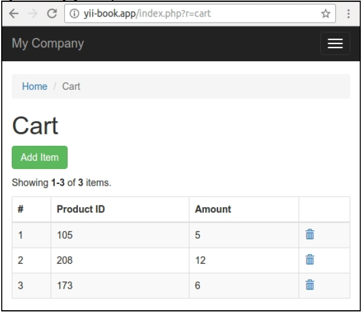

## 服务定位器

并不需要手动创建共享服务（应用组件）的实例，我们可以从一个特别的全局对象获取它们，这个全局对象包含配置和所有组件的实例。

一个服务定位器是一个全局对象，它包含一系列组件或者定义，通过一个ID进行唯一标识，并且允许我们通过它的ID获取任何想要的实例。这个定位器在第一次调用的时候创建了the component on-the-fly的一个单例，并在随后的调用中返回先前的实例。

在本节中，我们将会创建一个购物手推车组件，并使用它写一个手推车控制器。

### 准备

按照官方指导[http://www.yiiframework.com/doc-2.0/guide-start-installation.html](http://www.yiiframework.com/doc-2.0/guide-start-installation.html)中的描述，使用composer包管理器创建一个新的应用。

### 如何做...

执行如下步骤，创建一个购物手推车组件：

1. 创建一个购物手推车组件。它会在一个用户会话中，存储选择的商品。

```php
<?php
namespace app\components;
use Yii;
use yii\base\Component;
class ShoppingCart extends Component
{
    public $sessionKey = 'cart';
    private $_items = [];
    public function add($id, $amount)
    {
        $this->loadItems();
        if (array_key_exists($id, $this->_items)) {
            $this->_items[$id]['amount'] += $amount;
        } else {
            $this->_items[$id] = [
                'id' => $id,
                'amount' => $amount,
            ];
        }
        $this->saveItems();
    }
    public function remove($id)
    {
        $this->loadItems();
        $this->_items = array_diff_key($this->_items, [$id =>
            []]);
        $this->saveItems();
    }
    public function clear()
    {
        $this->_items = [];
        $this->saveItems();
    }
    public function getItems()
    {
        $this->loadItems();
        return $this->_items;
    }
    private function loadItems()
    {
        $this->_items =
            Yii::$app->session->get($this->sessionKey, []);
    }
    private function saveItems()
    {
        Yii::$app->session->set($this->sessionKey,
            $this->_items);
    }
}
```

1. 在文件config/web.php中以应用组件的方式，注册ShoppingCart到服务定位器中：

```php
'components' => [
    //…
    'cart => [
        'class' => 'app\components\ShoppingCart',
        'sessionKey' => 'primary-cart',
    ],
]
```

1. 创建一个手推车控制器：

```php
<?php
namespace app\controllers;
use app\models\CartAddForm;
use Yii;
use yii\data\ArrayDataProvider;
use yii\filters\VerbFilter;
use yii\web\Controller;
class CartController extends Controller
{
    public function behaviors()
    {
        return [
            'verbs' => [
                'class' => VerbFilter::className(),
                'actions' => [
                    'delete' => ['post'],
                ],
            ],
        ];
    }
    public function actionIndex()
    {
        $dataProvider = new ArrayDataProvider([
            'allModels' => Yii::$app->cart->getItems(),
        ]);
        return $this->render('index', [
            'dataProvider' => $dataProvider,
        ]);
    }
    public function actionAdd()
    {
        $form = new CartAddForm();
        if ($form->load(Yii::$app->request->post()) &&
            $form->validate()) {
            Yii::$app->cart->add($form->productId,
                $form->amount);
            return $this->redirect(['index']);
        }
        return $this->render('add', [
            'model' => $form,
        ]);
    }
    public function actionDelete($id)
    {
        Yii::$app->cart->remove($id);
        return $this->redirect(['index']);
    }
}
```

1. 创建一个表单：

```php
<?php
namespace app\models;
use yii\base\Model;
class CartAddForm extends Model
{
    public $productId;
    public $amount;
    public function rules()
    {
        return [
            [['productId', 'amount'], 'required'],
            [['amount'], 'integer', 'min' => 1],
        ];
    }
}
```

1. 创建视图文件views/cart/index.php：

```php
<?php
use yii\grid\ActionColumn;
use yii\grid\GridView;
use yii\grid\SerialColumn;
use yii\helpers\Html;
/* @var $this yii\web\View */
/* @var $dataProvider yii\data\ArrayDataProvider */
$this->title = 'Cart';
$this->params['breadcrumbs'][] = $this->title;
?>
<div class="site-contact">
    <h1><?= Html::encode($this->title) ?></h1>
    <p><?= Html::a('Add Item', ['add'], ['class' => 'btn btn-success']) ?></p>
    <?= GridView::widget([
        'dataProvider' => $dataProvider,
        'columns' => [
            ['class' => SerialColumn::className()],
            'id:text:Product ID',
            'amount:text:Amount',
            [
                'class' => ActionColumn::className(),
                'template' => '{delete}',
            ]
        ],
    ]) ?>
</div>
```

1. 创建视图文件views/cart/add.php：

```php
<?php
use yii\helpers\Html;
use yii\bootstrap\ActiveForm;
/* @var $this yii\web\View */
/* @var $form yii\bootstrap\ActiveForm */
/* @var $model app\models\CartAddForm */
$this->title = 'Add item';
$this->params['breadcrumbs'][] = ['label' => 'Cart', 'url' => ['index']];
$this->params['breadcrumbs'][] = $this->title;
?>
<div class="site-contact">
    <h1><?= Html::encode($this->title) ?></h1>
    <?php $form = ActiveForm::begin(['id' => 'contact-form']);
    ?>
    <?= $form->field($model, 'productId') ?>
    <?= $form->field($model, 'amount') ?>
    <div class="form-group">
        <?= Html::submitButton('Add', ['class' => 'btn btn-primary']) ?>
    </div>
    <?php ActiveForm::end(); ?>
</div>
```

1. 添加链接项到主菜单中：

```php
['label' => 'Home', 'url' => ['/site/index']],
['label' => 'Cart', 'url' => ['/cart/index']],
['label' => 'About', 'url' => ['/site/about']],
// …
```

1. 打开手推车页面，并尝试添加几行：



### 工作原理...

首先创建使用一个公共sessionKey选项创建我们自己的类：

```php
<?php
namespace app\components;
use yii\base\Component;
class ShoppingCart extends Component
{
    public $sessionKey = 'cart';
    // …
}
```

第二，我们添加组件定义到配置文件的components部分：

```php
'components' => [
    //…
    'cart => [
        'class' => 'app\components\ShoppingCart',
        'sessionKey' => 'primary-cart',
    ],
]
```

然后我们就可以通过两种方式获取组件实例：

```php
$cart = Yii::$app->cart;
$cart = Yii::$app->get('cart');
```

然后我们可以在我们自己的控制器、控件和其它地方使用这个对象。

当我们调用任何组件时，例如cart：

```php
Yii::$app->cart
```

我们在Yii::$app静态变量中调用Application类实例的这个虚拟属性。但是yii\base\Application类继承了yii\base\Module class，后者继承了带有\_\_call魔术方法的yii\di\ServiceLocator类。这个魔术方法只是调用yii\di\ServiceLocator 类的get\(\)方法：

```php
<?php
namespace yii\di;
class ServiceLocator extends Component
{
    private $_components = [];
    private $_definitions = [];
    public function __get($name)
    {
        if ($this->has($name)) {
            return $this->get($name);
        } else {
            return parent::__get($name);
        }
    }
    // …
}
```

因此另一种直接调用这个服务的方法是通过get方法：

```php
Yii::$app->get('cart');
```

当我们从服务定位器的get方法获取到一个组件，定位器在它的\_definitions列表中查找需要的定义，并且如果成功它会创建一个新的对象by the definition on the fly，并将它注册到它自己的完整的实例列表\_components中，然后返回这个对象。

如果我们获取一些组件，multiplying定位器总会一次次返回先前保存的实例：

```php
$cart1 = Yii::$app->cart;
$cart2 = Yii::$app->cart;
var_dump($cart1 === $cart2); // bool(true)
```

它能让我们使用共享的单cart实例Yii::$app-&gt;cart或者单数据库连接Yii::$app-&gt;db，而不是一次又一次从头创建。

### 参考

* 想要了解更多关于服务定位器的信息，以及核心框架组件，可以参考[http://www.yiiframework.com/doc-2.0/guide-concept-service-locator.html](http://www.yiiframework.com/doc-2.0/guide-concept-service-locator.html)
* 配置组件章节
* 《Extending Yii》第8章中的创建组件章节