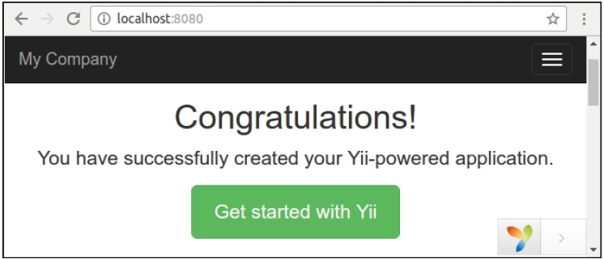
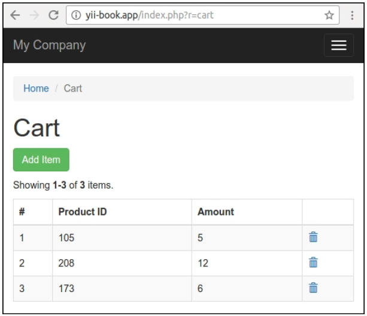

# 第一章 基础

在本章中，我们将会覆盖如下一些话题：
- 安装框架
- 应用模板
- 依赖注入容器
- 服务定位器
- 代码生成器
- 配置组件
- 使用事件
- 使用外部代码

## 介绍

在本章中，我们将介绍如何安装Yii框架以及可能的安装技术。我们将会向你介绍应用模板：基础版（basic）和高级版（advanced），以及它们之间的区别。然后你将会了解到依赖注入容器（dependency injection container）。本章包含了模型事件（model events）的内容，这些事件会在一些行为（actions）发生之后被触发，例如模型的保存、更新等。我们将会学习如何使用外部代码，例如ZendFramework、Laravel或者Symfony。我们也会学习如何一步一步将你的基于yii-1.x.x的应用升级到yii2。

## 安装框架

Yii2是一个以Composer包形式提供的现代PHP框架。接下来，我们将会通过Composer包管理器来安装框架，并为我们的应用配置数据库连接。

### 准备

首先，在你的系统上安装Composer包管理器。

**注意**：如果你在Windows上使用OpenServer应用，那么composer命令已经存在于OpenServer控制台上。

在Mac或者Linux上，可以从[https://getcomposer.org/download/](https://getcomposer.org/download/)下载安装包，并可以使用如下命令进行全局安装：

```
sudo php composer-setup.php --install-dir=/usr/local/bin --filename=composer
```

在Windows中，如果没有安装OpenServer，可以从[https://getcomposer.org/doc/00-intro.md](https://getcomposer.org/doc/00-intro.md)下载安装Composer-Setup.exe。

如果你没有系统的管理员权限，那么你也可以使用一个备用方案，下载[https://getcomposer.org/composer.phar](https://getcomposer.org/composer.phar)原始文件，并使用php composer.phar替单个composer命令。

安装好以后，在控制台中运行命令：

```
composer
```

或者备用方案（如果你只是下载了原始文件）：

```
php composer.phar
```

安装好以后，你将会看到如下响应：

```
   ______
  / ____/___ ____ ___ ____ ____ ________ _____
 / /    / __ \/ __ '__ \/ __ \/ __ \/ ___/ _ \/ ___/
/ /___/ /_/ / / / / / / /_/ / /_/ (__    ) __/ /
\____/\____/_/ /_/ /_/ .___/\____/____/\___/_/
                    /_/
```

然后你就可以安装[https://packagist.org](https://packagist.org)上提供的任意包了。

### 如何做...

你可以安装基本应用模板或者高级应用模板。为了了解这这两者的区别，你可以参考应用模板章节。

需要注意的是，在安装过程中，Composer包管理器从Github网站获取了很多信息。Github也许会限制匿名用户的请求。在这种情况下，Composer会让你输入访问令牌（access token）。你需要在[https://github.com](https://github.com)上进行注册，并根据[https://github.com/blog/1509-personal-api-tokens](https://github.com/blog/1509-personal-api-tokens)的指导，生成一个新的token。

#### 安装基础项目模板

执行如下步骤，安装基本项目模板：

1. 首先打开控制台，安装Bower-to-Composer适配器：

```
composer global require "fxp/composer-asset-plugin:^1.2.0"
```

它提供了一个简单的方法，可以从Bower库中加载相关的非PHP包（Javascript和CSS）。

2. 在这个新的basic目录中创建一个新的应用：

```
composer create-project --prefer-dist iisoft/yii2-app-basic
basic
```

3. 检查你的PHP是否包含必需的扩展：

```
cd basic
php requirements.php
```

**注意**：PHP在命令行模式和web界面模式可以使用不同的php.ini文件，从而可以使用不同的配置和不同的扩展。

4. 创建一个新的数据库（如果这对你的项目是必需的）并在`config/db.php`文件中配置。

5. 尝试通过如下控制台命令运行应用：

```
php yii serve
```

6. 在你的浏览器中通过访问网址[http://localhost:8080](http://localhost:8080)来检查应用是否工作：



For permanent working，在你的服务器（Apache、Nginx等等）上创建一个新的host，将web目录设置为host的文档根目录。

#### 安装高级项目模板

执行如下步骤来安装高级项目模板：

1. 首先打开控制台，安装Bower-to-Composer适配器：

```
composer global require "fxp/composer-asset-plugin:^1.2.0"
```

它提供了一个简单的方法，可以从Bower库中加载相关的非PHP包（Javascript和CSS）。

2. 在这个新的basic目录中创建一个新的应用：

```
composer create-project --prefer-dist yiisoft/yii2-app-advanced advanced
```

3. 然而这个新应用不包含本地配置文件和index.php入口脚本。为了生成这些文件只需要初始化一个工作环境：

```
cd advanced
php init
```

在初始化过程中选择开发环境。

4. 检查你的PHP是否包含了必需的扩展：

```
php requirements.php
```

**注意**：PHP在命令行模式和web界面模式可以使用不同的php.ini文件，从而可以使用不同的配置和不同的扩展。

5. 创建一个新的数据库，并在`common/config/mainlocal.php`文件中配置。

6. 执行这个应用迁移：

```
php yii migrate
```

这个命令将会自动在你的数据库中创建一个用户表。

7. 尝试通过如下控制台命令运行一个前端应用：

```
php yii serve --docroot=@frontend/web --port=8080
```

然后在另外一个控制台窗口运行后端：

```
php yii serve --docroot=@backend/web --port=8090
```

8. 通过访问网址[http://localhost:8080](http://localhost:8080)和[http://localhost:8090](http://localhost:8090)在你的浏览器中检查应用是否工作：


在你的服务器（Apache、Nginx等等）上，为后端和前端应用创建两个新hosts，然后将backend/web和frontend/web目录设置为hosts的文档根目录。

### 工作原理...

首先，我们安装了Composer包管理器和Bower资源插件。

通过composer的create-project命令安装了应用以后，这个命令创建了一个新的空目录，将应用模板源代码和所有的依赖（框架和其它控件）复制到vendor的子目录中。

如果需要，我们将会初始化应用配置并设置一个新的数据库。

我们可以在控制台或者浏览器中通过运行requirements.php脚本来检查系统要求。

复制好代码以后，我们可以配置自己的PHP服务器，将web目录作为服务器的文档根目录。

### 参考

这里可以找到更多关于yii2-app-basic的安装信息，[http://www.yiiframework.com/doc-2.0/guide-start-installation.html。](http://www.yiiframework.com/doc-2.0/guide-start-installation.html。)

yii2-app-advanced的安装可以参考[https://github.com/yiisoft/yii2-app-advanced/blob/master/docs/guide/start-installation.md](https://github.com/yiisoft/yii2-app-advanced/blob/master/docs/guide/start-installation.md)。

Composer包管理器可以参考[https://getcomposer.org](https://getcomposer.org)。

为Composer创建一个Github访问令牌（access token）可以参考[https://github.com/blog/1509-personal-api-tokens](https://github.com/blog/1509-personal-api-tokens)。

## 应用模板

Yii2有两套应用模板用于开发：基础模板（basic）和高级模板（advanced）。这两种模板之间的区别是什么呢？

从名字上看并不是很直观。一些人最后可能会选择基础版因为高级版听起来比较反感。本章我们将会看一下它们之间的区别。

### 如何做...

请参考安装框架章节中的如何做部分来理解和学习如何安装不同的模板。

### 工作原理...

高级模板有一个自定义配置系统，开发它的目的是让团队可以在一个项目上工作，并让每一个开发者能自定义它们自己的用于开发、测试和其它环境的配置。

配置环境比较复杂繁琐，并且一般不用于单独开发。

高级模板有frontend和backend两个文件夹，分别对应web应用的前端和后端。所以你可以为每一个文件夹配置一个单独的host，从而隔离前端和后端。

有一种简单的方式来组织文件到文件中，并配置web服务器。你可以很容易的在基础模板中做同样的事情。

无论是前端/后端分离还是用户管理，都不选择高级模板的好理由。最好将这些特性应用于你的app——你将会学到更多，并且不会遇到难的配置问题。

如果你和一个团队将为一个项目工作，也许你需要能灵活配置，使用不同的环境来开发，这种情况高级模板就是一个好选择。如果你是独自开发，并且你的项目比较简单，你可以选择使用基础应用模板。

## 依赖注入容器

在提取清晰抽象子系统的帮助下，依赖注入容器（DIP）建议我们创建模块化低耦合代码。

例如，如果你想简化一个大类，你可以将它分割成许多块的程序代码，并将每一个块提取成一个新的简单的独立类。

原则上，你的低级块应该实现一个充足清晰的抽象，并且高级代码应该只与这个抽象工作，不能与低级实现工作。

当我们将一个大的多任务类分割成小的专门类，我们会遇到创建依赖对象并将它们注入到对方中的问题。

之前如果我们创建了一个实例：

```
$service = new MyGiantSuperService();
```

分割以后我们将会创建或者获取所有的依赖项，并建立我们的服务：

```
$service = new MyService(
    new Repository(new PDO('dsn', 'username', 'password')),
    new Session(),
    new Mailer(new SmtpMailerTransport('username', 'password', host')),
    new Cache(new FileSystem('/tmp/cache')),
);
```

依赖注入容器是一个工厂，它能让我们不关心创建自己的对象。在Yii2中，我们可以一次性配置一个容器，然后就可以通过如下方式获取我们的服务：

```
$service = Yii::$container->get('app\services\MyService')
```

我们也可以使用这个：

```
$service = Yii::createObject('app\services\MyService')
```

或者在构造其它服务是，我们让容器作为一个依赖注入它：

```
use app\services\MyService;
class OtherService
{
    public function __construct(MyService $myService) { … }
}
```

当我们获取OtherService实例时：

```
$otherService = Yii::createObject('app\services\OtherService')
```

在所有情况下，容器将会解析所有的依赖，并为每个注入依赖对象。

在本节中，我们创建了带有存储子系统的购物手推车，并将手推车自动注入到控制器中。

### 准备

按照官方向导http://www.yiiframework.com/doc-2.0/guide-startinstallation.html中的描述，使用Composer包管理器创建一个新应用。

### 如何做...

执行如下步骤：

1. 创建一个购物手推车（shopping cart）类：

```
<?php
namespace app\cart;
use app\cart\storage\StorageInterface;
class ShoppingCart
{
    private $storage;
    private $_items = [];
    public function __construct(StorageInterface $storage)
    {
        $this->storage = $storage;
    }
    public function add($id, $amount)
    {
        $this->loadItems();
        if (array_key_exists($id, $this->_items)) {
            $this->_items[$id]['amount'] += $amount;
        } else {
            $this->_items[$id] = [
                'id' => $id,
                'amount' => $amount,
            ];
        }
        $this->saveItems();
    }
    public function remove($id)
    {
        $this->loadItems();
        $this->_items = array_diff_key($this->_items, [$id => []]);
        $this->saveItems();
    }
    public function clear()
    {
        $this->_items = [];
        $this->saveItems();
    }
    public function getItems()
    {
        $this->loadItems();
        return $this->_items;
    }
    private function loadItems()
    {
        $this->_items = $this->storage->load();
    }
    private function saveItems()
    {
        $this->storage->save($this->_items);
    }
}
```

2. 它将只会和它自己的项工作。并不是内置地将项目存放在session，它将这个任务委派给了任意的外部存储类，这些类需要实现StorageInterface接口。

3. 这个购物车类只是在它自己的构造器中获取了存储对象，将它保存在私有的$storage字段里，并通过load()和save()方法来调用。

4. 使用必需的方法定义一个常用的手推车存储接口：

```
<?php
namespace app\cart\storage;
interface StorageInterface
{
    /**
     * @return array of cart items
     */
    public function load();
    /**
     * @param array $items from cart
     */
    public function save(array $items);
}
```

5. 创建一个简单的存储实现。它将会在一个服务器session存储选择的项：

```
<?php
namespace app\cart\storage;
use yii\web\Session;
class SessionStorage implements StorageInterface
{
    private $session;
    private $key;
    public function __construct(Session $session, $key)
    {
        $this->key = $key;
        $this->session = $session;
    }
    public function load()
    {
        return $this->session->get($this->key, []);
    }
    public function save(array $items)
    {
        $this->session->set($this->key, $items);
    }
}
```

6. 这个存储可以在它的构造器中获取任意框架session实例，然后使用它来获取和存储项目。

7. 在config/web.php文件中配置ShoppingCart类和它的依赖：

```
<?php
use app\cart\storage\SessionStorage;
Yii::$container->setSingleton('app\cart\ShoppingCart');
Yii::$container->set('app\cart\storage\StorageInterface',
    function() {
        return new SessionStorage(Yii::$app->session,
            'primary-cart');
    });
$params = require(__DIR__ . '/params.php');
//…
```

8. 基于一个扩展的构造器创建cart控制器：

```
<?php
namespace app\controllers;
use app\cart\ShoppingCart;
use app\models\CartAddForm;
use Yii;
use yii\data\ArrayDataProvider;
use yii\filters\VerbFilter;
use yii\web\Controller;
class CartController extends Controller
{
    private $cart;
    public function __construct($id, $module, ShoppingCart $cart, $config = [])
    {
        $this->cart = $cart;
        parent::__construct($id, $module, $config);
    }
    public function behaviors()
    {
        return [
            'verbs' => [
                'class' => VerbFilter::className(),
                'actions' => [
                    'delete' => ['post'],
                ],
            ],
        ];
    }

    public function actionIndex()
    {
        $dataProvider = new ArrayDataProvider([
            'allModels' => $this->cart->getItems(),
        ]);
        return $this->render('index', [
            'dataProvider' => $dataProvider,
        ]);
    }
    public function actionAdd()
    {
        $form = new CartAddForm();
        if ($form->load(Yii::$app->request->post()) && $form->validate()) {
            $this->cart->add($form->productId, $form->amount);
            return $this->redirect(['index']);
        }
        return $this->render('add', [
            'model' => $form,
        ]);
    }
    public function actionDelete($id)
    {
        $this->cart->remove($id);
        return $this->redirect(['index']);
    }
}
```

9. 创建一个form：

```
<?php
namespace app\models;
use yii\base\Model;
class CartAddForm extends Model
{
    public $productId;
    public $amount;
    public function rules()
    {
        return [
            [['productId', 'amount'], 'required'],
            [['amount'], 'integer', 'min' => 1],
        ];
    }
}
```

10. 创建视图文件views/cart/index.php：

```
<?php
use yii\grid\ActionColumn;
use yii\grid\GridView;
use yii\grid\SerialColumn;
use yii\helpers\Html;
/* @var $this yii\web\View */
/* @var $dataProvider yii\data\ArrayDataProvider */
$this->title = 'Cart';
$this->params['breadcrumbs'][] = $this->title;
?>
<div class="cart-index">
    <h1><?= Html::encode($this->title) ?></h1>
    <p><?= Html::a('Add Item', ['add'], ['class' => 'btn btn-success']) ?></p>
    <?= GridView::widget([
        'dataProvider' => $dataProvider,
        'columns' => [
            ['class' => SerialColumn::className()],
            'id:text:Product ID',
            'amount:text:Amount',
            [
                'class' => ActionColumn::className(),
                'template' => '{delete}',
            ]
        ],
    ]) ?>
</div>
```

11. 创建视图文件views/cart/add.php：

```
<?php
use yii\helpers\Html;
use yii\bootstrap\ActiveForm;
/* @var $this yii\web\View */
/* @var $form yii\bootstrap\ActiveForm */
/* @var $model app\models\CartAddForm */
$this->title = 'Add item';
$this->params['breadcrumbs'][] = ['label' => 'Cart', 'url' => ['index']];
$this->params['breadcrumbs'][] = $this->title;
?>
<div class="cart-add">
    <h1><?= Html::encode($this->title) ?></h1>
    <?php $form = ActiveForm::begin(['id' => 'contact-form']);
    ?>
    <?= $form->field($model, 'productId') ?>
    <?= $form->field($model, 'amount') ?>
    <div class="form-group">
        <?= Html::submitButton('Add', ['class' => 'btn btn-primary']) ?>
    </div>
    <?php ActiveForm::end(); ?>
</div>
```

12. 添加链接项目到主菜单：

```
['label' => 'Home', 'url' => ['/site/index']],
['label' => 'Cart', 'url' => ['/cart/index']],
['label' => 'About', 'url' => ['/site/about']],
// …
```

13. 打开cart页并尝试添加几行：



### 工作原理...

在这个例子中，通过一个抽象接口，我们定义了一个依赖较少的主类ShoppingCart：

```
class ShoppingCart
{
    public function __construct(StorageInterface $storage) { … }
}
interface StorageInterface
{
    public function load();
    public function save(array $items);
}
```

然后我们实现了这个抽象类：

```
class SessionStorage implements StorageInterface
{
    public function __construct(Session $session, $key) { … }
}
```

### 参考

## 服务定位器

### 准备

### 如何做...

### 工作原理...

### 参考

## 代码生成器

### 准备

### 如何做...

### 工作原理...

## 配置控件

### 准备

### 如何做...

### 工作原理...

#### 内置控件

### 参考

## 使用事件

### 准备

### 如何做...

### 工作原理...

### 参考

## 使用外部代码

### 准备

### 如何做...

#### 使用Composer安装一个库

#### 手动安装库

#### 在其它框架中使用Yii2

### 工作原理...

### 参考


