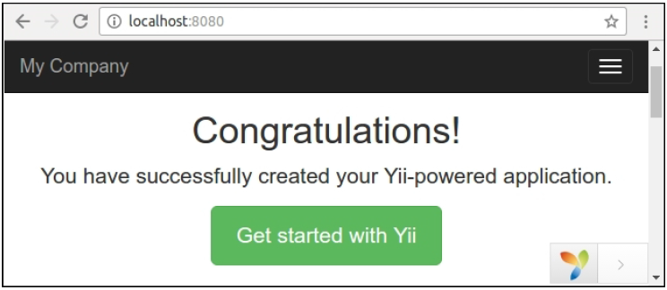
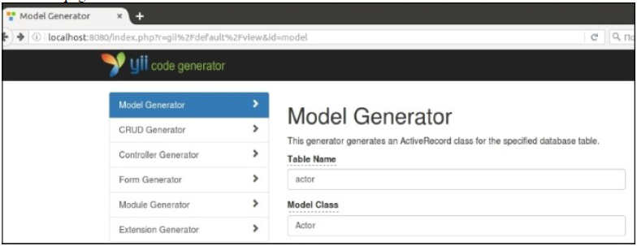
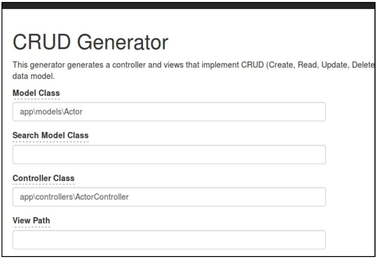
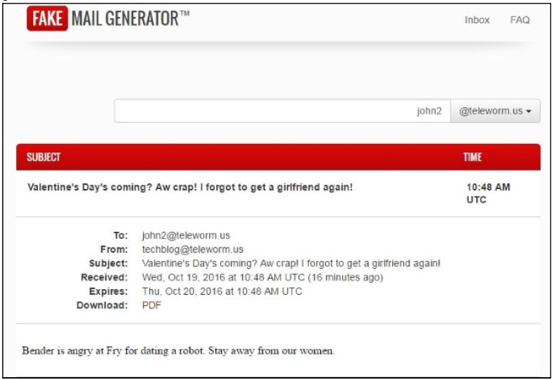

# 

## 介绍

在本章中，我们将介绍如何安装Yii框架以及可能的安装技术。我们将会向你介绍应用模板：基础版（basic）和高级版（advanced），以及它们之间的区别。然后你将会了解到依赖注入容器（dependency injection container）。本章包含了模型事件（model events）的内容，这些事件会在一些行为（actions）发生之后被触发，例如模型的保存、更新等。我们将会学习如何使用外部代码，例如ZendFramework、Laravel或者Symfony。我们也会学习如何一步一步将你的基于yii-1.x.x的应用升级到yii2。

## 安装框架

Yii2是一个以Composer包形式提供的现代PHP框架。接下来，我们将会通过Composer包管理器来安装框架，并为我们的应用配置数据库连接。

### 准备

首先，在你的系统上安装Composer包管理器。

**注意**：如果你在Windows上使用OpenServer应用，那么composer命令已经存在于OpenServer控制台上。

在Mac或者Linux上，可以从[https://getcomposer.org/download/](https://getcomposer.org/download/)下载安装包，并可以使用如下命令进行全局安装：

```
sudo php composer-setup.php --install-dir=/usr/local/bin --filename=composer
```

在Windows中，如果没有安装OpenServer，可以从[https://getcomposer.org/doc/00-intro.md](https://getcomposer.org/doc/00-intro.md)下载安装Composer-Setup.exe。

如果你没有系统的管理员权限，那么你也可以使用一个备用方案，下载[https://getcomposer.org/composer.phar](https://getcomposer.org/composer.phar)原始文件，并使用php composer.phar替单个composer命令。

安装好以后，在控制台中运行命令：

```
composer
```

或者备用方案（如果你只是下载了原始文件）：

```
php composer.phar
```

安装好以后，你将会看到如下响应：

```
   ______
  / ____/___ ____ ___ ____ ____ ________ _____
 / /    / __ \/ __ '__ \/ __ \/ __ \/ ___/ _ \/ ___/
/ /___/ /_/ / / / / / / /_/ / /_/ (__    ) __/ /
\____/\____/_/ /_/ /_/ .___/\____/____/\___/_/
                    /_/
```

然后你就可以安装[https://packagist.org](https://packagist.org)上提供的任意包了。

### 如何做...

你可以安装基本应用模板或者高级应用模板。为了了解这这两者的区别，你可以参考应用模板章节。

需要注意的是，在安装过程中，Composer包管理器从Github网站获取了很多信息。Github也许会限制匿名用户的请求。在这种情况下，Composer会让你输入访问令牌（access token）。你需要在[https://github.com](https://github.com)上进行注册，并根据[https://github.com/blog/1509-personal-api-tokens](https://github.com/blog/1509-personal-api-tokens)的指导，生成一个新的token。

#### 安装基础项目模板

执行如下步骤，安装基本项目模板：

1. 首先打开控制台，安装Bower-to-Composer适配器：

```
composer global require "fxp/composer-asset-plugin:^1.2.0"
```

它提供了一个简单的方法，可以从Bower库中加载相关的非PHP包（Javascript和CSS）。

1. 在这个新的basic目录中创建一个新的应用：

```
composer create-project --prefer-dist iisoft/yii2-app-basic
basic
```

1. 检查你的PHP是否包含必需的扩展：

```
cd basic
php requirements.php
```

**注意**：PHP在命令行模式和web界面模式可以使用不同的php.ini文件，从而可以使用不同的配置和不同的扩展。

1. 创建一个新的数据库（如果这对你的项目是必需的）并在`config/db.php`文件中配置。

2. 尝试通过如下控制台命令运行应用：

```
php yii serve
```

1. 在你的浏览器中通过访问网址[http://localhost:8080](http://localhost:8080)来检查应用是否工作：


For permanent working，在你的服务器（Apache、Nginx等等）上创建一个新的host，将web目录设置为host的文档根目录。

#### 安装高级项目模板

执行如下步骤来安装高级项目模板：

1. 首先打开控制台，安装Bower-to-Composer适配器：

```
composer global require "fxp/composer-asset-plugin:^1.2.0"
```

它提供了一个简单的方法，可以从Bower库中加载相关的非PHP包（Javascript和CSS）。

1. 在这个新的basic目录中创建一个新的应用：

```
composer create-project --prefer-dist yiisoft/yii2-app-advanced advanced
```

1. 然而这个新应用不包含本地配置文件和index.php入口脚本。为了生成这些文件只需要初始化一个工作环境：

```
cd advanced
php init
```

在初始化过程中选择开发环境。

1. 检查你的PHP是否包含了必需的扩展：

```
php requirements.php
```

**注意**：PHP在命令行模式和web界面模式可以使用不同的php.ini文件，从而可以使用不同的配置和不同的扩展。

1. 创建一个新的数据库，并在`common/config/mainlocal.php`文件中配置。

2. 执行这个应用迁移：

```
php yii migrate
```

这个命令将会自动在你的数据库中创建一个用户表。

1. 尝试通过如下控制台命令运行一个前端应用：

```
php yii serve --docroot=@frontend/web --port=8080
```

然后在另外一个控制台窗口运行后端：

```
php yii serve --docroot=@backend/web --port=8090
```

1. 通过访问网址[http://localhost:8080](http://localhost:8080)和[http://localhost:8090](http://localhost:8090)在你的浏览器中检查应用是否工作：



在你的服务器（Apache、Nginx等等）上，为后端和前端应用创建两个新hosts，然后将backend/web和frontend/web目录设置为hosts的文档根目录。

### 工作原理...

首先，我们安装了Composer包管理器和Bower资源插件。

通过composer的create-project命令安装了应用以后，这个命令创建了一个新的空目录，将应用模板源代码和所有的依赖（框架和其它控件）复制到vendor的子目录中。

如果需要，我们将会初始化应用配置并设置一个新的数据库。

我们可以在控制台或者浏览器中通过运行requirements.php脚本来检查系统要求。

复制好代码以后，我们可以配置自己的PHP服务器，将web目录作为服务器的文档根目录。

### 参考

这里可以找到更多关于yii2-app-basic的安装信息，[http://www.yiiframework.com/doc-2.0/guide-start-installation.html。](http://www.yiiframework.com/doc-2.0/guide-start-installation.html。)

yii2-app-advanced的安装可以参考[https://github.com/yiisoft/yii2-app-advanced/blob/master/docs/guide/start-installation.md](https://github.com/yiisoft/yii2-app-advanced/blob/master/docs/guide/start-installation.md)。

Composer包管理器可以参考[https://getcomposer.org](https://getcomposer.org)。

为Composer创建一个Github访问令牌（access token）可以参考[https://github.com/blog/1509-personal-api-tokens](https://github.com/blog/1509-personal-api-tokens)。

## 应用模板

Yii2有两套应用模板用于开发：基础模板（basic）和高级模板（advanced）。这两种模板之间的区别是什么呢？

从名字上看并不是很直观。一些人最后可能会选择基础版因为高级版听起来比较反感。本章我们将会看一下它们之间的区别。

### 如何做...

请参考安装框架章节中的如何做部分来理解和学习如何安装不同的模板。

### 工作原理...

高级模板有一个自定义配置系统，开发它的目的是让团队可以在一个项目上工作，并让每一个开发者能自定义它们自己的用于开发、测试和其它环境的配置。

配置环境比较复杂繁琐，并且一般不用于单独开发。

高级模板有frontend和backend两个文件夹，分别对应web应用的前端和后端。所以你可以为每一个文件夹配置一个单独的host，从而隔离前端和后端。

有一种简单的方式来组织文件到文件中，并配置web服务器。你可以很容易的在基础模板中做同样的事情。

无论是前端/后端分离还是用户管理，都不选择高级模板的好理由。最好将这些特性应用于你的app——你将会学到更多，并且不会遇到难的配置问题。

如果你和一个团队将为一个项目工作，也许你需要能灵活配置，使用不同的环境来开发，这种情况高级模板就是一个好选择。如果你是独自开发，并且你的项目比较简单，你可以选择使用基础应用模板。

## 依赖注入容器

在提取清晰抽象子系统的帮助下，依赖注入容器（DIP）建议我们创建模块化低耦合代码。

例如，如果你想简化一个大类，你可以将它分割成许多块的程序代码，并将每一个块提取成一个新的简单的独立类。

原则上，你的低级块应该实现一个充足清晰的抽象，并且高级代码应该只与这个抽象工作，不能与低级实现工作。

当我们将一个大的多任务类分割成小的专门类，我们会遇到创建依赖对象并将它们注入到对方中的问题。

之前如果我们创建了一个实例：

```
$service = new MyGiantSuperService();
```

分割以后我们将会创建或者获取所有的依赖项，并建立我们的服务：

```
$service = new MyService(
    new Repository(new PDO('dsn', 'username', 'password')),
    new Session(),
    new Mailer(new SmtpMailerTransport('username', 'password', host')),
    new Cache(new FileSystem('/tmp/cache')),
);
```

依赖注入容器是一个工厂，它能让我们不关心创建自己的对象。在Yii2中，我们可以一次性配置一个容器，然后就可以通过如下方式获取我们的服务：

```
$service = Yii::$container->get('app\services\MyService')
```

我们也可以使用这个：

```
$service = Yii::createObject('app\services\MyService')
```

或者在构造其它服务是，我们让容器作为一个依赖注入它：

```
use app\services\MyService;
class OtherService
{
    public function __construct(MyService $myService) { … }
}
```

当我们获取OtherService实例时：

```
$otherService = Yii::createObject('app\services\OtherService')
```

在所有情况下，容器将会解析所有的依赖，并为每个注入依赖对象。

在本节中，我们创建了带有存储子系统的购物手推车，并将手推车自动注入到控制器中。

### 准备

按照官方向导[http://www.yiiframework.com/doc-2.0/guide-startinstallation.html中的描述，使用Composer包管理器创建一个新应用。](http://www.yiiframework.com/doc-2.0/guide-startinstallation.html中的描述，使用Composer包管理器创建一个新应用。)

### 如何做...

执行如下步骤：

1. 创建一个购物手推车（shopping cart）类：

```
<?php
namespace app\cart;
use app\cart\storage\StorageInterface;
class ShoppingCart
{
    private $storage;
    private $_items = [];
    public function __construct(StorageInterface $storage)
    {
        $this->storage = $storage;
    }
    public function add($id, $amount)
    {
        $this->loadItems();
        if (array_key_exists($id, $this->_items)) {
            $this->_items[$id]['amount'] += $amount;
        } else {
            $this->_items[$id] = [
                'id' => $id,
                'amount' => $amount,
            ];
        }
        $this->saveItems();
    }
    public function remove($id)
    {
        $this->loadItems();
        $this->_items = array_diff_key($this->_items, [$id => []]);
        $this->saveItems();
    }
    public function clear()
    {
        $this->_items = [];
        $this->saveItems();
    }
    public function getItems()
    {
        $this->loadItems();
        return $this->_items;
    }
    private function loadItems()
    {
        $this->_items = $this->storage->load();
    }
    private function saveItems()
    {
        $this->storage->save($this->_items);
    }
}
```

1. 它将只会和它自己的项工作。并不是内置地将项目存放在session，它将这个任务委派给了任意的外部存储类，这些类需要实现StorageInterface接口。

2. 这个购物车类只是在它自己的构造器中获取了存储对象，将它保存在私有的$storage字段里，并通过load\(\)和save\(\)方法来调用。

3. 使用必需的方法定义一个常用的手推车存储接口：

```
<?php
namespace app\cart\storage;
interface StorageInterface
{
    /**
     * @return array of cart items
     */
    public function load();
    /**
     * @param array $items from cart
     */
    public function save(array $items);
}
```

1. 创建一个简单的存储实现。它将会在一个服务器session存储选择的项：

```
<?php
namespace app\cart\storage;
use yii\web\Session;
class SessionStorage implements StorageInterface
{
    private $session;
    private $key;
    public function __construct(Session $session, $key)
    {
        $this->key = $key;
        $this->session = $session;
    }
    public function load()
    {
        return $this->session->get($this->key, []);
    }
    public function save(array $items)
    {
        $this->session->set($this->key, $items);
    }
}
```

1. 这个存储可以在它的构造器中获取任意框架session实例，然后使用它来获取和存储项目。

2. 在config/web.php文件中配置ShoppingCart类和它的依赖：

```
<?php
use app\cart\storage\SessionStorage;
Yii::$container->setSingleton('app\cart\ShoppingCart');
Yii::$container->set('app\cart\storage\StorageInterface',
    function() {
        return new SessionStorage(Yii::$app->session,
            'primary-cart');
    });
$params = require(__DIR__ . '/params.php');
//…
```

1. 基于一个扩展的构造器创建cart控制器：

```
<?php
namespace app\controllers;
use app\cart\ShoppingCart;
use app\models\CartAddForm;
use Yii;
use yii\data\ArrayDataProvider;
use yii\filters\VerbFilter;
use yii\web\Controller;
class CartController extends Controller
{
    private $cart;
    public function __construct($id, $module, ShoppingCart $cart, $config = [])
    {
        $this->cart = $cart;
        parent::__construct($id, $module, $config);
    }
    public function behaviors()
    {
        return [
            'verbs' => [
                'class' => VerbFilter::className(),
                'actions' => [
                    'delete' => ['post'],
                ],
            ],
        ];
    }

    public function actionIndex()
    {
        $dataProvider = new ArrayDataProvider([
            'allModels' => $this->cart->getItems(),
        ]);
        return $this->render('index', [
            'dataProvider' => $dataProvider,
        ]);
    }
    public function actionAdd()
    {
        $form = new CartAddForm();
        if ($form->load(Yii::$app->request->post()) && $form->validate()) {
            $this->cart->add($form->productId, $form->amount);
            return $this->redirect(['index']);
        }
        return $this->render('add', [
            'model' => $form,
        ]);
    }
    public function actionDelete($id)
    {
        $this->cart->remove($id);
        return $this->redirect(['index']);
    }
}
```

1. 创建一个form：

```
<?php
namespace app\models;
use yii\base\Model;
class CartAddForm extends Model
{
    public $productId;
    public $amount;
    public function rules()
    {
        return [
            [['productId', 'amount'], 'required'],
            [['amount'], 'integer', 'min' => 1],
        ];
    }
}
```

1. 创建视图文件views/cart/index.php：

```
<?php
use yii\grid\ActionColumn;
use yii\grid\GridView;
use yii\grid\SerialColumn;
use yii\helpers\Html;
/* @var $this yii\web\View */
/* @var $dataProvider yii\data\ArrayDataProvider */
$this->title = 'Cart';
$this->params['breadcrumbs'][] = $this->title;
?>
<div class="cart-index">
    <h1><?= Html::encode($this->title) ?></h1>
    <p><?= Html::a('Add Item', ['add'], ['class' => 'btn btn-success']) ?></p>
    <?= GridView::widget([
        'dataProvider' => $dataProvider,
        'columns' => [
            ['class' => SerialColumn::className()],
            'id:text:Product ID',
            'amount:text:Amount',
            [
                'class' => ActionColumn::className(),
                'template' => '{delete}',
            ]
        ],
    ]) ?>
</div>
```

1. 创建视图文件views/cart/add.php：

```
<?php
use yii\helpers\Html;
use yii\bootstrap\ActiveForm;
/* @var $this yii\web\View */
/* @var $form yii\bootstrap\ActiveForm */
/* @var $model app\models\CartAddForm */
$this->title = 'Add item';
$this->params['breadcrumbs'][] = ['label' => 'Cart', 'url' => ['index']];
$this->params['breadcrumbs'][] = $this->title;
?>
<div class="cart-add">
    <h1><?= Html::encode($this->title) ?></h1>
    <?php $form = ActiveForm::begin(['id' => 'contact-form']);
    ?>
    <?= $form->field($model, 'productId') ?>
    <?= $form->field($model, 'amount') ?>
    <div class="form-group">
        <?= Html::submitButton('Add', ['class' => 'btn btn-primary']) ?>
    </div>
    <?php ActiveForm::end(); ?>
</div>
```

1. 添加链接项目到主菜单：

```
['label' => 'Home', 'url' => ['/site/index']],
['label' => 'Cart', 'url' => ['/cart/index']],
['label' => 'About', 'url' => ['/site/about']],
// …
```

1. 打开cart页并尝试添加几行：


### 工作原理...

在这个例子中，通过一个抽象接口，我们定义了一个依赖较少的主类ShoppingCart：

```
class ShoppingCart
{
    public function __construct(StorageInterface $storage) { … }
}
interface StorageInterface
{
    public function load();
    public function save(array $items);
}
```

然后我们实现了这个抽象类：

```
class SessionStorage implements StorageInterface
{
    public function __construct(Session $session, $key) { … }
}
```

然后我们可以按如下方式手动创建一个cart的实例：

```
$storage = new SessionStorage(Yii::$app->session, 'primary-cart');
$cart = new ShoppingCart($storage)
```

它允许我们创建许多不同的实现，例如SessionStorage、CookieStorage或者DbStorage。并且我们可以在不同的项目和不同的框架中复用不依赖框架的基于StorageInterface的ShoppingCart类。我们只需为需要的框架使用接口的方法实现这个存储类。

并不需要手动创建一个带有所有依赖的实例，我们可以使用一个依赖注入容器。

默认情况下容器解析所有类的构造函数，并递归创建所有需要的实例。例如，如果我们有四个类：

```
class A {
    public function __construct(B $b, C $c) { … }
}
class B {
...
}
class C {
    public function __construct(D $d) { … }
}
class D {
...
}
```

我们可以用两种方法获取A类的实例：

```
$a = Yii::$container->get('app\services\A')
// or
$a = Yii::createObject('app\services\A')
```

并且容器自动创建B、D、C和A的实例，并将他们注入到对象中。

在我们的例子中，我们将cart实例标记为一个单件模式（singleton）：

```
Yii::$container->setSingleton('app\cart\ShoppingCart');
```

这意味着容器将会为每一个重复的请求返回一个单例，而不是一次又一次的创建。

此外，我们的ShoppingCart在它自己的构造器中有StorageInterface类型，并且容器知道需要为这个类型实例化哪些类。我们必须按如下方式为接口手动绑定这个类：

```
Yii::$container->set('app\cart\storage\StorageInterface', 'app\cart\storage\CustomStorage',);
```

但是我们的SessionStorage有一个非标准构造器：

```
class SessionStorage implements StorageInterface
{
    public function __construct(Session $session, $key) { … }
}
```

因此我们使用一个匿名函数来手动创建这个实例：

```
Yii::$container->set('app\cart\storage\StorageInterface', function()
{
    return new SessionStorage(Yii::$app->session, 'primary-cart');
});
```

毕竟在我们自己的控制器、控件等其它地方，我们可以从容器中手动获取cart对象，

```
$cart = Yii::createObject('app\cart\ShoppingCart')
```

但是，在框架内部中，每一个控制器和其它对象将会通过createObject方法创建。并且我们可以通过控制器构造器来注入cart：

```
class CartController extends Controller
{
    private $cart;
    public function __construct($id, $module, ShoppingCart $cart,
                                $config = [])
    {
        $this->cart = $cart;
        parent::__construct($id, $module, $config);
    }
    // ...
}
```

使用被注入的cart对象：

```
public function actionDelete($id)
{
    $this->cart->remove($id);
    return $this->redirect(['index']);
}
```

### 参考

* 更多关于DIP的信息，参见[https://en.wikipedia.org/wiki/Dependency\_inversion\_principle](https://en.wikipedia.org/wiki/Dependency_inversion_principle)
* 欲了解更多关于依赖注入控制，参见[https://en.wikipedia.org/wiki/Dependency\_inversion\_principle](https://en.wikipedia.org/wiki/Dependency_inversion_principle)

## 服务定位器

并不需要手动创建共享服务（应用组件）的实例，我们可以从一个特别的全局对象获取它们，这个全局对象包含配置和所有组件的实例。

一个服务定位器是一个全局对象，它包含一系列组件或者定义，通过一个ID进行唯一标识，并且允许我们通过它的ID获取任何想要的实例。这个定位器在第一次调用的时候创建了the component on-the-fly的一个单例，并在随后的调用中返回先前的实例。

在本节中，我们将会创建一个购物手推车组件，并使用它写一个手推车控制器。

### 准备

按照官方指导[http://www.yiiframework.com/doc-2.0/guide-start-installation.html](http://www.yiiframework.com/doc-2.0/guide-start-installation.html)中的描述，使用composer包管理器创建一个新的应用。

### 如何做...

执行如下步骤，创建一个购物手推车组件：

1. 创建一个购物手推车组件。它会在一个用户会话中，存储选择的商品。

```
<?php
namespace app\components;
use Yii;
use yii\base\Component;
class ShoppingCart extends Component
{
    public $sessionKey = 'cart';
    private $_items = [];
    public function add($id, $amount)
    {
        $this->loadItems();
        if (array_key_exists($id, $this->_items)) {
            $this->_items[$id]['amount'] += $amount;
        } else {
            $this->_items[$id] = [
                'id' => $id,
                'amount' => $amount,
            ];
        }
        $this->saveItems();
    }
    public function remove($id)
    {
        $this->loadItems();
        $this->_items = array_diff_key($this->_items, [$id =>
            []]);
        $this->saveItems();
    }
    public function clear()
    {
        $this->_items = [];
        $this->saveItems();
    }
    public function getItems()
    {
        $this->loadItems();
        return $this->_items;
    }
    private function loadItems()
    {
        $this->_items =
            Yii::$app->session->get($this->sessionKey, []);
    }
    private function saveItems()
    {
        Yii::$app->session->set($this->sessionKey,
            $this->_items);
    }
}
```

1. 在文件config/web.php中以应用组件的方式，注册ShoppingCart到服务定位器中：

```
'components' => [
    //…
    'cart => [
        'class' => 'app\components\ShoppingCart',
        'sessionKey' => 'primary-cart',
    ],
]
```

1. 创建一个手推车控制器：

```
<?php
namespace app\controllers;
use app\models\CartAddForm;
use Yii;
use yii\data\ArrayDataProvider;
use yii\filters\VerbFilter;
use yii\web\Controller;
class CartController extends Controller
{
    public function behaviors()
    {
        return [
            'verbs' => [
                'class' => VerbFilter::className(),
                'actions' => [
                    'delete' => ['post'],
                ],
            ],
        ];
    }
    public function actionIndex()
    {
        $dataProvider = new ArrayDataProvider([
            'allModels' => Yii::$app->cart->getItems(),
        ]);
        return $this->render('index', [
            'dataProvider' => $dataProvider,
        ]);
    }
    public function actionAdd()
    {
        $form = new CartAddForm();
        if ($form->load(Yii::$app->request->post()) &&
            $form->validate()) {
            Yii::$app->cart->add($form->productId,
                $form->amount);
            return $this->redirect(['index']);
        }
        return $this->render('add', [
            'model' => $form,
        ]);
    }
    public function actionDelete($id)
    {
        Yii::$app->cart->remove($id);
        return $this->redirect(['index']);
    }
}
```

1. 创建一个表单：

```
<?php
namespace app\models;
use yii\base\Model;
class CartAddForm extends Model
{
    public $productId;
    public $amount;
    public function rules()
    {
        return [
            [['productId', 'amount'], 'required'],
            [['amount'], 'integer', 'min' => 1],
        ];
    }
}
```

1. 创建视图文件views/cart/index.php：

```
<?php
use yii\grid\ActionColumn;
use yii\grid\GridView;
use yii\grid\SerialColumn;
use yii\helpers\Html;
/* @var $this yii\web\View */
/* @var $dataProvider yii\data\ArrayDataProvider */
$this->title = 'Cart';
$this->params['breadcrumbs'][] = $this->title;
?>
<div class="site-contact">
    <h1><?= Html::encode($this->title) ?></h1>
    <p><?= Html::a('Add Item', ['add'], ['class' => 'btn btn-success']) ?></p>
    <?= GridView::widget([
        'dataProvider' => $dataProvider,
        'columns' => [
            ['class' => SerialColumn::className()],
            'id:text:Product ID',
            'amount:text:Amount',
            [
                'class' => ActionColumn::className(),
                'template' => '{delete}',
            ]
        ],
    ]) ?>
</div>
```

1. 创建视图文件views/cart/add.php：

```
<?php
use yii\helpers\Html;
use yii\bootstrap\ActiveForm;
/* @var $this yii\web\View */
/* @var $form yii\bootstrap\ActiveForm */
/* @var $model app\models\CartAddForm */
$this->title = 'Add item';
$this->params['breadcrumbs'][] = ['label' => 'Cart', 'url' => ['index']];
$this->params['breadcrumbs'][] = $this->title;
?>
<div class="site-contact">
    <h1><?= Html::encode($this->title) ?></h1>
    <?php $form = ActiveForm::begin(['id' => 'contact-form']);
    ?>
    <?= $form->field($model, 'productId') ?>
    <?= $form->field($model, 'amount') ?>
    <div class="form-group">
        <?= Html::submitButton('Add', ['class' => 'btn btn-primary']) ?>
    </div>
    <?php ActiveForm::end(); ?>
</div>
```

1. 添加链接项到主菜单中：

```
['label' => 'Home', 'url' => ['/site/index']],
['label' => 'Cart', 'url' => ['/cart/index']],
['label' => 'About', 'url' => ['/site/about']],
// …
```

1. 打开手推车页面，并尝试添加几行：


### 工作原理...

首先创建使用一个公共sessionKey选项创建我们自己的类：

```
<?php
namespace app\components;
use yii\base\Component;
class ShoppingCart extends Component
{
    public $sessionKey = 'cart';
    // …
}
```

第二，我们添加组件定义到配置文件的components部分：

```
'components' => [
    //…
    'cart => [
        'class' => 'app\components\ShoppingCart',
        'sessionKey' => 'primary-cart',
    ],
]
```

然后我们就可以通过两种方式获取组件实例：

```
$cart = Yii::$app->cart;
$cart = Yii::$app->get('cart');
```

然后我们可以在我们自己的控制器、控件和其它地方使用这个对象。

当我们调用任何组件时，例如cart：

```
Yii::$app->cart
```

我们在Yii::$app静态变量中调用Application类实例的这个虚拟属性。但是yii\base\Application类继承了yii\base\Module class，后者继承了带有\_\_call魔术方法的yii\di\ServiceLocator类。这个魔术方法只是调用yii\di\ServiceLocator 类的get\(\)方法：

```
<?php
namespace yii\di;
class ServiceLocator extends Component
{
    private $_components = [];
    private $_definitions = [];
    public function __get($name)
    {
        if ($this->has($name)) {
            return $this->get($name);
        } else {
            return parent::__get($name);
        }
    }
    // …
}
```

因此另一种直接调用这个服务的方法是通过get方法：

```
Yii::$app->get('cart');
```

当我们从服务定位器的get方法获取到一个组件，定位器在它的\_definitions列表中查找需要的定义，并且如果成功它会创建一个新的对象by the definition on the fly，并将它注册到它自己的完整的实例列表\_components中，然后返回这个对象。

如果我们获取一些组件，multiplying定位器总会一次次返回先前保存的实例：

```
$cart1 = Yii::$app->cart;
$cart2 = Yii::$app->cart;
var_dump($cart1 === $cart2); // bool(true)
```

它能让我们使用共享的单cart实例Yii::$app-&gt;cart或者单数据库连接Yii::$app-&gt;db，而不是一次又一次从头创建。

### 参考

* 想要了解更多关于服务定位器的信息，以及核心框架组件，可以参考[http://www.yiiframework.com/doc-2.0/guide-concept-service-locator.html](http://www.yiiframework.com/doc-2.0/guide-concept-service-locator.html)
* 配置组件章节
* 《Extending Yii》第8章中的创建组件章节

## 代码生成器

Yii2提供了强大的模块Gii来生成模型、控制器和视图，并在此基础上方便进行修改和自定义。对于快速开发是一个非常有用的工具。

在本部分中，我们将会探索如何使用Gii并生成代码。例如，你有一个数据库，其中有一张表film，你希望为这张表创建带有CRUD操作的应用。这很容易。

### 准备

1. 按照官方指导[http://www.yiiframework.com/doc-2.0/guide-start-installation.html](http://www.yiiframework.com/doc-2.0/guide-start-installation.html)中的描述，使用composer创建一个新应用。
2. 从[http://dev.mysql.com/doc/index-other.html](http://dev.mysql.com/doc/index-other.html)下载Sakila数据库。
3. 执行下载的SQLs： 首先是schema然后是数据。
4. 为了使用Sakila数据库，需要在config/main.php中配置数据库连接。
5. 通过命令./yii serve运行你的web服务器。

### 如何做...

1. 访问网址[http://localhost:8080/index.php?r=gii，并选择模型生成器（Model](http://localhost:8080/index.php?r=gii，并选择模型生成器（Model) Generator）。
2. 填写表名（Table Name）actor和模型类（Model Class）Actor，并点击页面底部的生成（Generate）按钮。



1. 点击yii代码生成器（yii code generator）logo返回到Gii主菜单，并选择CRUD生成器（CRUD Generator）。
2. 填写Model Class内容app\models\Actor和Controller Class内容app\controllers\ActorController。



1. 点击页面底部的预览（Preview）按钮，并点击绿色生成（Generate）按钮。
2. 访问网址[http://localhost:8080/index.php?actor/create检查生成的效果。](http://localhost:8080/index.php?actor/create检查生成的效果。)


### 工作原理...

如果你检查你的项目结构，你将会看到自动生成的代码：


首先我们已经创建了Actor模型。Gii自动创建所有的模型规则，这依赖于mysql字段类型。例如，如果在你的MySQL数据库actor表中，字段first\_name和last\_name有IS NOT NULL标志，那么Yii会自动为它们创建规则required，并设置最大长度为45个字符，因为在我们的数据库中，这个字段的最大长度被设置成了45。

```
public function rules()
{
    return [
        [['first_name', 'last_name'], 'required'],
        [['last_update'], 'safe'],
        [['first_name', 'last_name'], 'string', 'max' => 45],
    ];
}
```

并且Yii会自动基于数据库中的外键创建两个模型之间的联系。在我们的例子中，自动创建了两个关系。

```
public function getFilmActors()
{
    return $this->hasMany(FilmActor::className(), ['actor_id' => 'actor_id']);
}
public function getFilms()
{
    return $this->hasMany(Film::className(), ['film_id' => 'film_id'])->viaTable('film_actor', ['actor_id' => 'actor_id']);
}
```

创建这个关系的原因是在数据库中我们有两个外键。film\_actor表的外键fk\_film\_actor\_actor指向了actor表中的actor\_id字段，外键fk\_film\_actor\_film指向了film表中的film\_id字段。

注意你还没有生成FilmActor模型。所以，如果你希望开发完善的app，而不只是一个demo，你必须生成Film、FilmActor模型。接下来的内容，可以参考[http://www.yiiframework.com/doc-2.0/guide-start-gii.html](http://www.yiiframework.com/doc-2.0/guide-start-gii.html)。

## 配置控件

Yii是一个非常易于定制的框架。而且，在所有的可定制代码中，有一种非常方便的方法来设置应用的不同部分。在Yii中，是通过配置config文件夹中的文件进行的。

### 准备

按照官方指南[http://www.yiiframework.com/doc-2.0/guide-start-installation.html](http://www.yiiframework.com/doc-2.0/guide-start-installation.html)的描述，使用Composer包管理器创建一个新的应用。

### 如何做...

如果你之前使用过Yii，那么你可能已经配置过一个数据库连接：

```
return [
    …
    'components' => [
        'db' => [
            'class' => 'system.db.CDbConnection',
            'dsn' => 'mysql:host=localhost;dbname=database_name',
            'username' => 'root',
            'password' => '',
            'charset' => 'utf8',
        ],
    …
    ],
    …
];
```

当你希望在应用的所有部分使用一个控件时，就需要使用配置控件的方法。在之前的配置中，你可以通过控件的名字访问它，例如Yii::$app-&gt;db。

### 工作原理...

当你第一次直接或者通过Active Record模型使用Yii::$app-&gt;db控件时，Yii创建了一个模型，并使用应用配置文件中的component部分中db数组初始化它的公共属性。在先前的代码中，dsn会被赋值给yii\db\Connection::dsn，username会被赋值给Connection::username，等等。

如果你想找到charset代表的意思，或者想知道db控件中其它可以配置项，你需要知道它的类。在db控件这个例子中，类是yii\db\Connection。你只需要打开这个类，并查看它的公共属性，这些你可以从配置中设置。

在先前的代码中，class属性有一点不同，因为它被用于指定控件的类名。它在yii\db\Connection中并不存在。因此，可以按如下方法复写一个类：

```
return [
    …
    'components' => [
        'db' => [
            'class' => app\components\MyConnection',
        …
        ],
    …
    ],
    …
];
```

你可以复写每一个应用控件；当一个标准控件不适合你的应用时，这种方法非常有用。

#### 内置控件

现在，我们来看看YIi都有哪些标准控件可供配置。有两个应用类型绑定了Yii：

* Web应用（yii webApplication）
* 控制台应用（yii\console\Application）

这两个都继承自yii\base\Application，所以控制台和web应用共用这些模板。

你可以从应用的方法coreComponents\(\)的源代码获取这些控件的名称。

你可以通过简单的添加新配置项目，并将它们的类属性指定你自定义的类，来添加你自己的应用控件（继承yii\base\Component）。

### 参考

* 控制台和web应用控件列表参见[http://www.yiiframework.com/doc-2.0/guide-structure-application-components.html](http://www.yiiframework.com/doc-2.0/guide-structure-application-components.html)
* 更多关于创建自己控件的信息，参见：
  * 服务定位器章节
  * 第八章的创建控件章节

## 使用事件

Yii的时间提供了一个简单的实现， 它允许你监听订阅发生在你web应用中各种各样的事件。例如，你也许希望发送一个通知：每次当你发布一个新材料时，将这个新文档通知到你的订阅者。

### 准备

1. 按照官方指南[http://www.yiiframework.com/doc-2.0/guide-start-installation.html](http://www.yiiframework.com/doc-2.0/guide-start-installation.html)的描述，使用Composer包管理器创建一个新的应用。
2. 在你的服务器上执行如下SQL代码，创建文章表：

```
CREATE TABLE 'article' (
    'id' int(11) NOT NULL AUTO_INCREMENT,
    'name' varchar(255) DEFAULT NULL,
    'description' text,
    PRIMARY KEY ('id')
) ENGINE=InnoDB AUTO_INCREMENT=29 DEFAULT CHARSET=utf8;
```

1. 使用Gii生成Article模型。
2. 使用./yii服务命令运行你的web服务器。

### 如何做...

1. 添加一个测试action到\controllers\SiteController：

```
<?php
public function actionTest()
{
    $article = new Article();
    $article->name = 'Valentine\'s Day\'s coming? Aw crap! I forgot to get a girlfriend again!';
    $article->description = 'Bender is angry at Fry for dating a robot. Stay away from our women. You\'ve got metal fever, boy. Metal fever';
    // $event is an object of yii\base\Event or a child class
    $article->on(ActiveRecord::EVENT_AFTER_INSERT,
        function($event) {
            $followers = ['john2@teleworm.us',
                'shivawhite@cuvox.de', 'kate@dayrep.com' ];
            foreach($followers as $follower) {
                Yii::$app->mailer->compose()
                    ->setFrom('techblog@teleworm.us')
                    ->setTo($follower)
                    ->setSubject($event->sender->name)
                    ->setTextBody($event->sender->description)
                    ->send();
            }
            echo 'Emails has been sent';
        });
    if (!$article->save()) {
        echo VarDumper::dumpAsString($article->getErrors());
    };
}
```

1. 使用如下代码更新config/web.php控件mailer：

```
'mailer' => [
    'class' => 'yii\swiftmailer\Mailer',
    'useFileTransport' => false,
],
```

1. 在你的浏览器中访问如下网址：

[http://localhost:8080/index.php?r=site/test](http://localhost:8080/index.php?r=site/test).

1. 另外检查[http://www.fakemailgenerator.com/inbox/teleworm.us/john2/](http://www.fakemailgenerator.com/inbox/teleworm.us/john2/)



### 工作原理...

我们已经创建了一个Article模型，并在Article模型中为ActiveRecord::EVENT\_AFTER\_INSERT事件添加了一个handler。它意味着我们每次保存一个新文章，这个事件都会被触发，然后我们的handler就会被调用。

在现实世界中，我们也许希望在我们每次发布一个新文章时，通知我们的博客订阅者。在一个实际应用中，我们将会有一个follower或者user表，and with different blog sections not only single blog。在这个例子中，在保存好我们的模型以后，我们通知了我们的订阅者`john2@teleworm.us`、`shivawhite@cuvox.de`和`kate@dayrep.com`。在上一步中，我们只是证明了用户已经收到了我们的通知，特别是john2。你可以用任意名称创建你自己的事件，这里我们使用了一个内置的事件，叫做ActiveRecord::EVENT\_AFTER\_INSERT，它会在每次插入到数据库中调用。

例如，我们可以创建我们自己的事件。只需要使用如下代码添加一个新的actionTestNew：

```
<?php
public function actionTestNew()
{
    $article = new Article();
    $article->name = 'Valentine\'s Day\'s coming? Aw crap! I forgot to get a girlfriend again!';
    $article->description = 'Bender is angry at Fry for dating a robot. Stay away from our women. You\'ve got metal fever, boy. Metal fever';
// $event is an object of yii\base\Event or a child class
    $article->on(Article::EVENT_OUR_CUSTOM_EVENT, function($event) {
        $followers = ['john2@teleworm.us', 'shivawhite@cuvox.de',
            'kate@dayrep.com' ];
        foreach($followers as $follower) {
            Yii::$app->mailer->compose()
                ->setFrom('techblog@teleworm.us')
                ->setTo($follower)
                ->setSubject($event->sender->name)
                ->setTextBody($event->sender->description)
                ->send();
        }
        echo 'Emails have been sent';
    });
    if ($article->save()) {
        $article->trigger(Article::EVENT_OUR_CUSTOM_EVENT);
    }
}
```

同时按照如下方式将EVENT\_OUR\_CUSTOM\_EVENT常量加入到模型models/Article中：

```
class Article extends \yii\db\ActiveRecord
{
    CONST EVENT_OUR_CUSTOM_EVENT = 'eventOurCustomEvent';
    …
}
```

访问[http://localhost:8080/index.php?r=site/test-new。](http://localhost:8080/index.php?r=site/test-new。)

你应该看到相同的结果，并且所有给订阅者的通知会再发一遍。主要的区别是我们使用了自定义的事件名。

保存以后，我们触发了我们的事件。事件是通过调用yii\base\Component::trigger\(\)触发的。这个方法需要一个事件名称，以及一个可选的事件对象，它描述了传递给事件handler的参数。

### 参考

欲了解更多信息参见[http://www.yiiframework.com/doc-2.0/guide-conceptevents](http://www.yiiframework.com/doc-2.0/guide-conceptevents).  
html

## 使用外部代码

Package repositories，PSR标准，以及社会编码给我们提供了许多高质可复用的库，以及其它有免费条款的控件。我们可以在项目中只安装任何外部控件，instead of reengineering them from scratch。它提高了开发性能并保证了更高质量的代码。

### 准备

按照官方指南[http://www.yiiframework.com/doc-2.0/guide-start-installation.html](http://www.yiiframework.com/doc-2.0/guide-start-installation.html)的描述，使用Composer包管理器创建一个新的应用。

### 如何做...

在本章节中，我们将会尝试通过手工和使用Composer添加一些库。

#### 使用Composer安装一个库

当你使用NoSQL或者其它没有自增key的数据库，你必须手工生成唯一识别符。例如，你可以使用通用唯一识别码（Universally Unique Identifier，UUID），而不是一个数值。按如下步骤做：

1. 通过Composer安装[https://github.com/ramsey/uuid控件：](https://github.com/ramsey/uuid控件：)
2. 创建一个演示控制台控制器：

```
<?php
namespace app\commands;
use Ramsey\Uuid\Uuid;
use yii\console\Controller;
class UuidController extends Controller
{
    public function actionGenerate()
    {
        $this->stdout(Uuid::uuid4()->toString() . PHP_EOL);
        $this->stdout(Uuid::uuid4()->toString() . PHP_EOL);
        $this->stdout(Uuid::uuid4()->toString() . PHP_EOL);
        $this->stdout(Uuid::uuid4()->toString() . PHP_EOL);
        $this->stdout(Uuid::uuid4()->toString() . PHP_EOL);
    }
}
```

1. 然后运行：

```
./yii uuid/generate
```

1. 如果成功，你将会看到如下输出：

```
25841e6c-6060-4a81-8368-4d99aa3617dd
fcac910a-a9dc-4760-8528-491c17591a26
4d745da3-0a6c-47df-aee7-993a42ed915c
0f3e6da5-88f1-4385-9334-b47d1801ca0f
21a28940-c749-430d-908e-1893c52f1fe0
```

1. 完成了！现在你可以在你的项目中使用Ramsey\Uuid\Uuid类了。

#### 手动安装库

如果库是通过Composer包提供的，我们可以自动安装它。在其它情况下，我们需要进行手工安装。

例如，创建一些库例子：

1. 使用如下代码创建awesome/namespaced/Library.php文件：

```
<?php
namespace awesome\namespaced;
class Library
{
    public function method()
    {
        return 'I am an awesome library with namespace.';
    }
}
```

1. 创建old/OldLibrary.php文件：

```
<?php
class OldLibrary
{
    function method()
    {
        return 'I am an old library without namespace.';
    }
}
```

1. 创建函数的集合到文件old/functions.php中：

```
<?php
function simpleFunction()
{
    return 'I am a simple function.';
}
```

现在在我们的应用中设置这些文件：

1. 在config/web.php中给awesome库命名空间根定义新的别名（在alias部分）：

```
$config = [
    'id' => 'basic',
    'basePath' => dirname(__DIR__),
    'bootstrap' => ['log'],
    'aliases' => [
        '@awesome' => '@app/awesome',
    ],
    'components' => [
    // …
    ],
    'params' => // …
];
```

或者通过setAlias方法设置：

```
Yii::setAlias('@awesome', '@app/awesome');
```

1. 在文件config/web.php文件顶部定义一个简单的类文件路径：

```
Yii::$classMap['OldLibrary'] = '@old/OldLibrary.php';
```

1. 在composer.json文件中配置function.php文件的自动加载：

```
"require-dev": {
    ...
},
"autoload": {
    "files": ["old/functions.php"]
},
"config": {
    ...
},
```

并应用修改：

composer update

1. 现在创建一个控制器示例：

```
<?php
namespace app\controllers;
use yii\base\Controller;
class LibraryController extends Controller

{
    public function actionIndex()
    {
        $awesome = new \awesome\namespaced\Library();
        echo '<pre>' . $awesome->method() . '</pre>';
        $old = new \OldLibrary();
        echo '<pre>' . $old->method() . '</pre>';
        echo '<pre>' . simpleFunction() . '</pre>';
    }
}
```

打开这个网页：


#### 在其它框架中使用Yii2

如果你希望和其它框架一起使用Yii2框架代码，只需要在composer.json中添加Yii2定义的参数：

```
{
    ...
    "extra": {
        "asset-installer-paths": {
            "npm-asset-library": "vendor/npm",
            "bower-asset-library": "vendor/bower"
        }
    }
}
```

安装这个框架：

composer require yiisoft/yii2

现在打开你的应用的入口脚本（在ZendFramework, Laravel, Symfony等），require Yii2的autoloader，并创建Yii应用实例：

```
require(__DIR__ . '/../vendor/autoload.php');
require(__DIR__ . '/../vendor/yiisoft/yii2/Yii.php');
$config = require(__DIR__ . '/../config/yii/web.php');
new yii\web\Application($config);
```

完成了！现在你可以使用Yii::$app实例、模型、小工具等其它Yii2的控件。

### 工作原理...

在第一个例子中，我们只是在我们的项目中安装了一个新的Composer包并使用，因为它的composer.json文件定义了所有的autoloading库文件所有的方面。

但是在第二个例子中，我们没有Composer包并且registered the files in the autoloading mechanism manually。在Yii2中，我可以使用alias和`Yii::$classMap`注册PSR-4命名空间的根和单个文件。

但是另外一个选择是我们可以在所有情况下用Composer autoloader。只需要在`composer.json`文件中定义个外部`autoload`部分：

```
"autoload": {
    "psr-0": { "": "old/" },
    "psr-4": {"awesome\\": "awesome/"},
    "files": ["old/functions.php"]
}
```

应用这个更新：

```
composer update
```

现在你可以从你的配置文件中移除alias和`$classMap`定义，并确保示例页面仍能正常工作：


这个例子完全使用Composer的autoloader，而不是使用框架的autoloader。

### 参考

* 欲了解更多有关于在Yii2中集成外部代码以及将框架代码集成到自己项目中的信息，可以参考指南[http://www.yiiframework.com/doc-2.0/guide-tutorial-yiiintegration.html](http://www.yiiframework.com/doc-2.0/guide-tutorial-yiiintegration.html)
* 更多关于alias的信息，参考[http://www.yiiframework.com/doc-2.0/guide-concept-aliases.html](http://www.yiiframework.com/doc-2.0/guide-concept-aliases.html)
* `composer.json`中`autoload`部分的相关信息参考[https://getcomposer.org/doc/01-basic-usage.md\#autoloading](https://getcomposer.org/doc/01-basic-usage.md#autoloading)
* 你可以在[https://packagist.org](https://packagist.org)搜索和浏览任何Composer包。


