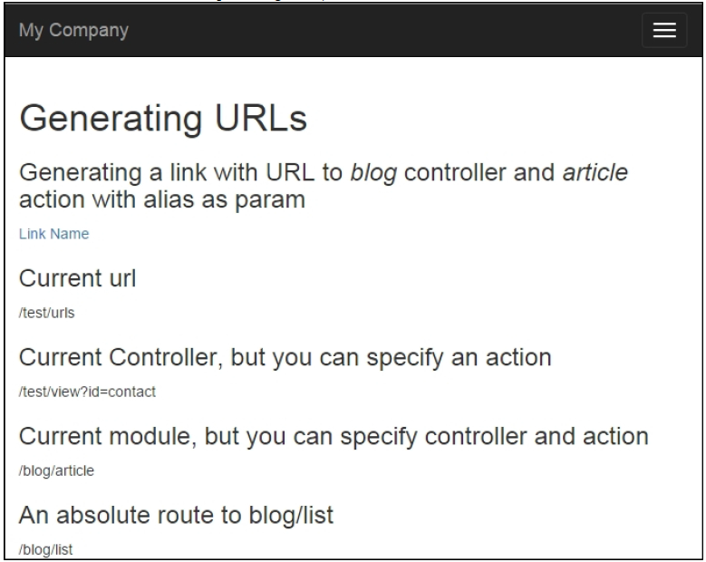

## 生成URLs

Yii不仅允许你将URL路由到不同的控制器动作上，而且可以通过执行一个正确的内部路由和它的参数来生成一个URL。这非常有用，因为在开发应用过程中，你可以将精力集中在内部路由上，只需要在上线前关注一下真实的URL。永远不要直接指定URL，并确保你使用了Yii URL工具集。它会允许你修改URL，而且不需要修改很多应用代码。

### 准备

1. 按照官方指南[http://www.yiiframework.com/doc-2.0/guide-start-installation.html](http://www.yiiframework.com/doc-2.0/guide-start-installation.html)的描述，使用Composer包管理器创建一个新的应用。
2. 找到`@app/config/web.php`文件，并替换规则数组：

```php
'urlManager' => array(
    'enablePrettyUrl' => true,
    'showScriptName' => false,
),
```

3. 配置你的应用服务器来使用干净的URL。如果你在使用带有`mod_rewrite`的Apache，并打开了`AllowOverride`，那么你就可以添加如下内容到`@app/web`文件夹下的`.htaccess`文件中：

```
Options +FollowSymLinks
IndexIgnore */*
RewriteEngine on
# if a directory or a file exists, use it directly
RewriteCond %{REQUEST_FILENAME} !-f
RewriteCond %{REQUEST_FILENAME} !-d
# otherwise forward it to index.php
RewriteRule . index.php
```

### 如何做...

1. 在`@app/controllers`目录中，使用如下代码创建`BlogController`：

```php
<?php
namespace app\controllers;
use yii\web\Controller;
class BlogController extends Controller
{
    public function actionIndex()
    {
        return $this->render('index');
    }
    public function actionRssFeed($param)
    {
        return $this->renderContent('This is RSS feed for our blog and ' . $param);
    }
    public function actionArticle($alias)
    {
        return $this->renderContent('This is an article with alias ' . $alias);
    }
    public function actionList()
    {
        return $this->renderContent('Blog\'s articles here');
    }
    public function actionHiTech()
    {
        return $this->renderContent('Just a test of action which contains more than one words in the name') ;
    }
}
```

这是我们的博客控制器，我们将会给它生成自定义URL。

2. 在`@app/controllers`文件夹中，使用如下代码创建`TestController`：

```php
<?php
namespace app\controllers;
use Yii;
use yii\web\Controller;
class TestController extends Controller
{
    public function actionUrls()
    {
        return $this->render('urls');
    }
}
```

3. 在`@app/views`文件夹中，创建`test`文件夹，以及`urls.php`视图文件，文件内容如下：

```php
<?php
use yii\helpers\Url;
use yii\helpers\Html;
?>
    <h1>Generating URLs</h1>
    <h3>Generating a link with URL to <i>blog</i> controller and
        <i>article</i> action with alias as param</h3>
<?= Html::a('Link Name', ['blog/article', 'alias' => 'someAlias']); ?>
    <h3>Current url</h3>
<?=Url::to('')?>
    <h3>Current Controller, but you can specify an action</h3>
<?=Url::toRoute(['view', 'id' => 'contact']);?>
    <h3>Current module, but you can specify controller and
        action</h3>
<?= Url::toRoute('blog/article')?>
    <h3>An absolute route to blog/list </h3>
<?= Url::toRoute('/blog/list')?>
    <h3> URL for <i>blog</i> controller and action <i>HiTech</i>
    </h3>
<?= Url::toRoute('blog/hi-tech')?>
    <h3>Canonical URL for current page</h3>
<?= Url::canonical()?>
<h3>Getting a home URL</h3>
<?= Url::home()?>
<h3>Saving a URL of the current page and getting it for
    re-use</h3>
<?php Url::remember()?>
<?=Url::previous()?>
<h3>Creating URL to <i>blog</i> controller and <i>rss-feed</i>
    action while URL helper isn't available</h3>
<?=Yii::$app->urlManager->createUrl(['blog/rss-feed', 'param' => 'someParam'])?>
<h3>Creating an absolute URL to <i>blog</i> controller and
    <i>rss-feed</i></h3>
<p>It's very useful for emails and console applications</p>
<?=Yii::$app->urlManager->createAbsoluteUrl(['blog/rss-feed', 'param' => 'someParam'])?>
```

4. 打开`http://yii-book.app/test/urls`你将会看到如下输出（参考先前代码中全部方法的列表）：



### 工作原理...

我们需要生成URL，指向`BlogController`的控制器动作（RssFeed, Article, List, HiTech）。

```php
<?= Html::a('Link Name', ['blog/article', 'alias' => 'someAlias']); ?>
```

依赖于我们需要的地方，有不同的方式可以做到这些，但是基础是一样的。下面列出一些生成URL的方法。

什么是内部路由？每一个控制器和它的动作有相应的路由。路由的格式是`moduleID/controllerID/actionID`。例如，`BlogController`的`actionHiTech`方法对应于`blog/hi-tech`路由。

为了获取控制器ID，你应该用它的不带`Controller`后缀的名称，并将它的首字母小写。为了获取一个动作ID，你应该用它的不带`action`前缀的方法名，同样将每个单词的首字母小写，并使用`-`符号分割（例如`actionHiTech`将会是`hi-tech`）。

`$_GET`变量做为参数会被传递给用内部路由指定的动作中。例如，如果我们想为`BlogController::actionArticle`创建一个URL，并将`$_GET['name']`传递给它，可以按如下方式进行：

```php
<?= Html::a('Link Name', ['blog/article', 'alias' => 'someAlias']); ?>
```

在你的应用内部，可以使用相对URL，绝对URL应该被用于指向你的网站（例如其它网站）外部，或者用于链接到能被外部访问的资源上（RSS feeds，email等等）。

你可以很容易的使用URL管理器。URL管理器是一个内置应用组件，名叫`urlManager`。你必须使用这个组件，它可以通过`Yii::$app->urlManager`从web和console被访问到。

当你不能获得一个控制器实例时，例如，当你实施一个控制台应用，你可以使用如下两个`urlManager`创建方法：

```php
<?=Yii::$app->urlManager->createUrl(['blog/rss-feed', 'param' => 'someParam'])?>
<?=Yii::$app->urlManager->createAbsoluteUrl(['blog/rss-feed','param' => 'someParam'])?>
```

### 更多...

欲了解更多信息，参考如下URL：

- [https://en.wikipedia.org/wiki/Canonical_link_element](https://en.wikipedia.org/wiki/Canonical_link_element)
- [http://www.yiiframework.com/doc-2.0/guide-structure-controllers.html](http://www.yiiframework.com/doc-2.0/guide-structure-controllers.html)
- [http://www.yiiframework.com/doc-2.0/guide-runtime-routing.html](http://www.yiiframework.com/doc-2.0/guide-runtime-routing.html)
- [http://www.yiiframework.com/doc-2.0/guide-helper-url.html](http://www.yiiframework.com/doc-2.0/guide-helper-url.html)
- [http://www.yiiframework.com/doc-2.0/yii-web-urlmanager.html](http://www.yiiframework.com/doc-2.0/yii-web-urlmanager.html)

### 参考

- *配置URL规则*小节