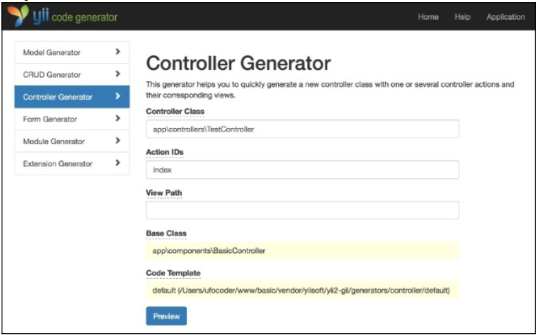

## 使用一个基础控制器

在许多框架中，通常会在指导中提出基础控制器的概念，它可以被其它控制器扩展。在Yii中，它不在指导中，因为你可以用其它多种方式很灵活的达到。但是，使用一个基础控制器是可能的，并且是有用的。

假设我们想添加添加一些控制器，它们只能被登录的用于访问。我们当然可以为每一个控制器单独设置一些限制，但是我们将会用一种更好的方式来做到它。

### 准备

按照官方指南[http://www.yiiframework.com/doc-2.0/guide-start-installation.html](http://www.yiiframework.com/doc-2.0/guide-start-installation.html)的描述，使用Composer包管理器创建一个新的应用。

### 如何做...

1. 首先，我们需要一个基础控制器，它只能被登录的用于使用。创建`@app/components/BaseController.php`，内容如下：

```php
<?php
namespace app\components;
use Yii;
use yii\web\Controller;
use yii\filters\AccessControl;
class BaseController extends Controller
{
    public function actions()
    {
        return [
            'error' => ['class' => 'yii\web\ErrorAction'],
        ];
    }
    public function behaviors()
    {
        return [
            'access' => [
                'class' => AccessControl::className(),
                'rules' => [
                    [
                        'allow' => true,
                        'actions' => 'error'
                    ],
                    [
                        'allow' => true,
                        'roles' => ['@'],
                    ],
                ],
            ]
        ];
    }
}
```

这个控制器有一个动作map，此外还有一个错误动作。

2. 现在，使用Gii创建`TestController`，但是将基础类设置为`app/components/BaseController`：



你将会得到类似如下的输出：

```php
<?php
namespace app\controllers;
class TestController extends \app\components\BaseController
{
    public function actionIndex()
    {
        return $this->render('index');
    }
}
```

3. 现在，你的`TestController`只能被登录用户访问，尽管我们没有在`TestController`控制器中做明确的说明。你可以在登出的时候通过访问`http://yii-book.app/index.php?r=test/index`来检查它。

### 工作原理...

这个把戏只是一个类继承。如果过滤器或者访问控制规则不在`TestController`，那么他们将会从`SecureController`中调用。

### 更多...

如果你需要继承基础控制器的方法，记住它不能被覆盖。例如，我们需要添加一个页面动作到控制器的动作map中：

```php
<?php
namespace app\controllers;
use yii\helpers\ArrayHelper;
use app\components\BaseController;
class TestController extends BaseController
{
    public function actions()
    {
        return ArrayHelper::merge(parent::actions(), [
            'page' => [
                'class' => 'yii\web\ViewAction',
            ],
        ]);
    }
    public function behaviors()
    {
        $behaviors = parent::behaviors();
        $rules = $behaviors['access']['rules'];
        $rules = ArrayHelper::merge(
            $rules,
            [
                [
                    'allow' => true,
                    'actions' => ['page']
                ]
            ]
        );
        $behaviors['access']['rules'] = $rules;
        return $behaviors;
    }
    public function actionIndex()
    {
        return $this->render('index');
    }
}
```

欲了解更多信息，参考[http://www.yiiframework.com/doc-2.0/yii-base-controller.html](http://www.yiiframework.com/doc-2.0/yii-base-controller.html)。