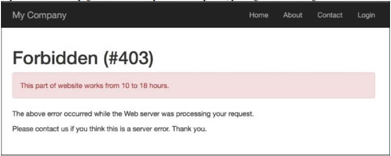

## 创建一个自定义过滤器

过滤器是一种对象，它会在控制器动作之前或者之后运行。例如，一个访问控制过滤器可能会在动作之前运行，确保它们只能被特殊的终端用户访问；一个内容压缩过滤器可能会在动作之后运行，用于在发送给终端用户之前压缩响应内容。

一个过滤器可能由一个前处理器（在动作之前执行）和/或一个后处理器（在动作之后执行）。过滤器本质上是一种特殊的行为。因此，使用过滤器和使用行为是一样的。

假设我们有一个web应用，它提供了一个用户界面，只在指定的小时内工作，例如从上午10点到下午6点。

### 准备

按照官方指南[http://www.yiiframework.com/doc-2.0/guide-start-installation.html](http://www.yiiframework.com/doc-2.0/guide-start-installation.html)的描述，使用Composer包管理器创建一个新的应用。

### 如何做...

1. 创建一个控制器`@app/controllers/TestController.php`：

```php
<?php
namespace app\controllers;
use app\components\CustomFilter;
use yii\helpers\Html;
use yii\web\Controller;
class TestController extends Controller
{
    public function behaviors()
    {
        return [
            'access' => [
                'class' => CustomFilter::className(),
            ],
        ];
    }
    public function actionIndex()
    {
        return $this->renderContent(Html::tag('h1',
            'This is a test content'
        ));
    }
}
```

2. 创建一个新的过滤器`@app/components/CustomFilter.php`：

```php
<?php
namespace app\components;
use Yii;
use yii\base\ActionFilter;
use yii\web\HttpException;
class CustomFilter extends ActionFilter
{
    const WORK_TIME_BEGIN = 10;
    const WORK_TIME_END = 18;
    protected function canBeDisplayed()
    {
        $hours = date('G');
        return $hours >= self::WORK_TIME_BEGIN && $hours <= self::WORK_TIME_END;
    }
    public function beforeAction($action)
    {
        if (!$this->canBeDisplayed())
        {
            $error = 'This part of website works from '
                . self::WORK_TIME_BEGIN . ' to '
                . self::WORK_TIME_END . ' hours.';
            throw new HttpException(403, $error);
        }
        return parent::beforeAction($action);
    }
    public function afterAction($action, $result)
    {
        if (Yii::$app->request->url == '/test/index') {
            Yii::trace("This is the index action");
        }
        return parent::afterAction($action, $result);
    }
}
```

3. 如果你在指定的时间之外访问页面，你将得到如下结果：



### 工作原理...

首先，我们添加一些代码到我们的控制器中，它实现了我们的自定义过滤器：

```php
public function behaviors()
{
return [
    'access' => [
        'class' => CustomFilter::className(),
    ],
];
}
```

默认情况下，过滤器会应用到控制器所有的动作上，但是我们可以指定哪些动作可以被应用，或者哪些动作不被应用。

你有两个动作——`beforeAction`和`afterAction`。第一个会在控制器动作执行之前运行，第二个会在之后运行。

在我们的简单的例子中，我们定义了一个条件，如果时间早于早上10点，不允许访问网站，并且在after方法中，我们只是运行了一个trace方法，如果当前路径是`test/index`的话。

你可以在debugger中看到这个结果，在`log`部分：


在真实的应用中，过滤器是比较复杂的，并且，Yii2提供了需要内置的过滤器，例如core、authentication、content negotiator，HTTP cache end等等。

### 参考

欲了解更多信息，参考[http://www.yiiframework.com/doc-2.0/guidestructure-filters.html](http://www.yiiframework.com/doc-2.0/guidestructure-filters.html)。