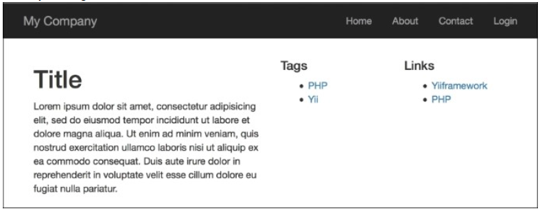

## 定义多个布局

大部分应用位所有的视图使用同一个布局。但是，有些情况需要使用多个布局。例如，一个应用在不同的页面上有不同的布局：博客有两个额外的列，文章有一个额外的列，归档没有额外的列。

### 准备

按照官方指南[http://www.yiiframework.com/doc-2.0/guide-start-installation.html](http://www.yiiframework.com/doc-2.0/guide-start-installation.html)的描述，使用Composer包管理器创建一个新的应用。

### 如何做...

1. 在`views/layouts`中创建两个布局：`blog`和`articles`。`blog`的代码如下：

```php
<?php $this->beginContent('//layouts/main')?>
    <div>
        <?= $content ?>
    </div>
    <div class="sidebar tags">
        <ul>
            <li><a href="#php">PHP</a></li>
            <li><a href="#yii">Yii</a></li>
        </ul>
    </div>
    <div class="sidebar links">
        <ul>
            <li><a href="http://yiiframework.com/">Yiiframework</a></li>
            <li><a href="http://php.net/">PHP</a></li>
        </ul>
    </div>
<?php $this->endContent()?>
```

2. `articles`的代码如下：

```php
<?php
/* @var $this yii\web\View */
?>
<?php $this->beginContent('@app/views/layouts/main.php'); ?>
    <div class="container">
        <div class="col-xs-8">
            <?= $content ?>
        </div>
        <div class="col-xs-4">
            <h4>Table of contents</h4>
            <ol>
                <li><a href="#intro">Introduction</a></li>
                <li><a href="#quick-start">Quick start</a></li>
                <li>..</li>
            </ol>
        </div>
    </div>
<?php $this->endContent() ?>
```

3. 创建一个视图文件`views/site/content.php`：

```htmlphp
<h1>Title</h1>
<p>Lorem ipsum dolor sit amet, consectetur adipisicing elit,
sed do eiusmod tempor incididunt ut labore et dolore magna
aliqua. Ut enim ad minim veniam, quis nostrud exercitation
ullamco laboris nisi ut aliquip ex ea commodo consequat. Duis
aute irure dolor in reprehenderit in voluptate velit esse
cillum dolore eu fugiat nulla pariatur.</p>
```

4. 创建三个控制器，名叫`BlogController`、`ArticleController`、`PortfolioController`，每一个都一个index动作。`controllers/BlogController.php`文件内容如下：

```php
<?php
namespace app\controllers;
use yii\web\Controller;
class BlogController extends Controller
{
    public $layout = 'blog';
    public function actionIndex()
    {
        return $this->render('//site/content');
    }
}
```

5. `controllers/ArticleController.php`文件的内容如下：

```php
<?php
namespace app\controllers;
use yii\web\Controller;
class ArticleController extends Controller
{
    public $layout = 'articles';
    public function actionIndex()
    {
        return $this->render('//site/content');
    }
}
```

6. `controllers/PortfolioController.php`文件的内容如下：

```php
<?php
namespace app\controllers;
use yii\web\Controller;
class PortfolioController extends Controller
{
    public function actionIndex()
    {
        return $this->render('//site/content');
    }
}
```

7. 尝试运行`http://yii-book.app/?r=blog/index`：



8. 尝试运行`http://yii-book.app/?r=article/index`：


9. 尝试运行`http://yii-book.app/?r=portfolio/index`：


### 工作原理...

我们为博客和文章定义了两个额外的布局。因为我们不想从主布局中拷贝和粘贴相同的部分，我们使用`$this->beginContent`和`$this->endContent`做额外的布局装饰器。

所以，我们使用一个在文章布局的内部渲染的视图，作为主布局的`$content`。

### 参考

- [http://www.yiiframework.com/doc-2.0/guide-structure-views.html#nested-layouts](http://www.yiiframework.com/doc-2.0/guide-structure-views.html#nested-layouts)提供了关于布局更多的细节
- *在一个视图中使用控制器上下文*小节
- *使用装饰器*小节