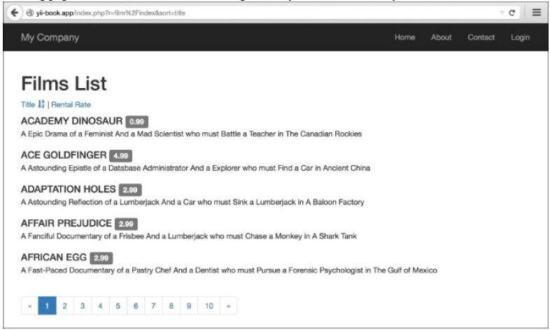

## 页码和数据排序

在最新的Yii发布版本中，焦点从直接使用Active Record移到了grids、lists和data providers。但是，有时直接使用Active Record是更好的。下面我们来看如果列出分好页的AR记录，并有能力对他们进行排序。在这部分中，我们将会创建电影的一个列表，并通过数据库中的一些属性对他们进行排序。在我们的例子中，我们将会通过电影标题和租用率对他们进行排序。

### 准备

1. 按照官方指南[http://www.yiiframework.com/doc-2.0/guide-start-installation.html](http://www.yiiframework.com/doc-2.0/guide-start-installation.html)的描述，使用Composer包管理器创建一个新的应用。
2. 从[http://dev.mysql.com/doc/index-other.html](http://dev.mysql.com/doc/index-other.html)下载Sakila数据库。
3. 执行下载的SQL：首先是schema，然后是数据。
4. 在`config/main.php`中配置DB连接，来使用Sakila数据库。
5. 使用Gii生成`Film`模型

### 如何做...

1. 首先，你需要创建`@app/controllers/FilmController.php`：

```php
<?php
namespace app\controllers;
use app\models\Film;
use yii\web\Controller;
use yii\data\Pagination;
use yii\data\Sort;
class FilmController extends Controller
{
    public function actionIndex()
    {
        $query = Film::find();
        $countQuery = clone $query;
        $pages = new Pagination(['totalCount' => $countQuery->count()]);
        $pages->pageSize = 5;
        $sort = new Sort([
            'attributes' => [
                'title',
                'rental_rate'
            ]
        ]);
        $models = $query->offset($pages->offset)
            ->limit($pages->limit)
            ->orderBy($sort->orders)
            ->all();
        return $this->render('index', [
            'models' => $models,
            'sort' => $sort,
            'pages' => $pages
        ]);
    }
}
```

2. 现在，让我们实现`@app/views/film/index.php`：

```php
<?php
use yii\widgets\LinkPager;
/**
 * @var \app\models\Film $models
 * @var \yii\web\View $this
 * @var \yii\data\Pagination $pages
 * @var \yii\data\Sort $sort
 */
?>
    <h1>Films List</h1>
    <p><?=$sort->link('title')?> |
        <?=$sort->link('rental_rate')?></p>
<?php foreach ($models as $model): ?>
    <div class="list-group">
        <h4 class="list-group-item-heading"> <?=$model->title ?>
            <label class="label label-default">
                <?=$model->rental_rate ?>
            </label>
        </h4>
        <p class="list-group-item-text"><?=$model->description
            ?></p>
    </div>
<?php endforeach ?>
<?=LinkPager::widget([
    'pagination' => $pages
]); ?>
```

3. 尝试访问`http://yii-book.app/index.php?r=film/index`。你应该能得到一个工作的分页，和允许通过电影标题和租用率排序的链接：



### 工作原理...

首先，我们得到了全部模型的数量，通过将这个数传递给`Pagination`实例的`totalCount`变量，初始化了新的分页组件实例。然后我们使用`$page->pageSize`字段为我们的分页设置每页的大小。然后，我们为这个模型创建了一个sorter实例，指定了我们希望用作排序的模型属性，并通过调用`orderBy`应用排序条件到查询，然后将其传递给`$sort->orders`做为一个参数。然后，我们调用了`all()`从DB中获取记录。

现在，我们有了模型的列表、页面以及被用于link pager的数据，以及我们用于生成排序连接的sorter。

在这个视图中，我们使用我们搜集的数据。首先，我们使用`Sort::link`生成链接。然后，我们列出模型。最后，使用*LinkPager*小组件，我们渲染了分页控制。

### 参考

访问如下地址，获取更多关于分页和排序的信息：

- [http://www.yiiframework.com/doc-2.0/yii-data-pagination.html](http://www.yiiframework.com/doc-2.0/yii-data-pagination.html)
- [http://www.yiiframework.com/doc-2.0/yii-data-sort.html](http://www.yiiframework.com/doc-2.0/yii-data-sort.html)
- [http://www.yiiframework.com/doc-2.0/guide-output-pagination.html](http://www.yiiframework.com/doc-2.0/guide-output-pagination.html)
- [http://www.yiiframework.com/doc-2.0/guide-output-sorting.html](http://www.yiiframework.com/doc-2.0/guide-output-sorting.html)