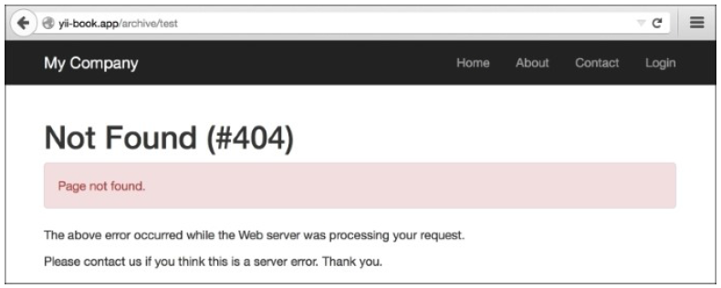
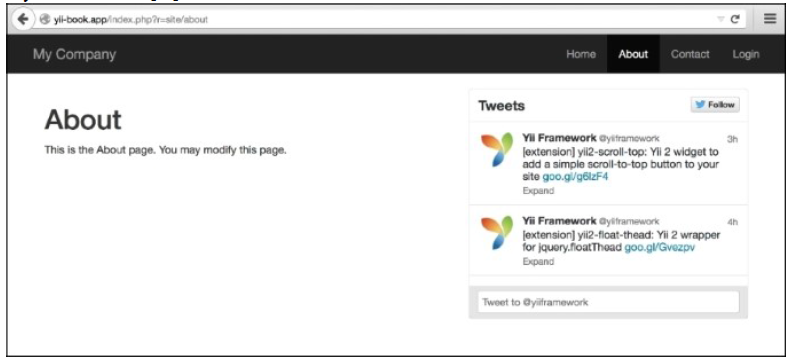
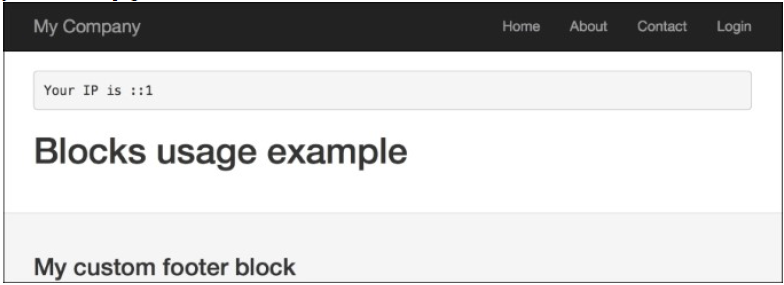
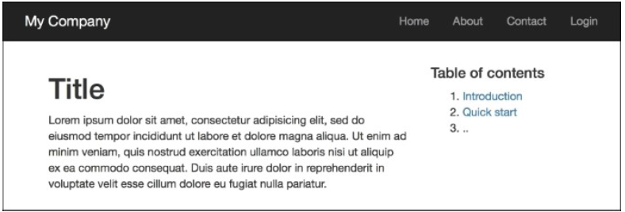

# 第二章 路由，控制器和视图

在本章中，我们将会讨论如下话题：

- 配置URL规则
- 生成URL
- 在URL规则中使用正则表达式
- 使用一个基础控制器
- 使用独立动作
- 创建一个自定义过滤器
- 展示静态页面
- 使用flash消息
- 在视图中使用控制器上下文
- 部分复用视图
- 使用blocks
- 使用装饰器
- 定义多个布局
- 翻页和数据排序

## 介绍

本章将会帮助你学习一些方便的东西：Yii URL路由，控制器和视图。你将能够使你的控制器和视图更加灵活。

## 配置URL规则

在本小节中，我们将会学习如何配置URL规则。在开始以前，我们创建一个应用。

### 准备

1. 按照官方指南[http://www.yiiframework.com/doc-2.0/guide-start-installation.html](http://www.yiiframework.com/doc-2.0/guide-start-installation.html)的描述，使用Composer包管理器创建一个新的应用。
2. 使用如下代码创建`@app/controllers/TestController.php`控制器：

```
<?php
namespace app\controllers;
use yii\helpers\Html;
use yii\web\Controller;
class TestController extends Controller
{
    public function actionIndex()
    {
        return $this->renderContent(Html::tag('h2',
            'Index action'
        ));
    }
    public function actionPage($alias)
    {
        return $this->renderContent(Html::tag('h2',
            'Page is '. Html::encode($alias)
        ));
    }
}
```

这就是我们即将做自定义URL的控制器。

3. 为了使用干净的URL，需要配置你的应用服务器。如果你在使用带有`mod_rewrite`的Apache，并打开了`AllowOverride`，那么你就可以添加如下内容到`@web`文件夹下的`.htaccess`文件中：

```
Options +FollowSymLinks
IndexIgnore */*
RewriteEngine on
# if a directory or a file exists, use it directly
RewriteCond %{REQUEST_FILENAME} !-f
RewriteCond %{REQUEST_FILENAME} !-d
# otherwise forward it to index.php
RewriteRule . index.php
```

### 如何做...

我们的网站将会在`/home`展示index页面，并且其它页面在`/page/<alias_ here>`。此外，`/about`应该定向到带有alias about的页面：

1. 在`@app/config/web.php`文件中添加`urlManager`组件：

```
'components' => [
    // ..
    'urlManager' => [
        'enablePrettyUrl' => true,
        'rules' => [
            'home' => 'test/index',
            '<alias:about>' => 'test/page',
            'page/<alias>' => 'test/page',
        ]
    ],
    // ..
],
```

保存过你的改动以后，你应该能浏览如下URL：

```
/home
/about
/page/about
/page/test
```

2. 尝试运行`/home` URL，你将会得到如下截图：


3. 尝试运行`/about`页面：


### 工作原理...

下面我们来回顾都做了些什么，以及是如何工作的。我们的第一条规则是：

```
'home' => 'test/index',
```

`test/index`是什么？在Yii应用中，每一个控制器和它的动作都有相应的内部路由。对于一个内部路由，它的格式是`moduleID/controllerID/actionID`。例如，`TestController`的`actionPage`方法对应的路由是`test/page`。所以，为了获取控制器ID，你应该用它的不带`Controller`后缀的名称，并将它的首字母小写。为了获取一个动作ID，你应该用它的不带`action`前缀的方法名，同样将其首字母小写。

现在，什么是home？为了以更好的方式理解它，我们需要知道，至少是表面上，当我们使用不同的URL访问我们的应用时，都发生了些什么。

当我们使用`/home`时，URL路由从上到下一个一个的检查我们的规则，尝试找到和输入URL匹配的规则。如果找到了，那么路由将会从一个分配给它的内部路由中获取到控制器和它的动作，并执行它。所以，`/home`是URL模式，它定义了URL将会被处理的规则。

### 更多...

你也可以使用一个特殊的语法创建参数化的规则。回顾一下第三条规则：

```
'page/<alias>' => test/page',
```

这里我们定义了一个alias参数，它应该在URL中`/page/`后边被指定。它可以是任何东西，并会被传递给`$alias`参数：

```
TestController::actionPage($alias)
```

你可以为这样一个参数定义一个模式。我们为第二条规则做同样的事情：

```
'<alias:about>' => test/page'
```

这里的alias应该匹配`about`，否则这条规则不能被应用。

### 参考

欲了解更多信息，参考如下地址：

- [http://www.yiiframework.com/doc-2.0/guide-runtime-routing.html](http://www.yiiframework.com/doc-2.0/guide-runtime-routing.html)
- [http://www.yiiframework.com/doc-2.0/guide-runtime-url-handling.html](http://www.yiiframework.com/doc-2.0/guide-runtime-url-handling.html)
- [http://www.yiiframework.com/doc-2.0/yii-web-urlmanager.html](http://www.yiiframework.com/doc-2.0/yii-web-urlmanager.html)
- *在URL规则中使用正则表达式*小节

## 生成URLs

Yii不仅允许你将URL路由到不同的控制器动作上，而且可以通过执行一个正确的内部路由和它的参数来生成一个URL。这非常有用，因为在开发应用过程中，你可以将精力集中在内部路由上，只需要在上线前关注一下真实的URL。永远不要直接指定URL，并确保你使用了Yii URL工具集。它会允许你修改URL，而且不需要修改很多应用代码。

### 准备

1. 按照官方指南[http://www.yiiframework.com/doc-2.0/guide-start-installation.html](http://www.yiiframework.com/doc-2.0/guide-start-installation.html)的描述，使用Composer包管理器创建一个新的应用。
2. 找到`@app/config/web.php`文件，并替换规则数组：

```
'urlManager' => array(
    'enablePrettyUrl' => true,
    'showScriptName' => false,
),
```

3. 配置你的应用服务器来使用干净的URL。如果你在使用带有`mod_rewrite`的Apache，并打开了`AllowOverride`，那么你就可以添加如下内容到`@app/web`文件夹下的`.htaccess`文件中：

```
Options +FollowSymLinks
IndexIgnore */*
RewriteEngine on
# if a directory or a file exists, use it directly
RewriteCond %{REQUEST_FILENAME} !-f
RewriteCond %{REQUEST_FILENAME} !-d
# otherwise forward it to index.php
RewriteRule . index.php
```

### 如何做...

1. 在`@app/controllers`目录中，使用如下代码创建`BlogController`：

```
<?php
namespace app\controllers;
use yii\web\Controller;
class BlogController extends Controller
{
    public function actionIndex()
    {
        return $this->render('index');
    }
    public function actionRssFeed($param)
    {
        return $this->renderContent('This is RSS feed for our blog and ' . $param);
    }
    public function actionArticle($alias)
    {
        return $this->renderContent('This is an article with alias ' . $alias);
    }
    public function actionList()
    {
        return $this->renderContent('Blog\'s articles here');
    }
    public function actionHiTech()
    {
        return $this->renderContent('Just a test of action which contains more than one words in the name') ;
    }
}
```

这是我们的博客控制器，我们将会给它生成自定义URL。

2. 在`@app/controllers`文件夹中，使用如下代码创建`TestController`：

```
<?php
namespace app\controllers;
use Yii;
use yii\web\Controller;
class TestController extends Controller
{
    public function actionUrls()
    {
        return $this->render('urls');
    }
}
```

3. 在`@app/views`文件夹中，创建`test`文件夹，以及`urls.php`视图文件，文件内容如下：

```
<?php
use yii\helpers\Url;
use yii\helpers\Html;
?>
    <h1>Generating URLs</h1>
    <h3>Generating a link with URL to <i>blog</i> controller and
        <i>article</i> action with alias as param</h3>
<?= Html::a('Link Name', ['blog/article', 'alias' => 'someAlias']); ?>
    <h3>Current url</h3>
<?=Url::to('')?>
    <h3>Current Controller, but you can specify an action</h3>
<?=Url::toRoute(['view', 'id' => 'contact']);?>
    <h3>Current module, but you can specify controller and
        action</h3>
<?= Url::toRoute('blog/article')?>
    <h3>An absolute route to blog/list </h3>
<?= Url::toRoute('/blog/list')?>
    <h3> URL for <i>blog</i> controller and action <i>HiTech</i>
    </h3>
<?= Url::toRoute('blog/hi-tech')?>
    <h3>Canonical URL for current page</h3>
<?= Url::canonical()?>
<h3>Getting a home URL</h3>
<?= Url::home()?>
<h3>Saving a URL of the current page and getting it for
    re-use</h3>
<?php Url::remember()?>
<?=Url::previous()?>
<h3>Creating URL to <i>blog</i> controller and <i>rss-feed</i>
    action while URL helper isn't available</h3>
<?=Yii::$app->urlManager->createUrl(['blog/rss-feed', 'param' => 'someParam'])?>
<h3>Creating an absolute URL to <i>blog</i> controller and
    <i>rss-feed</i></h3>
<p>It's very useful for emails and console applications</p>
<?=Yii::$app->urlManager->createAbsoluteUrl(['blog/rss-feed', 'param' => 'someParam'])?>
```

4. 打开`http://yii-book.app/test/urls`你将会看到如下输出（参考先前代码中全部方法的列表）：


### 工作原理...

我们需要生成URL，指向`BlogController`的控制器动作（RssFeed, Article, List, HiTech）。

```
<?= Html::a('Link Name', ['blog/article', 'alias' => 'someAlias']); ?>
```

依赖于我们需要的地方，有不同的方式可以做到这些，但是基础是一样的。下面列出一些生成URL的方法。

什么是内部路由？每一个控制器和它的动作有相应的路由。路由的格式是`moduleID/controllerID/actionID`。例如，`BlogController`的`actionHiTech`方法对应于`blog/hi-tech`路由。

为了获取控制器ID，你应该用它的不带`Controller`后缀的名称，并将它的首字母小写。为了获取一个动作ID，你应该用它的不带`action`前缀的方法名，同样将每个单词的首字母小写，并使用`-`符号分割（例如`actionHiTech`将会是`hi-tech`）。

`$_GET`变量做为参数会被传递给用内部路由指定的动作中。例如，如果我们想为`BlogController::actionArticle`创建一个URL，并将`$_GET['name']`传递给它，可以按如下方式进行：

```
<?= Html::a('Link Name', ['blog/article', 'alias' => 'someAlias']); ?>
```

在你的应用内部，可以使用相对URL，绝对URL应该被用于指向你的网站（例如其它网站）外部，或者用于链接到能被外部访问的资源上（RSS feeds，email等等）。

你可以很容易的使用URL管理器。URL管理器是一个内置应用组件，名叫`urlManager`。你必须使用这个组件，它可以通过`Yii::$app->urlManager`从web和console被访问到。

当你不能获得一个控制器实例时，例如，当你实施一个控制台应用，你可以使用如下两个`urlManager`创建方法：

```
<?=Yii::$app->urlManager->createUrl(['blog/rss-feed', 'param' => 'someParam'])?>
<?=Yii::$app->urlManager->createAbsoluteUrl(['blog/rss-feed','param' => 'someParam'])?>
```

### 更多...

欲了解更多信息，参考如下URL：

- [https://en.wikipedia.org/wiki/Canonical_link_element](https://en.wikipedia.org/wiki/Canonical_link_element)
- [http://www.yiiframework.com/doc-2.0/guide-structure-controllers.html](http://www.yiiframework.com/doc-2.0/guide-structure-controllers.html)
- [http://www.yiiframework.com/doc-2.0/guide-runtime-routing.html](http://www.yiiframework.com/doc-2.0/guide-runtime-routing.html)
- [http://www.yiiframework.com/doc-2.0/guide-helper-url.html](http://www.yiiframework.com/doc-2.0/guide-helper-url.html)
- [http://www.yiiframework.com/doc-2.0/yii-web-urlmanager.html](http://www.yiiframework.com/doc-2.0/yii-web-urlmanager.html)

### 参考

- *配置URL规则*小节

## 在URL规则中使用正则表达式

Yii URL路由器的一个隐藏特性是，你可以使用正则表达式来处理地址。

### 准备

1. 按照官方指南[http://www.yiiframework.com/doc-2.0/guide-start-installation.html](http://www.yiiframework.com/doc-2.0/guide-start-installation.html)的描述，使用Composer包管理器创建一个新的应用。
2. 在你的`@app/controllers`文件夹中，使用如下代码创建`PostController.php`：

```
<?php
namespace app\controllers;
use yii\helpers\Html;
use yii\web\Controller;
class PostController extends Controller
{
    public function actionView($alias)
    {
        return $this->renderContent(Html::tag('h2', 'Showing post with alias ' . Html::encode($alias)
        ));
    }
    public function actionIndex($type = 'posts', $order = 'DESC')
    {
        return $this->renderContent(Html::tag('h2', 'Showing ' . Html::encode($type) . ' ordered ' . Html::encode($order)));
    }
    public function actionHello($name)
    {
        return $this->renderContent(Html::tag('h2', 'Hello, ' . Html::encode($name) . '!'));
    }
}
```

这是我们的应用控制器，我们将会使用自定义URL来方法它。

3. 配置你的应用服务器，来使用干净的URL。如果你在使用带有`mod_rewrite`的Apache，并打开了`AllowOverride`，那么你就可以添加如下内容到`@web`文件夹下的`.htaccess`文件中：

```
Options +FollowSymLinks
IndexIgnore */*
RewriteEngine on
# if a directory or a file exists, use it directly
RewriteCond %{REQUEST_FILENAME} !-f
RewriteCond %{REQUEST_FILENAME} !-d
# otherwise forward it to index.php
RewriteRule . index.php
```

### 如何做...

我们希望我们的`PostController`动作根据一些指定的规则接受参数，并将其它所有不匹配的参数给以`404 not found`的HTTP响应。此外，`post/index`应该有一个alias URL archive。

添加如下`urlManager`组件配置到`@app/config/web.php`：

```
'components' => [
    // ..
    'urlManager' => [
        'enablePrettyUrl' => true,
        'rules' => [
            'post/<alias:[-a-z]+>' => 'post/view',
            '<type:(archive|posts)>' => 'post/index',
            '<type:(archive|posts)>/<order:(DESC|ASC)>' => 'post/index',
            'sayhello/<name>' => 'post/hello',
        ]
    ],
    // ..
],
```

如下URL将会成功：

- `http://yii-book.app/post/test`
- `http://yii-book.app/posts`
- `http://yii-book.app/archive`
- `http://yii-book.app/posts/ASC`
- `http://yii-book.app/sayhello`

如下URL将会失败：

- `http://yii-book.app/archive/test`
- `http://yii-book.app/post/another_post`

下面的截图展示了`http://yii-book.app/post/test`运行是成功的：


下面的截图展示了`http://yii-book.app/archive`也可以运行成功：


下面的截图展示`http://yii-book.app/archive/test`没有运行成功，并有一个报错：



### 工作原理...

你可以在参数定义和规则的其它部分使用正则表达式。下面我们一条一条的看这些规则：

```
'post/<alias:[-a-z]+>' => 'post/view',
```

alias参数应该包含一个或多个英文单词或者一个`-`。其它符号不被允许。

```
'(posts|archive)' => 'post/index',
'(posts|archive)/<order:(DESC|ASC)>' => 'post/index',
```

`posts`和`archive`都会指向`post/index`。`order`参数只接受两个值——`DESC`和`ASC`：

```
'sayhello/<name>' => 'post/hello',
```

你应该指定名称部分，但是没有对可以使用的单词做限制。注意到不管使用的规则是什么，开发者不应该假设输入的数据是安全的。


### 更多...

欲了解更多关于正则表达式的信息，你可以使用如下资源：

- [http://www.php.net/manual/en/reference.pcre.pattern.syntax.php](http://www.php.net/manual/en/reference.pcre.pattern.syntax.php)
- [http://regex.info/](http://regex.info/)提供的*掌握正则表达式，Jeffrey Friedl*

### 参考

- *配置URL规则*小节

## 使用一个基础控制器

在许多框架中，通常会在指导中提出基础控制器的概念，它可以被其它控制器扩展。在Yii中，它不在指导中，因为你可以用其它多种方式很灵活的达到。但是，使用一个基础控制器是可能的，并且是有用的。

假设我们想添加添加一些控制器，它们只能被登录的用于访问。我们当然可以为每一个控制器单独设置一些限制，但是我们将会用一种更好的方式来做到它。

### 准备

按照官方指南[http://www.yiiframework.com/doc-2.0/guide-start-installation.html](http://www.yiiframework.com/doc-2.0/guide-start-installation.html)的描述，使用Composer包管理器创建一个新的应用。

### 如何做...

1. 首先，我们需要一个基础控制器，它只能被登录的用于使用。创建`@app/components/BaseController.php`，内容如下：

```
<?php
namespace app\components;
use Yii;
use yii\web\Controller;
use yii\filters\AccessControl;
class BaseController extends Controller
{
    public function actions()
    {
        return [
            'error' => ['class' => 'yii\web\ErrorAction'],
        ];
    }
    public function behaviors()
    {
        return [
            'access' => [
                'class' => AccessControl::className(),
                'rules' => [
                    [
                        'allow' => true,
                        'actions' => 'error'
                    ],
                    [
                        'allow' => true,
                        'roles' => ['@'],
                    ],
                ],
            ]
        ];
    }
}
```

这个控制器有一个动作map，此外还有一个错误动作。

2. 现在，使用Gii创建`TestController`，但是将基础类设置为`app/components/BaseController`：


你将会得到类似如下的输出：

```
<?php
namespace app\controllers;
class TestController extends \app\components\BaseController
{
    public function actionIndex()
    {
        return $this->render('index');
    }
}
```

3. 现在，你的`TestController`只能被登录用户访问，尽管我们没有在`TestController`控制器中做明确的说明。你可以在登出的时候通过访问`http://yii-book.app/index.php?r=test/index`来检查它。

### 工作原理...

这个把戏只是一个类继承。如果过滤器或者访问控制规则不在`TestController`，那么他们将会从`SecureController`中调用。

### 更多...

如果你需要继承基础控制器的方法，记住它不能被覆盖。例如，我们需要添加一个页面动作到控制器的动作map中：

```
<?php
namespace app\controllers;
use yii\helpers\ArrayHelper;
use app\components\BaseController;
class TestController extends BaseController
{
    public function actions()
    {
        return ArrayHelper::merge(parent::actions(), [
            'page' => [
                'class' => 'yii\web\ViewAction',
            ],
        ]);
    }
    public function behaviors()
    {
        $behaviors = parent::behaviors();
        $rules = $behaviors['access']['rules'];
        $rules = ArrayHelper::merge(
            $rules,
            [
                [
                    'allow' => true,
                    'actions' => ['page']
                ]
            ]
        );
        $behaviors['access']['rules'] = $rules;
        return $behaviors;
    }
    public function actionIndex()
    {
        return $this->render('index');
    }
}
```

欲了解更多信息，参考[http://www.yiiframework.com/doc-2.0/yii-base-controller.html](http://www.yiiframework.com/doc-2.0/yii-base-controller.html)。

## 使用独立动作

在Yii中，你可以定义控制器动作作为独立的类，然后连接它们到你的控制器上。这将会帮助你复用一些常用功能。

例如，你可以为自动完成字段移动后端到一个动作中并保存，而不需要再次一遍一遍的写。

另外一个例子是，我们可以创建所有的CRUD操作作为分开的独立动作。我们将会写、创建、查看和删除模型的动作，并查看模型的操作列表。

### 准备

1. 按照官方指南[http://www.yiiframework.com/doc-2.0/guide-start-installation.html](http://www.yiiframework.com/doc-2.0/guide-start-installation.html)的描述，使用Composer包管理器创建一个新的应用。
2. 创建`post`表。使用如下命令创建migration：

```
./yii migrate/create create_post_table
```

3. 更新刚刚创建的migration的方法和导出的类列表：

```
<?php
use yii\db\Schema;
use yii\db\Migration;
class m150719_152435_create_post_table extends Migration
{
    const TABLE_NAME = '{{%post}}';
    public function up()
    {
        $tableOptions = null;
        if ($this->db->driverName === 'mysql') {
            $tableOptions = 'CHARACTER SET utf8 COLLATE utf8_general_ci ENGINE=InnoDB';
        }
        $this->createTable(self::TABLE_NAME, [
            'id' => Schema::TYPE_PK,
            'title' => Schema::TYPE_STRING.'(255) NOT NULL',
            'content' => Schema::TYPE_TEXT.' NOT NULL',
        ], $tableOptions);
        for ($i = 1; $i < 7; $i++) {
            $this->insert(self::TABLE_NAME, [
                'title' => 'Test article #'.$i,
                'content' => 'Lorem ipsum dolor sit amet, consectetur adipiscing elit. '
                    .'Sed sit amet mauris est. Sed at dignissim dui. '
                    .'Phasellus arcu massa, facilisis a fringilla sit amet, '
                    .'rhoncus ut enim.',
            ]);
        }
    }
    public function down()
    {
        $this->dropTable(self::TABLE_NAME);
    }
}
```

4. 使用如下命名安装所有的migration：

```
./yii migrate up
```

5. 使用Gii创建`Post`。

### 如何做...

1. 创建独立动作`@app/actions/CreateAction.php`：

```
<?php
namespace app\actions;
use Yii;
use yii\base\Action;
class CreateAction extends Action
{
    public $modelClass;
    public function run()
    {
        $model = new $this->modelClass();
        if ($model->load(Yii::$app->request->post()) && $model->save()) {
            $this->controller->redirect(['view', 'id' => $model->getPrimaryKey()]);
        } else {
            return $this->controller->render('//crud/create', [
                'model' => $model
            ]);
        }
    }
}
```

2. 创建独立动作`@app/actions/DeleteAction.php`：

```
<?php
namespace app\actions;
use yii\base\Action;
use yii\web\NotFoundHttpException;
class DeleteAction extends Action
{
    public $modelClass;
    public function run($id)
    {
        $class = $this->modelClass;
        if (($model = $class::findOne($id)) === null) {
            throw new NotFoundHttpException('The requested page does not exist.');
        }
        $model->delete();
        return $this->controller->redirect(['index']);
    }
}
```

3. 创建独立动作`@app/actions/IndexAction.php`：

```
<?php
namespace app\actions;
use yii\base\Action;
use yii\data\Pagination;
class IndexAction extends Action
{
    public $modelClass;
    public $pageSize = 3;
    public function run()
    {
        $class = $this->modelClass;
        $query = $class::find();
        $countQuery = clone $query;
        $pages = new Pagination([
            'totalCount' => $countQuery->count(),
        ]);
        $pages->setPageSize($this->pageSize);
        $models = $query->offset($pages->offset)
            ->limit($pages->limit)
            ->all();
        return $this->controller->render('//crud/index', [
            'pages' => $pages,
            'models' => $models
        ]);
    }
}
```

4. 创建独立动作`@app/actions/ViewAction.php`：

```
<?php
namespace app\actions;
use yii\base\Action;
use yii\web\NotFoundHttpException;
class ViewAction extends Action
{
    public $modelClass;
    public function run($id)
    {
        $class = $this->modelClass;
        if (($model = $class::findOne($id)) === null) {
            throw new NotFoundHttpException('The requested page does not exist.');
        }
        return $this->controller->render('//crud/view', [
            'model' => $model
        ]);
    }
}
```

5. 创建视图文件`@app/views/crud/create.php`：

```
<?php
use yii\helpers\Html;
use yii\widgets\ActiveForm;
/*
* @var yii\web\View $this
*/
?>
    <h1><?= Yii::t('app', 'Create post'); ?></h1>
<?php $form = ActiveForm::begin();?>
<?php $form->errorSummary($model); ?>
<?= $form->field($model, 'title')->textInput() ?>
<?= $form->field($model, 'content')->textarea() ?>
<?= Html::submitButton(Yii::t('app', 'Create'), ['class' =>
    'btn btn-primary']) ?>
<?php ActiveForm::end(); ?>
```

6. 创建视图文件`@app/views/crud/index.php`：

```
<?php
use yii\widgets\LinkPager;
use yii\helpers\Html;
use yii\helpers\Url;
/*
* @var yii\web\View $this
* @var yii\data\Pagination $pages
* @var array $models
*/
?>
<h1>Posts</h1>
<?= Html::a('+ Create a post', Url::toRoute('post/create')); ?>
<?php foreach ($models as $model):?>
<h3><?= Html::encode($model->title);?></h3>
<p><?= Html::encode($model->content);?></p>
    <p>
        <?= Html::a('view', Url::toRoute(['post/view', 'id' =>
            $model->id]));?> |
        <?= Html::a('delete', Url::toRoute(['post/delete', 'id'
        => $model->id]));?>
    </p>
<?php endforeach; ?>
<?= LinkPager::widget([
    'pagination' => $pages,
]); ?>
```

7. 创建视图文件`@app/views/crud/view.php`：

```
<?php
use yii\helpers\Html;
use yii\helpers\Url;
/*
* @var yii\web\View $this
* @var app\models\Post $model
*/
?>
<p><?= Html::a('< back to posts', Url::toRoute('post/index'));
    ?></p>
<h2><?= Html::encode($model->title);?></h2>
<p><?= Html::encode($model->content);?></p>
```

为了使用独立动作，我们在动作map中通过复写动作方法定义它。

8. 运行`post/index`：


### 工作原理...

每一个控制器可以从独立中创建，

### 参考

## 创建一个自定义过滤器

### 准备

### 如何做...

```
<?php
namespace app\controllers;
use app\components\CustomFilter;
use yii\helpers\Html;
use yii\web\Controller;
class TestController extends Controller
{
    public function behaviors()
    {
        return [
            'access' => [
                'class' => CustomFilter::className(),
            ],
        ];
    }
    public function actionIndex()
    {
        return $this->renderContent(Html::tag('h1',
            'This is a test content'
        ));
    }
}
```


```
<?php
namespace app\components;
use Yii;
use yii\base\ActionFilter;
use yii\web\HttpException;
class CustomFilter extends ActionFilter
{
    const WORK_TIME_BEGIN = 10;
    const WORK_TIME_END = 18;
    protected function canBeDisplayed()
    {
        $hours = date('G');
        return $hours >= self::WORK_TIME_BEGIN && $hours <= self::WORK_TIME_END;
    }
    public function beforeAction($action)
    {
        if (!$this->canBeDisplayed())
        {
            $error = 'This part of website works from '
                . self::WORK_TIME_BEGIN . ' to '
                . self::WORK_TIME_END . ' hours.';
            throw new HttpException(403, $error);
        }
        return parent::beforeAction($action);
    }
    public function afterAction($action, $result)
    {
        if (Yii::$app->request->url == '/test/index') {
            Yii::trace("This is the index action");
        }
        return parent::afterAction($action, $result);
    }
}
```


### 工作原理...

```
public function behaviors()
{
return [
    'access' => [
        'class' => CustomFilter::className(),
    ],
];
}
```


### 参考

## 展示静态页面

### 准备

### 如何做...


```
<?php
namespace app\controllers;
use yii\web\Controller;
class TestController extends Controller
{
    public function actions()
    {
        return [
            'page' => [
                'class' => 'yii\web\ViewAction',
            ]
        ];
    }
}
```


```
<h1>Index</h1>
content of index file
Contact.php content is:
<h2>Contacts</h2>
<p>Our contact: contact@localhost</p>
```


### 工作原理...


### 更多...


#### 关于ViewAction

#### 配置URL规则

```
'<view:about>' => 'test/page'
```


### 参考

## 使用flash消息

### 准备

### 如何做...

```
<?php
namespace app\controllers;
use Yii;
use yii\web\Controller;
use yii\filters\AccessControl;
class TestController extends Controller
{
    public function behaviors()
    {
        return [
            'access' => [
                'class' => AccessControl::className(),
                'rules' => [
                    [
                        'allow' => true,
                        'roles' => ['@'],
                        'actions' => ['user']
                    ],
                    [
                        'allow' => true,
                        'roles' => ['?'],
                        'actions' => ['index', 'success',
                            'error']
                    ],
                ],
                'denyCallback' => function ($rule, $action) {
                    Yii::$app->session->setFlash('error',
                        'This section is only for registered users.');
                    $this->redirect(['index']);
                },
            ],
        ];
    }
    public function actionUser()
    {
        return $this->renderContent('user');
    }
    public function actionSuccess()
    {
        Yii::$app->session->setFlash('success', 'Everything went fine!');
        $this->redirect(['index']);
    }
    public function actionError()
    {
        Yii::$app->session->setFlash('error', 'Everything went wrong!');
        $this->redirect(['index']);
    }
    public function actionIndex()
    {
        return $this->render('index');
    }
}
```


```
<?php
use yii\bootstrap\Alert;
?>
<?php if (Yii::$app->session->hasFlash('success')):?>
    <?= Alert::widget([
        'options' => ['class' => 'alert-success'],
        'body' => Yii::$app->session->getFlash('success'),
    ]);?>
<?php endif ?>
<?php if (Yii::$app->session->hasFlash('error')) :?>
    <?= Alert::widget([
        'options' => ['class' => 'alert-danger'],
        'body' => Yii::$app->session->getFlash('error'),
    ]);?>
<?php endif; ?>
```


```
<?php
/* @var $this yii\web\View */
?>
<?= $this->render('//common/alert') ?>
<h2>Guest page</h2>
<p>There's a content of guest page</p>
```


```
<?php
/* @var $this yii\web\View */
?>
<?= $this->render('//common/alert') ?>
<h2>User page</h2>
<p>There's a content of user page</p>
```


### 工作原理...

### 更多...

#### getAllFlashes()方法

```
$flashes = Yii::$app->session->getAllFlashes();
<?php foreach ($flashes as $key => $message): ?>
<?= Alert::widget([
    'options' => ['class' => 'alert-info'],
    'body' => $message,
]);
?>
<?php endforeach; ?>
```

#### removeAllFlashes()方法

```
Yii::$app->session->removeAllFlashes();
```

#### removeFlash()方法

```
Yii::$app->session->removeFlash('success');
```


### 参考

## 在一个视图中使用控制器上下文

### 准备

### 如何做...


```
<?php
namespace app\controllers;
use yii\web\Controller;
class ViewController extends Controller
{
    public $pageTitle;
    public function actionIndex()
    {
        $this->pageTitle = 'Controller context test';
        return $this->render('index');
    }
    public function hello()
    {
        if (!empty($_GET['name'])) {
            echo 'Hello, ' . $_GET['name'] . '!';
        }
    }
}
```


```
<h1><?= $this->context->pageTitle ?></h1>
<p>Hello call. <?php $this->context->hello() ?></p>
```


### 工作原理...


### 更多...

## 部分复用视图

### 准备

### 如何做...

```
<?php
namespace app\controllers;
use yii\web\Controller;
class BlogController extends Controller
{
    public function actionIndex()
    {
        $posts = [
            [
                'title' => 'First post',
                'content' => 'There\'s an example of reusing views with partials.',
            ],
            [
                'title' => 'Second post',
                'content' => 'We use twitter widget.'
            ],
        ];
        return $this->render('index', [
            'posts' => $posts
        ]);
    }
}
```


```
<?php
/* @var $this \yii\web\View */
/* @var $widget_id integer */
/* @var $screen_name string */
?>
    <script>!function(d,s,id){var
            js,fjs=d.getElementsByTagName(s)[0],p=/^http:/.test(d.location)?
                'http':'https';if(!d.getElementById(id)){js=d.createElement(s);j
            s.id=id;js.src=p+"://platform.twitter.com/
            widgets.js";fjs.parentNode.insertBefore(js,fjs);}}(document,"scr
            ipt","twitter-wjs");</script>
<?php if ($widget_id && $screen_name): ?>
    <a class="twitter-timeline"
       data-widget-id="<?= $widget_id?>"
       href="https://twitter.com/<?= $screen_name?>"
       height="300">
        Tweets by @<?= $screen_name?>
    </a>
<?php endif;?>
```


```
<?php
/* @var $category string */
/* @var $posts array */
/* @var $this \yii\web\View */
?>
<div class="row">
    <div class="col-xs-7">
        <h1>Posts</h1>
        <hr>
        <?php foreach ($posts as $post): ?>
            <h3><?= $post['title']?></h3>
            <p><?= $post['content']?></p>
        <?php endforeach;?>
    </div>
    <div class="col-xs-5">
        <?= $this->render('//common/twitter', [
            'widget_id' => '620531418213576704',
            'screen_name' => 'php_net',
        ]);?>
    </div>
</div>
```


```
<?php
use yii\helpers\Html;
/* @var $this yii\web\View */
$this->title = 'About';
?>
<div class="col-xs-7">
    <h1><?= Html::encode($this->title) ?></h1>
    <p>
        This is the About page. You may modify this page.
    </p>
</div>
<div class="col-xs-5">
    <?= $this->render('//common/twitter', [
        'widget_id' => '620526086343012352',
        'screen_name' => 'yiiframework'
    ]);?>
</div>
```





### 工作原理...


### 更多...

## 使用blocks

### 准备

### 如何做...


```
<?php if(!empty($this->blocks['beforeContent'])) echo $this->blocks['beforeContent']; ?>
```


```
<footer class="footer">
    <div class="container">
        <?php if (!empty($this->blocks['footer'])):
            echo $this->blocks['footer'] ?>
        <?php else: ?>
            <p class="pull-left">&copy; My Company <?= date('Y') ?></p>
            <p class="pull-right"><?= Yii::powered() ?></p>
        <?php endif; ?>
    </div>
</footer>
```


```
public function actionBlocks()
{
    return $this->render('blocks');
}
```


```
<?php
use \yii\Helpers\Html;
/* @var $this \yii\web\View */
?>
<?php $this->beginBlock('beforeContent');
echo Html::tag('pre', 'Your IP is ' . Yii::$app->request->userIP);
$this->endBlock(); ?>
<?php $this->beginBlock('footer');
echo Html::tag('h3', 'My custom footer block');
$this->endBlock(); ?>
<h1>Blocks usage example</h1>
```



### 工作原理...

### 更多...

## 使用装饰器

### 准备

### 如何做...

```
<div class="quote">
    <h2>&ldquo;<?= $content?>&rdquo;, <?= $author?></h2>
</div>
```


```
<?php
use yii\widgets\ContentDecorator;
/* @var */
?>
<?php ContentDecorator::begin([
        'viewFile' => '@app/views/decorators/quote.php',
        'view' => $this,
        'params' => ['author' => 'S. Freud']
    ]
);?>
    Time spent with cats is never wasted.
<?php ContentDecorator::end();?>
```


### 工作原理...

### 参考

## 定义多个布局

### 准备

### 如何做...


```
<?php $this->beginContent('//layouts/main')?>
    <div>
        <?= $content ?>
    </div>
    <div class="sidebar tags">
        <ul>
            <li><a href="#php">PHP</a></li>
            <li><a href="#yii">Yii</a></li>
        </ul>
    </div>
    <div class="sidebar links">
        <ul>
            <li><a href="http://yiiframework.com/">
                    Yiiframework</a></li>
            <li><a href="http://php.net/">PHP</a></li>
        </ul>
    </div>
<?php $this->endContent()?>
```

```
<?php
/* @var $this yii\web\View */
?>
<?php $this->beginContent('@app/views/layouts/main.php'); ?>
    <div class="container">
        <div class="col-xs-8">
            <?= $content ?>
        </div>
        <div class="col-xs-4">
            <h4>Table of contents</h4>
            <ol>
                <li><a href="#intro">Introduction</a></li>
                <li><a href="#quick-start">Quick start</a></li>
                <li>..</li>
            </ol>
        </div>
    </div>
<?php $this->endContent() ?>
```

```
<h1>Title</h1>
<p>Lorem ipsum dolor sit amet, consectetur adipisicing elit,
sed do eiusmod tempor incididunt ut labore et dolore magna
aliqua. Ut enim ad minim veniam, quis nostrud exercitation
ullamco laboris nisi ut aliquip ex ea commodo consequat. Duis
aute irure dolor in reprehenderit in voluptate velit esse
cillum dolore eu fugiat nulla pariatur.</p>
```


```
<?php
namespace app\controllers;
use yii\web\Controller;
class BlogController extends Controller
{
    public $layout = 'blog';
    public function actionIndex()
    {
        return $this->render('//site/content');
    }
}
```


```
<?php
namespace app\controllers;
use yii\web\Controller;
class ArticleController extends Controller
{
    public $layout = 'articles';
    public function actionIndex()
    {
        return $this->render('//site/content');
    }
}
```


```
<?php
namespace app\controllers;
use yii\web\Controller;
class PortfolioController extends Controller
{
    public function actionIndex()
    {
        return $this->render('//site/content');
    }
}
```





### 工作原理...

### 参考

## 页码和数据排序

### 准备

### 如何做...


```
<?php
namespace app\controllers;
use app\models\Film;
use yii\web\Controller;
use yii\data\Pagination;
use yii\data\Sort;
class FilmController extends Controller
{
    public function actionIndex()
    {
        $query = Film::find();
        $countQuery = clone $query;
        $pages = new Pagination(['totalCount' => $countQuery->count()]);
        $pages->pageSize = 5;
        $sort = new Sort([
            'attributes' => [
                'title',
                'rental_rate'
            ]
        ]);
        $models = $query->offset($pages->offset)
            ->limit($pages->limit)
            ->orderBy($sort->orders)
            ->all();
        return $this->render('index', [
            'models' => $models,
            'sort' => $sort,
            'pages' => $pages
        ]);
    }
}
```


```
<?php
use yii\widgets\LinkPager;
/**
 * @var \app\models\Film $models
 * @var \yii\web\View $this
 * @var \yii\data\Pagination $pages
 * @var \yii\data\Sort $sort
 */
?>
    <h1>Films List</h1>
    <p><?=$sort->link('title')?> |
        <?=$sort->link('rental_rate')?></p>
<?php foreach ($models as $model): ?>
    <div class="list-group">
        <h4 class="list-group-item-heading"> <?=$model->title ?>
            <label class="label label-default">
                <?=$model->rental_rate ?>
            </label>
        </h4>
        <p class="list-group-item-text"><?=$model->description
            ?></p>
    </div>
<?php endforeach ?>
<?=LinkPager::widget([
    'pagination' => $pages
]); ?>
```


### 工作原理...

### 参考


