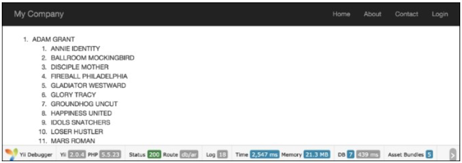

## 从数据库中获取数据

今天大多数应用都在使用数据库。不论是一个小网站，还是一个大型社交网站，至少其中一部分功能是由数据库驱动的。

Yii引入了三种方法来允许你使用数据库。他们是：

- Active Record
- Query Builder
- SQL via DAO

我们将使用这三种方法从`film`、`film_actor`、`actor`表中获取数据，并将他们展示在一个列表中。同时，我们将会比较它们的执行时间和内存占用情况，来决定这些方法的使用场景。

### 准备

1. 按照官方指南[http://www.yiiframework.com/doc-2.0/guide-start-installation.html](http://www.yiiframework.com/doc-2.0/guide-start-installation.html)的描述，使用Composer包管理器创建一个新的应用。
2. 从[http://dev.mysql.com/doc/index-other.html](http://dev.mysql.com/doc/index-other.html)下载Sakila数据库。
3. 执行下载好的SQLs；首先是schema，然后是数据。
4. 在`config/main.php`中配置数据库连接，使用Sakila数据库。
5. 使用Gii为actor和film表创建模型。

### 如何做...

1. 创建`app/controllers/DbController.php`：

```php
<?php
namespace app\controllers;
use app\models\Actor;
use Yii;
use yii\db\Query;
use yii\helpers\ArrayHelper;
use yii\helpers\Html;
use yii\web\Controller;
/**
 * Class DbController
 * @package app\controllers
 */
class DbController extends Controller
{
/**
 * Example of Active Record usage.
 *
 * @return string
 */
    public function actionAr()
    {
        $records = Actor::find()
            ->joinWith('films')
            ->orderBy('actor.first_name,
actor.last_name, film.title')
            ->all();
        return $this->renderRecords($records);
    }
    /**
     * Example of Query class usage.
     *
     * @return string
     */
    public function actionQuery()
    {
        $rows = (new Query())
            ->from('actor')
            ->innerJoin('film_actor',
                'actor.actor_id=film_actor.actor_id')
            ->leftJoin('film',
                'film.film_id=film_actor.film_id')
            ->orderBy('actor.first_name, actor.last_name,
actor.actor_id, film.title')
            ->all();
        return $this->renderRows($rows);
    }
    /**
     * Example of SQL execution usage.
     *
     * @return string
     */
    public function actionSql()
    {
        $sql = 'SELECT *
FROM actor a
JOIN film_actor fa ON fa.actor_id = a.actor_id
JOIN film f ON fa.film_id = f.film_id
ORDER BY a.first_name, a.last_name, a.actor_id,
f.title';
        $rows = Yii::$app->db->createCommand($sql)->queryAll();
        return $this->renderRows($rows);
    }
    /**
     * Render records for Active Record array.
     *
     * @param array $records
     *
     * @return string
     */
    protected function renderRecords(array $records = [])
    {
        if (!$records) {
            return $this->renderContent('Actor list is empty.');
        }
        $items = [];
        foreach ($records as $record) {
            $actorFilms = $record->films
                ?
                Html::ol(ArrayHelper::getColumn($record->films, 'title')): null;
            $actorName = $record->first_name.'
'.$record->last_name;
            $items[] = $actorName.$actorFilms;
        }
        return $this->renderContent(Html::ol($items, [
            'encode' => false,
        ]));
    }
    /**
     * Render rows for result of query.
     *
     * @param array $rows
     *
     * @return string
     */
    protected function renderRows(array $rows = [])
    {
        if (!$rows) {
            return $this->renderContent('Actor list is empty.');
        }
        $items = [];
        $films = [];
        $actorId = null;
        $actorName = null;
        $actorFilms = null;
        $lastActorId = $rows[0]['actor_id'];
        foreach ($rows as $row) {
            $actorId = $row['actor_id'];
            $films[] = $row['title'];
            if ($actorId != $lastActorId) {
                $actorName = $row['first_name'].'
'.$row['last_name'];
                $actorFilms = $films ? Html::ol($films) : null;
                $items[] = $actorName.$actorFilms;
                $films = [];
                $lastActorId = $actorId;
            }
        }
        if ($actorId == $lastActorId) {
            $actorFilms = $films ? Html::ol($films) : null;
            $items[] = $actorName.$actorFilms;
        }
        return $this->renderContent(Html::ol($items, [
            'encode' => false,
        ]));
    }
}
```

2. 这里，我们有三个actions分别对应于三种不同的方法。
3. 运行上面的`db/ar`、`db/query`、`db/sql`三个actions之后，你应该得到了一个展示200个演员和他们演过的1000个电影的树，截图如下：



4. 在页面底部，提供了关于内存使用和执行时间的信息。运行这段代码的绝对时间可能不同，但相对大小应该是一致的：

| 方法 | 内存使用（MB） | 执行时间（秒） |
|--|--|--|
| Active Record | 21.4 | 2.398 |
| Query Builder | 28.3 | 0.477 |
| SQL(DAO) | 27.6 | 0.481 |

### 工作原理...

`actionAr`方法使用Active Record方法获取了模型的实例。我们使用Gii生成的`Actor`模型来获取所有的演员，并指定`joinWith=>'films'`来获取对应的电影，它使用一个简单的查询或者通过关系预先加载，这是由Gii从`InnoDB`表外键为我们创建的。然后迭代所有的演员和电影，打印出他们的名字。

`actionQuery`函数使用Query Builder。首先我们使用`\yii\db\Query`为当前数据库连接创建了一个查询。然后依次加入查询部分`from`、`joinInner`和`leftJoin`。这些方法自动escape值、表和field名称。`\yii\db\Query`的函数`all()`返回了原始数据库的行数组。每一行也是一个数组，索引是field名称。我们将结果传给了`renderRows`，它负责渲染。

`actionSql`是一样的，不同的是我们直接传递SQL，而不是一个接着一个。值得一提的是，我们应该使用`Yii::app()->db->quoteValue`手动escape参数值：

`renderRows`方法渲染了Query Builder。

`renderRecords`方法渲染了active records。

| 方法 | Active Record | Query Builder | SQL(DAO) |
|---|---|---|---|
| 语法 | 能为你处理SQL。<br />Gii会为你创建模型和关系。<br />使用完全面向对象风格的模型和整洁的API。<br />生成一个适当嵌套的模型的数组作为结果。 | 整洁的API，适于一步步创建查询。<br />生成原始数据数组作为结果。 | 适用于复杂的SQL。<br />手动qoute值和关键字。<br />不太适用于一步步创建查询。<br />生成原始数据数组作为结果。 |
| 性能 | 相对于SQL和Query Builder，内存占用率高，执行时间长。 | Okay | Okay |
| 更多特性 | 自动quote值和名称。<br />Behaviors. Before/after hook.<br />校验。Prototyping select. | 自动quote值和名称 | 无 |
| 适用于 | 为单个模型更新、删除和创建（当使用form时尤为便利） | 适用于大量的数据，并能一步步创建查询。 | 使用纯SQL进行复杂的查询，并有尽可能好的性能。 |

### 更多...

欲了解更多有关Yii操作数据库，参考如下资源：

- [http://www.yiiframework.com/doc-2.0/guide-db-dao.html](http://www.yiiframework.com/doc-2.0/guide-db-dao.html)
- [http://www.yiiframework.com/doc-2.0/guide-db-query-builder.html](http://www.yiiframework.com/doc-2.0/guide-db-query-builder.html)
- [http://www.yiiframework.com/doc-2.0/guide-db-active-record.html](http://www.yiiframework.com/doc-2.0/guide-db-active-record.html)