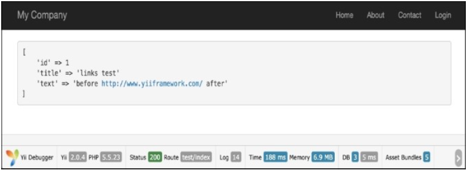

## 使用AR event-like方法处理model fields

Yii中实现的Active Record非常强大，并有很多特性。其中一个特性就是event-like方法，你可以在将存入数据库之前或者从数据库中取出来时，利用它预处理模型字段，也可以删除和模型相关的数据等等。

在本节中，我们将会链接post文本中所有的URL，并列出所有存在的Active Record event-like方法。

### 准备

1. 按照官方指南[http://www.yiiframework.com/doc-2.0/guide-start-installation.html](http://www.yiiframework.com/doc-2.0/guide-start-installation.html)的描述，使用Composer包管理器创建一个新的应用。
2. 设置数据库连接并创建一个名叫`post`的表：

```sql
DROP TABLE IF EXISTS 'post';
CREATE TABLE IF NOT EXISTS 'post' (
  'id' INT(10) UNSIGNED NOT NULL AUTO_INCREMENT,
  'title' VARCHAR(255) NOT NULL,
  'text' TEXT NOT NULL,
  PRIMARY KEY ('id')
);
```

3. 使用Gii生成`Post`模型。

### 如何做...

1. 添加如下方法到`models/Post.php`：

```php
/**
* @param bool $insert
*
* @return bool
*/
public function beforeSave($insert)
{
    $this->text = preg_replace(
        '~((?:https?|ftps?)://.*?)(|$)~iu', 
        '<a href="\1">\1</a>\2', 
        $this->text
    );
    return parent::beforeSave($insert);
}
```

2. 现在尝试保存一个包含链接的帖子，创建`controllers/TestController.php`：

```php
<?php
namespace app\controllers;
use app\models\Post;
use yii\helpers\Html;
use yii\helpers\VarDumper;
use yii\web\Controller;
/**
 * Class TestController.
 * @package app\controllers
 */
class TestController extends Controller
{
    public function actionIndex()
    {
        $post = new Post();
        $post->title = 'links test';
        $post->text = 'before http://www.yiiframework.com/
after';
        $post->save();
        return $this->renderContent(Html::tag('pre',
            VarDumper::dumpAsString(
                $post->attributes
            )));
    }
}
```

3. 现在，运行`test/index`。你会得到如下结果：



### 工作原理...

`ActiveRecord`类中实现的方法`beforeSave`是在保存之前执行的。使用一个正则表达式，我们将所有的URL替换成链接。为了防止保存，你可以返回false。

### 参考

- 欲了解更多信息，访问[http://www.yiiframework.com/doc-2.0/guide-db-activerecord.
html#active-record-life-cycles](http://www.yiiframework.com/doc-2.0/guide-db-activerecord.
html#active-record-life-cycles)。
- 第一章*基础*中的*使用事件*小节
- *自动化时间戳*小节
- *自动设置一个作者*小节
- *自动设置一个slug*小节