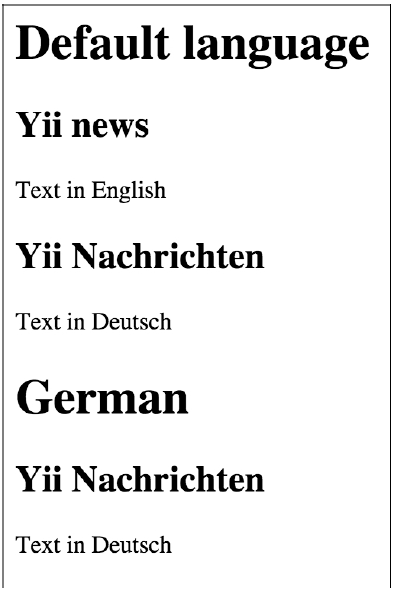
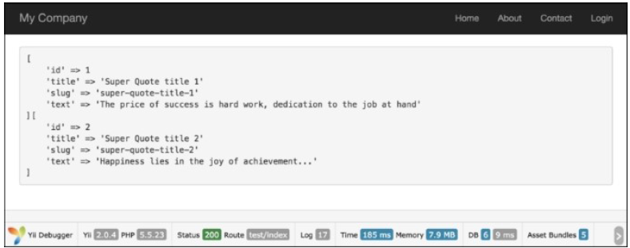

# 第3章 ActiveRecord, Model, 数据库

在本章中，我们将会讨论如下话题：

- 从数据库中获取数据
- 定义和使用多个数据库连接
- 自定义ActiveQuery类
- 使用AR event-like方法处理model fields
- 自动化时间戳
- 自动设置一个作者
- 自动设置一个slug
- 事务
- 复制和读写分离
- Implementing 单表 inheritance

## 介绍

在本章中，你将学习如何高效使用数据库，什么时候应该使用models而什么时候不应该，如何使用多个数据库，如何自动预处理Active Record fields，如何使用事务，等等。

## 从数据库中获取数据

今天大多数应用都在使用数据库。不论是一个小网站，还是一个大型社交网站，至少其中一部分功能是由数据库驱动的。

Yii引入了三种方法来允许你使用数据库。他们是：

- Active Record
- Query Builder
- SQL via DAO

我们将使用这三种方法从`film`、`film_actor`、`actor`表中获取数据，并将他们展示在一个列表中。同时，我们将会比较它们的执行时间和内存占用情况，来决定这些方法的使用场景。

### 准备

1. 按照官方指南[http://www.yiiframework.com/doc-2.0/guide-start-installation.html](http://www.yiiframework.com/doc-2.0/guide-start-installation.html)的描述，使用Composer包管理器创建一个新的应用。
2. 从[http://dev.mysql.com/doc/index-other.html](http://dev.mysql.com/doc/index-other.html)下载Sakila数据库。
3. 执行下载好的SQLs；首先是schema，然后是数据。
4. 在`config/main.php`中配置数据库连接，使用Sakila数据库。
5. 使用Gii为actor和film表创建模型。

### 如何做...

1. 创建`app/controllers/DbController.php`：

```
<?php
namespace app\controllers;
use app\models\Actor;
use Yii;
use yii\db\Query;
use yii\helpers\ArrayHelper;
use yii\helpers\Html;
use yii\web\Controller;
/**
 * Class DbController
 * @package app\controllers
 */
class DbController extends Controller
{
/**
 * Example of Active Record usage.
 *
 * @return string
 */
    public function actionAr()
    {
        $records = Actor::find()
            ->joinWith('films')
            ->orderBy('actor.first_name,
actor.last_name, film.title')
            ->all();
        return $this->renderRecords($records);
    }
    /**
     * Example of Query class usage.
     *
     * @return string
     */
    public function actionQuery()
    {
        $rows = (new Query())
            ->from('actor')
            ->innerJoin('film_actor',
                'actor.actor_id=film_actor.actor_id')
            ->leftJoin('film',
                'film.film_id=film_actor.film_id')
            ->orderBy('actor.first_name, actor.last_name,
actor.actor_id, film.title')
            ->all();
        return $this->renderRows($rows);
    }
    /**
     * Example of SQL execution usage.
     *
     * @return string
     */
    public function actionSql()
    {
        $sql = 'SELECT *
FROM actor a
JOIN film_actor fa ON fa.actor_id = a.actor_id
JOIN film f ON fa.film_id = f.film_id
ORDER BY a.first_name, a.last_name, a.actor_id,
f.title';
        $rows = Yii::$app->db->createCommand($sql)->queryAll();
        return $this->renderRows($rows);
    }
    /**
     * Render records for Active Record array.
     *
     * @param array $records
     *
     * @return string
     */
    protected function renderRecords(array $records = [])
    {
        if (!$records) {
            return $this->renderContent('Actor list is empty.');
        }
        $items = [];
        foreach ($records as $record) {
            $actorFilms = $record->films
                ?
                Html::ol(ArrayHelper::getColumn($record->films, 'title')): null;
            $actorName = $record->first_name.'
'.$record->last_name;
            $items[] = $actorName.$actorFilms;
        }
        return $this->renderContent(Html::ol($items, [
            'encode' => false,
        ]));
    }
    /**
     * Render rows for result of query.
     *
     * @param array $rows
     *
     * @return string
     */
    protected function renderRows(array $rows = [])
    {
        if (!$rows) {
            return $this->renderContent('Actor list is empty.');
        }
        $items = [];
        $films = [];
        $actorId = null;
        $actorName = null;
        $actorFilms = null;
        $lastActorId = $rows[0]['actor_id'];
        foreach ($rows as $row) {
            $actorId = $row['actor_id'];
            $films[] = $row['title'];
            if ($actorId != $lastActorId) {
                $actorName = $row['first_name'].'
'.$row['last_name'];
                $actorFilms = $films ? Html::ol($films) : null;
                $items[] = $actorName.$actorFilms;
                $films = [];
                $lastActorId = $actorId;
            }
        }
        if ($actorId == $lastActorId) {
            $actorFilms = $films ? Html::ol($films) : null;
            $items[] = $actorName.$actorFilms;
        }
        return $this->renderContent(Html::ol($items, [
            'encode' => false,
        ]));
    }
}
```

2. 这里，我们有三个actions分别对应于三种不同的方法。
3. 运行上面的`db/ar`、`db/query`、`db/sql`三个actions之后，你应该得到了一个展示200个演员和他们演过的1000个电影的树，截图如下：


4. 在页面底部，提供了关于内存使用和执行时间的信息。运行这段代码的绝对时间可能不同，但相对大小应该是一致的：

| 方法 | 内存使用（MB） | 执行时间（秒） |
|--|--|--|
| Active Record | 21.4 | 2.398 |
| Query Builder | 28.3 | 0.477 |
| SQL(DAO) | 27.6 | 0.481 |

### 工作原理...

`actionAr`方法使用Active Record方法获取了模型的实例。我们使用Gii生成的`Actor`模型来获取所有的演员，并指定`joinWith=>'films'`来获取对应的电影，它使用一个简单的查询或者通过关系预先加载，这是由Gii从`InnoDB`表外键为我们创建的。然后迭代所有的演员和电影，打印出他们的名字。

`actionQuery`函数使用Query Builder。首先我们使用`\yii\db\Query`为当前数据库连接创建了一个查询。然后依次加入查询部分`from`、`joinInner`和`leftJoin`。这些方法自动escape值、表和field名称。`\yii\db\Query`的函数`all()`返回了原始数据库的行数组。每一行也是一个数组，索引是field名称。我们将结果传给了`renderRows`，它负责渲染。

`actionSql`是一样的，不同的是我们直接传递SQL，而不是一个接着一个。值得一提的是，我们应该使用`Yii::app()->db->quoteValue`手动escape参数值：

`renderRows`方法渲染了Query Builder。

`renderRecords`方法渲染了active records。

| 方法 | Active Record | Query Builder | SQL(DAO) |
|---|---|---|---|
| 语法 | 能为你处理SQL。<br />Gii会为你创建模型和关系。<br />使用完全面向对象风格的模型和整洁的API。<br />生成一个适当嵌套的模型的数组作为结果。 | 整洁的API，适于一步步创建查询。<br />生成原始数据数组作为结果。 | 适用于复杂的SQL。<br />手动qoute值和关键字。<br />不太适用于一步步创建查询。<br />生成原始数据数组作为结果。 |
| 性能 | 相对于SQL和Query Builder，内存占用率高，执行时间长。 | Okay | Okay |
| 更多特性 | 自动quote值和名称。<br />Behaviors. Before/after hook.<br />校验。Prototyping select. | 自动quote值和名称 | 无 |
| 适用于 | 为单个模型更新、删除和创建（当使用form时尤为便利） | 适用于大量的数据，并能一步步创建查询。 | 使用纯SQL进行复杂的查询，并有尽可能好的性能。 |

### 更多...

欲了解更多有关Yii操作数据库，参考如下资源：

- [http://www.yiiframework.com/doc-2.0/guide-db-dao.html](http://www.yiiframework.com/doc-2.0/guide-db-dao.html)
- [http://www.yiiframework.com/doc-2.0/guide-db-query-builder.html](http://www.yiiframework.com/doc-2.0/guide-db-query-builder.html)
- [http://www.yiiframework.com/doc-2.0/guide-db-active-record.html](http://www.yiiframework.com/doc-2.0/guide-db-active-record.html)

## 定义和使用多个数据库连接

对于新的单机web应用，多数据库连接并不常用。但是，当你为一个已经存在的系统附加一个应用是，你很可能需要另外一个数据库连接。

在本节中，你将会学习如何定义多个数据库连接并利用DAO、Query Builder和Active Record模型使用它们。

### 准备

1. 按照官方指南[http://www.yiiframework.com/doc-2.0/guide-start-installation.html](http://www.yiiframework.com/doc-2.0/guide-start-installation.html)的描述，使用Composer包管理器创建一个新的应用。
2. 创建两个MySQL数据库，名字分别叫`db1`和`db2`。
3. 在`db1`中创建一个名叫`post`的表：

```
DROP TABLE IF EXISTS 'post';
CREATE TABLE IF NOT EXISTS 'post' (
  'id' INT(10) UNSIGNED NOT NULL AUTO_INCREMENT,
  'title' VARCHAR(255) NOT NULL,
  'text' TEXT NOT NULL,
  PRIMARY KEY ('id')
);
```

4. 在`db2`中创建一个名叫`comment`的表：

```
DROP TABLE IF EXISTS 'comment';
CREATE TABLE IF NOT EXISTS 'comment' (
  'id' INT(10) UNSIGNED NOT NULL AUTO_INCREMENT,
  'text' TEXT NOT NULL,
  'post_id' INT(10) UNSIGNED NOT NULL,
  PRIMARY KEY ('id')
);
```

### 如何做...

1. 首先配置数据库连接。打开`config/main.php`文件，按照官方指南中的描述，定义一个主连接：

```
'db' => [
    'connectionString' =>'mysql:host=localhost;dbname=db1',
    'username' => 'root',
    'password' => '',
    'charset' => 'utf8',
],
```

2. 复制它，重命名`db`组件为`db2`，并相应修改`connectionString`。同时，你需要按照如下方式添加`class`：

```
'db2' => [
    'class'=>'yii\db\Connection',
    'connectionString' => 'mysql:host=localhost;dbname=db2',
    'username' => 'root',
    'password' => '',
    'charset' => 'utf8',
],
```

3. 现在你有两个数据库连接，你可以按如下方式利用DAO和Query Builder使用它们：

```
$rows1 = Yii::$app->db->createCommand($sql)->queryAll();
$rows2 = Yii::$app->db2->createCommand($sql)->queryAll();
```

4. 现在，如何我们需要使用Active Record模型，首先我们需要使用Gii创建Post和Comment模型。你可以为每一个模型选择一个合适的连接。当你创建Comment模型时，将数据库连接ID设置为`db2`，如下截图所示：


5. 现在你可以按往常一样使用`Comment`模型，并创建`controllers/DbController.php`：

```
<?php
namespace app\controllers;
use app\models\Post;
use app\models\Comment;
use yii\helpers\ArrayHelper;
use yii\helpers\Html;
use yii\web\Controller;
/**
 * Class DbController.
 * @package app\controllers
 */

class DbController extends Controller
{
    public function actionIndex()
    {
        $post = new Post();
        $post->title = 'Post #'.rand(1, 1000);
        $post->text = 'text';
        $post->save();
        $posts = Post::find()->all();
        echo Html::tag('h1', 'Posts');
        echo Html::ul(ArrayHelper::getColumn($posts, 'title'));
        $comment = new Comment();
        $comment->post_id = $post->id;
        $comment->text = 'comment #'.rand(1, 1000);
        $comment->save();
        $comments = Comment::find()->all();
        echo Html::tag('h1', 'Comments');
        echo Html::ul(ArrayHelper::getColumn($comments,
            'text'));
    }
}
```

6. 运行`db/index`多次，然后你将会看到记录保存到了两个数据库中，如下截图所示：


### 工作原理...

在Yii中，你可以通过配置文件添加和配置你自己的组件。对于非标准的组件，例如`db2`，你必须指定组件类。类似地，你可以添加`db3`、`db4`或者其他组件，例如`facebookApi`。剩余的数组键值对分别赋值给了组件的公共属性。

### 更多...

依赖于使用的RDBMS，有一个额外的事情可以做，能让我们更方便的使用多个数据库。

#### 跨数据库关系

如果你使用的是MySQL，你可以为你的模型创建跨数据库的关系。为了做到这一步，你应该为`Comment`模型的表名添加数据库名称：

```
class Comment extends \yii\db\ActiveRecord
{
//...
    public function tableName()
    {
        return 'db2.comment';
    }
//...
}
```

现在，如果在`Post`模型中你定义了一个评论关系，你可以按如下方式使用：

```
$posts = Post::find()->joinWith('comments')->all();
```

### 参考

欲了解更多信息，参考[http://www.yiiframework.com/doc-2.0/guide-db-dao.html#creating-dbconnections](http://www.yiiframework.com/doc-2.0/guide-db-dao.html#creating-dbconnections)

## 自定义ActiveQuery类

默认情况下，所有的Active Record查询是由`\yii\db\ActiveQuery`支持的。为了在一个Active Record中使用一个自定义的查询类，你可以重写`\yii\db\ActiveRecord::find()`方法，并返回一个你的自定义查询类的实例。

### 准备

1. 按照官方指南[http://www.yiiframework.com/doc-2.0/guide-start-installation.html](http://www.yiiframework.com/doc-2.0/guide-start-installation.html)的描述，使用Composer包管理器创建一个新的应用。
2. 设置数据库连接，创建一个名为`post`的表：

```
DROP TABLE IF EXISTS ''post'';
CREATE TABLE IF NOT EXISTS ''post'' (
''id'' INT(10) UNSIGNED NOT NULL AUTO_INCREMENT,
''lang'' VARCHAR(5) NOT NULL DEFAULT ''en'',
''title'' VARCHAR(255) NOT NULL,
''text'' TEXT NOT NULL,
PRIMARY KEY (''id'')
);
INSERT INTO ''post''(''id'',''lang'',''title'',''text'')
VALUES (1,''en_us'',''Yii news'',''Text in English''),
(2,''de'',''Yii Nachrichten'',''Text in Deutsch'');
```

3. 使用Gii生成一个`Post`模型，并选中**Generate ActiveQuery**选项，这会生成`PostQuery`类。

### 如何做...

1. 为`models/PostQuery.php`添加如下方法：

```
<?php
namespace app\models;
/**
 * This is the ActiveQuery class for [[Post]].
 *
 * @see Post
 */
class PostQuery extends \yii\db\ActiveQuery
{
/**
 * @param $lang
 *
 * @return $this
 */
    public function lang($lang)
    {
        return $this->where([ 'lang' => $lang ]);
    }
}
```

2. 现在，我们可以使用我们的模型。创建`controllers/DbController.php`：

```
<?php
namespace app\controllers;
use app\models\Post;
use yii\helpers\Html;
use yii\web\Controller;
/**
 * Class DbController.
 * @package app\controllers
 */
class DbController extends Controller
{
    public function actionIndex()
    {
        // Get posts written in default application language
        $posts = Post::find()->all();

        echo Html::tag('h1', 'Default language');
        foreach ($posts as $post) {
            echo Html::tag('h2', $post->title);
            echo $post->text;
        }

        // Get posts written in German
        $posts = Post::find()->lang('de')->all();
        
        echo Html::tag('h1', 'German');
        foreach ($posts as $post) {
            echo Html::tag('h2', $post->title);
            echo $post->text;
        }
    }
}
```

3. 现在运行`db/index`你会得到类似如下截图所示的输出：



### 工作原理...

我们在`Post`模型中重写了`find`方法，并扩展了ActiveQuery类。`lang`方法返回指定语言值的ActiveQuery。为了支持链式调用，`lang`返回自身模型的实例。

### 参考

欲了解更多信息，参考如下地址：

- [http://www.yiiframework.com/doc-2.0/guide-db-active-record.html#customizing-query-classes](http://www.yiiframework.com/doc-2.0/guide-db-active-record.html#customizing-query-classes)
- [http://www.yiiframework.com/doc-2.0/guide-intro-upgrade-from-v1.html#active-record](http://www.yiiframework.com/doc-2.0/guide-intro-upgrade-from-v1.html#active-record)

## 使用AR event-like方法处理model fields

Yii中实现的Active Record非常强大，并有很多特性。其中一个特性就是event-like方法，你可以在将存入数据库之前或者从数据库中取出来时，利用它预处理模型字段，也可以删除和模型相关的数据等等。

在本节中，我们将会链接post文本中所有的URL，并列出所有存在的Active Record event-like方法。

### 准备

1. 按照官方指南[http://www.yiiframework.com/doc-2.0/guide-start-installation.html](http://www.yiiframework.com/doc-2.0/guide-start-installation.html)的描述，使用Composer包管理器创建一个新的应用。
2. 设置数据库连接并创建一个名叫`post`的表：

```
DROP TABLE IF EXISTS 'post';
CREATE TABLE IF NOT EXISTS 'post' (
  'id' INT(10) UNSIGNED NOT NULL AUTO_INCREMENT,
  'title' VARCHAR(255) NOT NULL,
  'text' TEXT NOT NULL,
  PRIMARY KEY ('id')
);
```

3. 使用Gii生成`Post`模型。

### 如何做...

1. 添加如下方法到`models/Post.php`：

```
/**
* @param bool $insert
*
* @return bool
*/
public function beforeSave($insert)
{
    $this->text = preg_replace(
        '~((?:https?|ftps?)://.*?)(|$)~iu', 
        '<a href="\1">\1</a>\2', 
        $this->text
    );
    return parent::beforeSave($insert);
}
```

2. 现在尝试保存一个包含链接的帖子，创建`controllers/TestController.php`：

```
<?php
namespace app\controllers;
use app\models\Post;
use yii\helpers\Html;
use yii\helpers\VarDumper;
use yii\web\Controller;
/**
 * Class TestController.
 * @package app\controllers
 */
class TestController extends Controller
{
    public function actionIndex()
    {
        $post = new Post();
        $post->title = 'links test';
        $post->text = 'before http://www.yiiframework.com/
after';
        $post->save();
        return $this->renderContent(Html::tag('pre',
            VarDumper::dumpAsString(
                $post->attributes
            )));
    }
}
```

3. 现在，运行`test/index`。你会得到如下结果：


### 工作原理...





