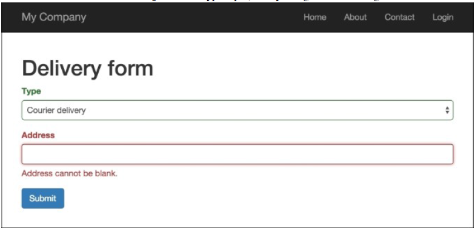

## 条件校验器

有些情况下，需要启用或者禁用模型的指定验证规则。Yii2提供了一个机制来帮你做到这一点。

### 准备

按照官方指南[http://www.yiiframework.com/doc-2.0/guide-start-installation.html](http://www.yiiframework.com/doc-2.0/guide-start-installation.html)的描述，使用Composer包管理器创建一个新的应用。

### 如何做...

1. 创建一个表单文件`@app/models/DeliveryForm.php`：

```
<?php
namespace app\models;
use app\components\WordsValidator;
use yii\base\Model;
class DeliveryForm extends Model
{
    const TYPE_PICKUP = 1;
    const TYPE_COURIER = 2;
    public $type;
    public $address;
    public function rules()
    {
        return [
            ['type', 'required'],
            ['type', 'in', 'range'=>[self::TYPE_PICKUP, self::TYPE_COURIER]],
            ['address', 'required', 'when' => function ($model)
            {
                return $model->type == self::TYPE_COURIER;
            }, 'whenClient' => "function (attribute, value) {return $('#deliveryform-type').val()=='".self::TYPE_COURIER."';}"]
        ];
    }
    public function typeList()
    {
        return [
            self::TYPE_PICKUP => 'Pickup',
            self::TYPE_COURIER => 'Courier delivery',
        ];
    }
}
```

2. 创建一个控制器文件`@app/controllers/ValidationController.php`：

```
<?php
namespace app\controllers;
use Yii;
use yii\web\Controller;
use app\models\DeliveryForm;
class ValidationController extends Controller
{
    public function actionIndex()
    {
        $model = new DeliveryForm();
        if ($model->load(Yii::$app->request->post()) && $model->validate()) {
            Yii::$app->session->setFlash('success',
                'The form was successfully processed!'
            );
        }
        return $this->render('index', array(
            'model' => $model,
        ));
    }
}
```

3. 创建一个视图文件`@app/views/validation/index.php`：

```
<?php
use yii\bootstrap\ActiveForm;
use yii\helpers\Html;
?>
    <h1>Delivery form</h1>
<?php if (Yii::$app->session->hasFlash('success')): ?>
    <div class="alert alert-success"><?= Yii::$app->session->getFlash('success'); ?></div>
<?php endif; ?>
<?php $form = ActiveForm::begin(); ?>
<?= $form->field($model, 'type')->dropDownList($model->typeList(), ['prompt'=>'Select delivery type']) ?>
<?= $form->field($model, 'address') ?>
    <div class="form-group">
        <?= Html::submitButton('Submit', ['class' => 'btn btn-primary']) ?>
    </div>
<?php ActiveForm::end(); ?>
```

4. 运行`validation`控制器`index.php?r=validation`，选择`courier delivery`:



### 工作原理...

当`type`属性被设置为`DeliveryForm::TYPE_COURIER`时，`DeliveryForm address`属性是必需的；否则是可选的。

此外，为了支持客户端条件验证，我们配置了`whenClient`属性，它使用了一个Javascript函数来决定是否应用这个规则。

### 参考

欲了解更多信息，参考[http://www.yiiframework.com/doc-2.0/guideinputvalidation.html#conditional-validation](http://www.yiiframework.com/doc-2.0/guideinputvalidation.html#conditional-validation)