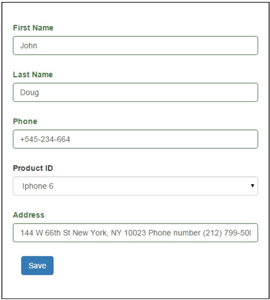

## 带有多个模型的复杂表单

当处理一些复杂数据时，你可能需要使用多个不同的模型来搜集用户的输入。例如，你有一个订单表单，有用户的信息，例如姓、名、电话号码；你也需要一个递送地址和一些产品。

你希望在一个表单中保存所有的数据。使用Yii2模型和表单，你可以很容易的这道它。假设用户信息被存放在用户表中，并且在订单表单中，我们将会保存产品信息和买家用户的`user_id`。此外我们还有一个产品表，存储了一些产品信息。

### 准备

1. 按照官方指南[http://www.yiiframework.com/doc-2.0/guide-start-installation.html](http://www.yiiframework.com/doc-2.0/guide-start-installation.html)的描述，使用Composer包管理器创建一个新的应用。
2. 使用如下命令为用户表、产品表和订单表创建migration：

```
./yii migrate/create create_order_tables
```

3. 修改新创建的migrations的`up()`和`down()`方法：

```
<?php
use yii\db\Schema;
use yii\db\Migration;
use app\models\Product;
class m150813_161817_create_order_form_tables extends Migration
{
    public function up()
    {
        $tableOptions = null;
        if ($this->db->driverName === 'mysql') {
            $tableOptions = 'CHARACTER SET utf8 COLLATE utf8_general_ci ENGINE=InnoDB';
        }
        $this->createTable('user', [
            'id' => Schema::TYPE_PK,
            'first_name' => Schema::TYPE_STRING . ' NOT NULL',
            'last_name' => Schema::TYPE_STRING . ' NOT NULL',
            'phone' => Schema::TYPE_STRING . ' NOT NULL',
        ], $tableOptions);
        $this->createTable('product', [
            'id' => Schema::TYPE_PK,
            'title' => Schema::TYPE_STRING . ' NOT NULL',
            'price' => Schema::TYPE_FLOAT . '(6,2) ',
        ], $tableOptions);
        $this->createTable('order', [
            'id' => Schema::TYPE_PK,
            'user_id' => Schema::TYPE_INTEGER . ' NULL',
            'address' => Schema::TYPE_STRING . ' NOT NULL',
            'product_id' => Schema::TYPE_INTEGER . ' NOT NULL',
        ], $tableOptions);
        $product1 = new Product();
        $product1->title = 'Iphone 6';
        $product1->price = 400.5;
        $product1->save();
        $product3 = new Product();
        $product3->title = 'Samsung Galaxy Note 5';
        $product3->price = 900;
        $product3->save();
        $this->addForeignKey('fk_order_product_id', 'order', 'product_id', 'product', 'id');
    }
    public function down()
    {
        $this->dropTable('order');
        $this->dropTable('user');
        $this->dropTable('product');
    }
}
```

4. 使用如下命令安装migration：

```
./yii migrate/up
```

5. 使用Gii生成用户、订单和产品模型。

### 如何做...

1. 创建`@app/controller/TestController.php`：

```
<?php
namespace app\controllers;
use app\models\Order;
use app\models\User;
use Yii;
use yii\web\Controller;
class TestController extends Controller
{
    public function actionOrder()
    {
        $user = new User();
        $order = new Order();
        if ($user->load(Yii::$app->request->post()) &&
            $order->load(Yii::$app->request->post())) {
            if ($user->validate() && $order->validate()) {
                $user->save(false);
                $order->user_id = $user->id;
                $order->save(false);
                $this->redirect(['/test/result', 'id' => $order->id]);
            }
        }
        return $this->render('order', ['user' => $user, 'order' => $order]);
    }
    public function actionResult($id)
    {
        $order = Order::find($id)->with('product', 'user')->one();
        return $this->renderContent(
            'Product: ' . $order->product->title . '</br>' .
            'Price: ' . $order->product->price . '</br>' .
            'Customer: ' . $order->user->first_name . ' ' .
            $order->user->last_name . '</br>' .
            'Address: ' . $order->address
        );
    }
}
```

2. 创建一个视图文件`@app/views/test/order.php`：

```
<?php
use yii\helpers\Html;
use yii\widgets\ActiveForm;
use app\models\Product;
use yii\helpers\ArrayHelper;
/**
 * @var $user \app\models\User
 * @var $order \app\models\Order
 */
$form = ActiveForm::begin([
    'id' => 'order-form',
    'options' => ['class' => 'form-horizontal'],
]) ?>
<?= $form->field($user, 'first_name')->textInput(); ?>
<?= $form->field($user, 'last_name')->textInput(); ?>
<?= $form->field($user, 'phone')->textInput(); ?>
<?= $form->field($order, 'product_id')->dropDownList(ArrayHelper::map(Product::find()->all(), 'id', 'title')); ?>
<?= $form->field($order, 'address')->textInput(); ?>
<?= Html::submitButton('Save', ['class' => 'btn btn-primary'])?>
<?php ActiveForm::end() ?>
```

### 工作原理...

访问`http://yii-book.app/index.php?r=test/order`你可以看到这个表单。我们的表单从用户和订单模型中搜集信息。

首先填写表单：



保存以后，你将会看到如下结果：


在这个控制器中，我们进行和验证和存储。当然，这个例子很简单，在实际的项目中，你可能需要处理不止一个模型，使用这种方法，你就能解决这个问题。当你希望在同一个表单中创建或者更新不止一个实例时，这种方法非常有用。

### 参考

欲了解更多信息，参考[http://www.yiiframework.com/doc-2.0/guide-input-multiplemodels.html](http://www.yiiframework.com/doc-2.0/guide-input-multiplemodels.html)