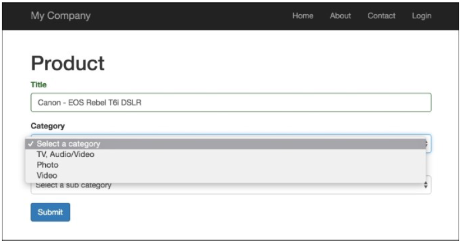

## 依赖AJAX的下拉列表

通常，你会需要一个带有两个下拉列表的表单，一个表单的值依赖于另外一个。使用Yii内置的AJAX功能，你可以创建这样一个下拉列表。

### 准备

1. 按照官方指南[http://www.yiiframework.com/doc-2.0/guide-start-installation.html](http://www.yiiframework.com/doc-2.0/guide-start-installation.html)的描述，使用Composer包管理器创建一个新的应用。
2. 创建`@app/model/Product.php`：


```
<?php
namespace app\models;
use yii\db\ActiveRecord;
class Product extends ActiveRecord
{
    public function rules()
    {
        return [
            ['title', 'string'],
            [['title', 'category_id', 'sub_category_id'],
                'required'],
            ['category_id', 'exist', 'targetAttribute' => 'id',
                'targetClass' => 'app\models\Category'],
            ['sub_category_id', 'exist', 'targetAttribute' =>
                'id', 'targetClass' => 'app\models\Category'],
        ];
    }
    public function attributeLabels()
    {
        return [
            'category_id' => 'Category',
            'sub_category_id' => 'Sub category',
        ]; }
}
```

3. 创建`@app/models/Category.php`模型：

```
<?php
namespace app\models;
use yii\db\ActiveRecord;
class Category extends ActiveRecord
{
    public function rules()
    {
        return [
            ['title', 'string'],
        ];
    }
    /**
     * @return array
     */
    public static function getSubCategories($categoryId)
    {
        $subCategories = [];
        if ($categoryId) {
            $subCategories = self::find()
                ->where(['category_id' => $categoryId])
                ->asArray()
                ->all();
        }
        return $subCategories;
    }
}
```

4. 创建`create_category_and_product_tables` migration：

```
./yii migrate/create create_category_and_product_tables
```

5. 更新刚刚创建的migration方法：

```
<?php
use yii\db\Schema;
use yii\db\Migration;
class m150813_005030_create_categories extends Migration
{
    public function up()
    {
        $tableOptions = null;
        $this->createTable('{{%product}}', [
            'id' => Schema::TYPE_PK,
            'category_id' => Schema::TYPE_INTEGER . ' NOT NULL',
            'sub_category_id' => Schema::TYPE_INTEGER . ' NOT NULL',
            'title' => Schema::TYPE_STRING . ' NOT NULL',
        ], $tableOptions);
        $this->createTable('{{%category}}', [
            'id' => Schema::TYPE_PK,
            'category_id' => Schema::TYPE_INTEGER,
            'title' => Schema::TYPE_STRING . ' NOT NULL',
        ], $tableOptions);
        $this->addForeignKey('fk_product_category_id',
            '{{%product}}', 'category_id', '{{%category}}', 'id');
        $this->addForeignKey('fk_product_sub_category_id','{{%product}}', 'category_id', '{{%category}}', 'id');
        $this->batchInsert('{{%category}}', ['id', 'title'], [
            [1, 'TV, Audio/Video'],
            [2, 'Photo'],
            [3, 'Video']
        ]);
        $this->batchInsert('{{%category}}', ['category_id', 'title'], [
            [1, 'TV'],
            [1, 'Acoustic System'],
            [2, 'Cameras'],
            [2, 'Flashes and Lenses '],
            [3, 'Video Cams'],
            [3, 'Action Cams'],
            [3, 'Accessories']
        ]);
    }
    public function down()
    {
        $this->dropTable('{{%product}}');
        $this->dropTable('{{%category}}');
    }
}
```

### 如何做...

1. 创建控制器文件，`@app/controllers/DropdownController.php`：

```
<?php
namespace app\controllers;
use app\models\Product;
use app\models\Category;
use app\models\SubCategory;
use Yii;
use yii\helpers\ArrayHelper;
use yii\helpers\Json;
use yii\web\Controller;
use yii\web\HttpException;
class DropdownController extends Controller
{
    public function actionGetSubCategories($id)
    {
        if (!Yii::$app->request->isAjax) {
            throw new HttpException(400, 'Only ajax request is allowed.');
        }
        return Json::encode(Category::getSubCategories($id));
    }
    public function actionIndex()
    {
        $model = new Product();
        if ($model->load(Yii::$app->request->post()) &&
            $model->validate()) {
            Yii::$app->session->setFlash('success',
                'Model was successfully saved'
            );
        }
        return $this->render('index', [
            'model' => $model,
        ]);
    }
}
```

2. 创建视图文件`@app/views/dropdown/index.php`：

```
<?php
use yii\bootstrap\ActiveForm;
use yii\helpers\Html;
use yii\helpers\Url;
use app\models\Category;
use yii\helpers\ArrayHelper;
use yii\web\View;
$url = Url::toRoute(['dropdown/get-sub-categories']);
$this->registerJs("
(function(){
var select = $('#product-sub_category_id');
var buildOptions = function(options) {
if (typeof options === 'object') {
select.children('option').remove();
$('<option />')
.appendTo(select)
.html('Select a sub category')
$.each(options, function(index, option) {
$('<option />', {value:option.id})
.appendTo(select)
.html(option.title);
});
}
};
var categoryOnChange = function(category_id){
$.ajax({
dataType: 'json',
url: '" . $url . "&id=' + category_id ,
success: buildOptions});
};
window.buildOptions = buildOptions;
window.categoryOnChange = categoryOnChange;
})();
", View::POS_READY);
?>
    <h1>Product</h1>
<?php if (Yii::$app->session->hasFlash('success')): ?>
    <div class="alert alert-success"><?=
        Yii::$app->session->getFlash('success'); ?></div>
<?php endif; ?>
<?php $form = ActiveForm::begin(); ?>
<?= $form->field($model, 'title')->textInput() ?>
<?= $form->field($model,
    'category_id')->dropDownList(ArrayHelper::map(
    Category::find()->where('category_id IS NULL')->asArray()->all(),'id', 'title'), [
    'prompt' => 'Select a category',
    'onChange' => 'categoryOnChange($(this).val());',
]) ?>
<?= $form->field($model, 'sub_category_id')->dropDownList(
    ArrayHelper::map(Category::getSubCategories($model->sub_category_id), 'id' ,'title'), [
    'prompt' => 'Select a sub category',
]) ?>
<div class="form-group">
    <?= Html::submitButton('Submit', ['class' => 'btn btn-primary']) ?>
</div>
<?php ActiveForm::end(); ?>
```

3. 打开`index.php?r=dropdown`运行`dropdown`控制器，然后添加一个新的产品，`Canon - EOS Rebel T6i DSLR`：



4. 正如你所见到的，`Category`输入框有三个选项。选择**Photo**选项，然后第二个输入选择将会有两个更多的选项：


5. 如果你选择了另外一个分类。你将会得到这个分类的子分类。

### 工作原理...

在这个例子中，我们有两个依赖的列表，分类和子分类，以及一个模型`Category`。主要的思想比较简单：我们将JQuery的`onChange`事件绑定到表单的`category_id`字段上。每次当用户修改字段时，我们的应用会发送一个AJAX请求到`get-sub-categories`动作上。这个动作返回一个JSON格式的子分类列表，然后在客户端，将子列表进行渲染。