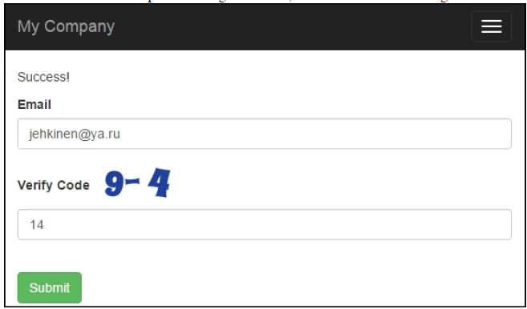
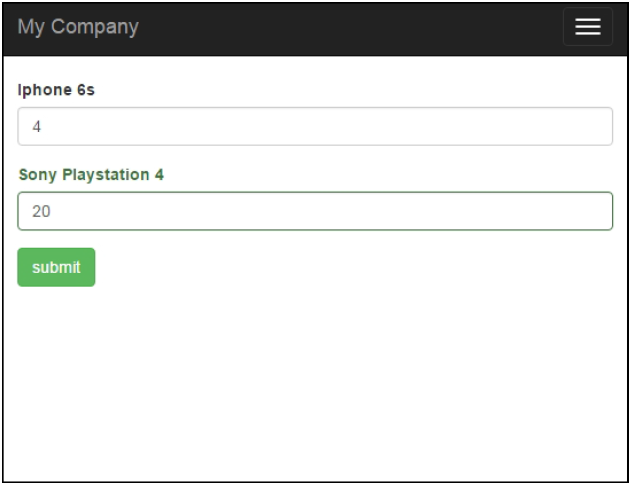
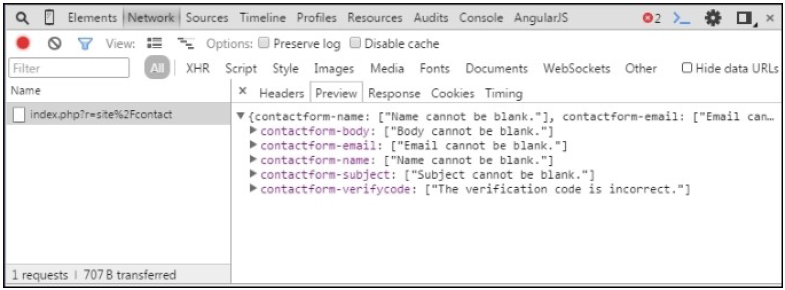
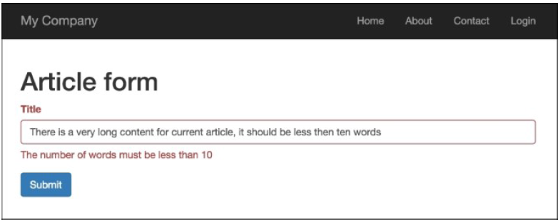

# 第四章 表单

在本章中，我们将讨论如下话题：

- 自定义校验器
- 上传文件
- 添加和自定义CaptchaWidget
- 自定义Captcha
- 创建一个自定义输入小部件
- Tabular输入
- 条件校验器
- 带有多个模型的复杂表单
- 依赖AJAX的下拉列表
- AJAX校验器
- 创建一个自定义客户端的校验器

## 介绍

Yii使得使用forms非常容易，并且关于它的文档非常完整。但仍有一些问题需要说明和例子。我们将在本章中介绍说明。

## 自定义校验器

Yii提供了一套内置表单校验器，基本覆盖了所有典型的开发需求，并且是高度可配置的。但是，在一些情况下，开发者可能需要创建一个自定义校验器。

本小节会给出一个例子，创建一个检查单词个数的独立校验器。

### 准备

按照官方指南[http://www.yiiframework.com/doc-2.0/guide-start-installation.html](http://www.yiiframework.com/doc-2.0/guide-start-installation.html)的描述，使用Composer包管理器创建一个新的应用。

### 如何做...

1. 创建一个独立校验器`@app/components/WordsValidator.php`：

```
<?php
namespace app\components;
use yii\validators\Validator;
class WordsValidator extends Validator
{
    public $size = 50;
    public function validateValue($value){
        if (str_word_count($value) > $this->size) {
            return ['The number of words must be less than {size}', ['size' => $this->size]];
        }
        return false;
    }
}
```

2. 创建一个`Article`模型`@app/models/Article.php`：

```
<?php
namespace app\models;
use app\components\WordsValidator;
use yii\base\Model;
class Article extends Model
{
    public $title;
    public function rules()
    {
        return [
            ['title', 'string'],
            ['title', WordsValidator::className(), 'size' =>
                10],
        ];
    }
}
```

3. 创建`@app/controllers/ModelValidationController.php`：

```
<?php
namespace app\controllers;
use app\models\Article;
use yii\helpers\Html;
use yii\web\Controller;
class ModelValidationController extends Controller
{
    private function getLongTitle()
    {
        return 'There is a very long content for current article, '.'it should be less then ten words';
    }
    private function getShortTitle()
    {
        return 'There is a shot title';
    }
    private function renderContentByModel($title)
    {
        $model = new Article();
        $model->title = $title;
        if ($model->validate()) {
            $content = Html::tag('div', 'Model is valid.',[
                'class' => 'alert alert-success',
            ]);
        } else {
            $content = Html::errorSummary($model, [
                'class' => 'alert alert-danger',
            ]);
        }
        return $this->renderContent($content);
    }
    public function actionSuccess()
    {
        $title = $this->getShortTitle();
        return $this->renderContentByModel($title);
    }
    public function actionFailure()
    {
        $title = $this->getLongTitle();
        return $this->renderContentByModel($title);
    }
}
```

4. 访问`index.php?r=model-validation/success`来运行`modelValidation`控制器的`success`动作：


5. 访问`index.php?r=model-validation/failure`来运行`modelValidation`控制器的`failure`动作：


6. 创建`@app/controllers/AdhocValidationController.php`：

```
<?php
namespace app\controllers;
use app\components\WordsValidator;
use app\models\Article;
use yii\helpers\Html;
use yii\web\Controller;
class AdhocValidationController extends Controller
{
    private function getLongTitle()
    {
        return 'There is a very long content for current article, '.'it should be less then ten words';
    }
    private function getShortTitle()
    {
        return 'There is a shot title';
    }
    private function renderContentByTitle($title)
    {
        $validator = new WordsValidator([
            'size' => 10,
        ]);
        if ($validator->validate($title, $error)) {
            $content = Html::tag('div', 'Value is valid.',[
                'class' => 'alert alert-success',
            ]);
        } else {
            $content = Html::tag('div', $error, [
                'class' => 'alert alert-danger',
            ]);
        }
        return $this->renderContent($content);
    }
    public function actionSuccess()
    {
        $title = $this->getShortTitle();
        return $this->renderContentByTitle($title);
    }
    public function actionFailure()
    {
        $title = $this->getLongTitle();
        return $this->renderContentByTitle($title);
    }
}
```

7. 访问`index.php?r=adhoc-validation/success`来运行`adhocValidation`控制器的`success`动作：


8. 访问`index.php?r=adhoc-validation/failure`来运行`adhocValidation`控制器的`failure`动作：


### 工作原理

首先我们创建了一个独立的校验器，它会使用`str_word_count`函数来检查单词的数量，然后演示了两个使用例子：

- 作为`Article`模型的校验规则使用这个校验器
- 作为一个特定的校验器使用这个校验器

### 参考

欲了解更多信息，参考如下链接：

- [http://www.yiiframework.com/doc-2.0/guide-input-validation.html](http://www.yiiframework.com/doc-2.0/guide-input-validation.html)
- [http://www.yiiframework.com/doc-2.0/guide-tutorial-corevalidators.html](http://www.yiiframework.com/doc-2.0/guide-tutorial-corevalidators.html)

## 上传文件

处理文件上传对于web应用是非常常见的一个任务。Yii有一些非常有用的内置类。让我们创建一个简单的表单，它允许上传ZIP压缩包，并保存到`/uploads`文件夹中。

### 准备

1. 按照官方指南[http://www.yiiframework.com/doc-2.0/guide-start-installation.html](http://www.yiiframework.com/doc-2.0/guide-start-installation.html)的描述，使用Composer包管理器创建一个新的应用。
2. 创建`@app/web/uploads`文件夹

### 如何做...

1. 我们将会以一个模型开始，创建`@app/models/Upload.php`：

```
<?php
namespace app\models;
use yii\base\Model;
use yii\web\UploadedFile;
class UploadForm extends Model
{
    /**
     * @var UploadedFile
     */
    public $file;
    public function rules()
    {
        return [
            ['file', 'file', 'skipOnEmpty' => false,
                'extensions' => 'zip'],
        ];
    }
    public function upload()
    {
        if ($this->validate()) {
            $this->file->saveAs('uploads/' .
                $this->file->baseName . '.' . $this->file->extension);
            return true;
        } else {
            return false;
        }
    }
}
```

2. 现在我们来看控制器，创建`@app/controllers/UploadController.php`：

```
<?php
namespace app\controllers;
use Yii;
use yii\web\Controller;
use app\models\UploadForm;
use yii\web\UploadedFile;
class UploadController extends Controller
{
    public function actionUpload()
    {
        $model = new UploadForm();
        if (Yii::$app->request->isPost) {
            $model->file = UploadedFile::getInstance($model,
                'file');
            if ($model->upload()) {
                return $this->renderContent("File {$model->file->name} is uploaded successfully");
            }
        }
        return $this->render('index', ['model' => $model]);
    }
}
```

3. 最后是`@app/views/upload/index.php`：

```
<?php
use yii\widgets\ActiveForm;
use yii\helpers\Html;
?>
<?php $form = ActiveForm::begin(['options' => ['enctype' => 'multipart/form-data']]) ?>
    <?= $form->field($model, 'file')->fileInput() ?>
    <?= Html::submitButton('Upload', ['class' => 'btn-success'])?>
<?php ActiveForm::end() ?>
```

4. 现在运行upload控制器，并尝试上传ZIP压缩包和其他文件：


### 工作原理...

我们使用的模型非常简单，我们只是定义了一个字段，名叫`$file`，以及一个使用`FileValidator`文件校验器的校验规则，它只读取ZIP文件。

我们创建一个模型的实例，并在提交表单的时候使用`$_POST`中的数据填充它：

```
$model->file = UploadedFile::getInstance($model, 'file');
if ($model->upload()) {
    return $this->renderContent("File {$model->file->name} is uploaded successfully");
}
```

然后我们使用`UploadFile::getInstance`，它给我们`UploadFile`的实例。当上传文件的时候，它是对`$_FILE`数组的封装。通过调用模型的`validate`方法，我们确保这个文件是一个ZIP压缩包，然后我们使用`UploadFile::saveAs`保存文件。

为了上传文件，HTML表单必须满足如下两个重要的需求：

- 必须使用`POST`方法
- `enctype`属性必须设置为`multipart/form-data`

记住你需要添加`enctype`选项到表单，这样文件才能正确上传。

我们可以使用`Html`帮助类或者带有`htmlOptions`集合的`ActiveForm`来生成HTML。这里使用的HTML是：

```
<?= Html::beginForm('', 'post', ['enctype'=>'multipart/form-data'])?>
```

最后，我们为模型的file属性展示了一个错误和一个字段，并渲染了一个提交按钮。

### 更多...

为了上传多个文件，Yii2实现了两个特殊的方法。

例如，你已经定义了`$imageFiles`，在你的模型、视图文件中所有都是一样的，除了一些细小的差别：

```
...
<?= $form->field($model, 'imageFiles[]')->fileInput(['multiple' => true, 'accept' => 'image/*']) ?>
...
```

为了获取所有文件的实例，你必须调用`UploadFile::getInstances()`而不是`UploadFile::getInstance()`：

```
..
$model->imageFiles = UploadedFile::getInstances($model, 'imageFiles');
..
```

可以使用简单的代码来处理并保存多个文件：

```
foreach ($this->imageFiles as $file) {
    $file->saveAs('uploads/' . $file->baseName . '.' .$file->extension);
}
```

### 参考

欲了解更多信息，参考：

- [http://www.yiiframework.com/doc-2.0/guide-input-file-upload.html](http://www.yiiframework.com/doc-2.0/guide-input-file-upload.html)
- [http://www.yiiframework.com/doc-2.0/guide-input-file-upload.html#uploading-multiple-files](http://www.yiiframework.com/doc-2.0/guide-input-file-upload.html#uploading-multiple-files)

## 添加和自定义CaptchaWidget

现如今在互联网上，如果你放出了一个没有做垃圾信息防护的表单，你将会在短时间内收到大量的垃圾数据。Yii有一个验证码组件，它可以让添加这样的防护非常简单。唯一的问题是没有系统的使用说明。

在接下来的例子中，我们将会给一个简单的表单添加验证码防护。

### 准备

1. 按照官方指南[http://www.yiiframework.com/doc-2.0/guide-start-installation.html](http://www.yiiframework.com/doc-2.0/guide-start-installation.html)的描述，使用Composer包管理器创建一个新的应用。
2. 创建一个表单模型，`@app/models/EmailForm.php`：

```
<?php
namespace app\models;
use yii\base\Model;
class EmailForm extends Model
{
    public $email;
    public function rules()
    {
        return [
            ['email', 'email']
        ];
    }
}
```

3. 创建控制器`@app/controllers/EmailController.php`：

```
<?php
namespace app\controllers;
use Yii;
use yii\web\Controller;
use app\models\EmailForm;
class EmailController extends Controller
{
    public function actionIndex(){
        $success = false;
        $model = new EmailForm();
        if ($model->load(Yii::$app->request->post()) && $model->validate()) {
            Yii::$app->session->setFlash('success', 'Success!');
        }
        return $this->render('index', [
            'model' => $model,
            'success' => $success,
        ]);
    }
}
```

4. 创建一个视图，`@app/views/email/index.php`：

```
<?php
use yii\helpers\Html;
use yii\captcha\Captcha;
use yii\widgets\ActiveForm;
?>
<?php if (Yii::$app->session->hasFlash('success')): ?>
    <div class="alert alert-success"><?=Yii::$app->session->getFlash('success')?></div>
<?php else: ?>
    <?php $form = ActiveForm::begin()?>
    <div class="control-group">
        <div class="controls">
            <?= $form->field($model, 'email')->textInput(['class' => 'form-control']); ?>
            <?php echo Html::error($model, 'email', ['class' => 'help-block'])?>
        </div>
    </div>
    <?php if (Captcha::checkRequirements() &&
        Yii::$app->user->isGuest): ?>
        <div class="control-group">
            <?= $form->field($model, 'verifyCode')-widget(\yii\captcha\Captcha::classname(), [
                'captchaAction' => 'email/captcha'
            ]) ?>
        </div>
    <?php endif; ?>
    <div class="control-group">
        <label class="control-label" for=""></label>
        <div class="controls">
            <?=Html::submitButton('Submit', ['class' => 'btn btn-success'])?>
        </div>
    </div>
    <?php ActiveForm::end()?>
<?php endif;?>
```

5. 现在，我们有了一个电子邮件提交表单，如下截图所示，它验证了电子邮件字段。让我们添加验证码：


### 如何做...

1. 首先我们需要自定义表单模型。我们需要添加`$verifyCode`，它会保存输入的验证码，并为它添加一个验证规则：

```
<?php
namespace app\models;
use yii\base\Model;
use yii\captcha\Captcha;
class EmailForm extends Model
{
    public $email;
    public $verifyCode;
    public function rules()
    {
        return [
            ['email', 'email'],
            ['verifyCode', 'captcha', 'skipOnEmpty' => !Captcha::checkRequirements(), 'captchaAction' => 'email/captcha']
        ];
    }
}
```

2. 然后添加一个外部动作到控制器中：

```
public function actions()
{
    return [
        'captcha' => [
            'class' => 'yii\captcha\CaptchaAction',
        ],
    ];
}
```

3. 在视图中，我们需要展示一个额外的字段和验证码图片：

```
...
<?php if (Captcha::checkRequirements() &&
    Yii::$app->user->isGuest): ?>
    <div class="control-group">
        <?=Captcha::widget([
            'model' => $model,
            'attribute' => 'verifyCode',
        ]);?>
        <?php echo Html::error($model, 'verifyCode')?>
    </div>
<?php endif; ?>
...
```

4. 同时，不要忘记在视图的头部添加`Captcha`导入：

```
<?php
    use yii\helpers\Html;
    use yii\captcha\Captcha;
?>
```

5. 完成了。现在你可以运行电子邮件控制器，可以在动作动看到验证码，如下截图所示：


如果屏幕上没有错误，表单中没有`Captcha`字段，很有可能是因为你没有安装PHP扩展GD或者Imagick。验证码依赖于GD或者Imagick生成图片。我们添加了几个`Captcha::checkRequirement()`检查，所以当图片不会展示时，不使用验证码，应用仍可以正常工作。

### 工作原理...

在视图中，我们调用验证码小部件渲染`img`标签，将`src`属性指向控制器中的验证码动作。在这个动作中，生成了一张带有随机单词的图片。生成的单词需要用户输入到表单中。它被存储在一个用户session中，并向用户展示了一张图片。党用户输入电子邮箱和验证码到表单中时，我们将这些值赋给表单模型，并进行校验。对于验证码的校验，我们使用`CaptchaValidator`。它会从用户session获取验证码，并和输入的验证码进行比较。如果不匹配，模型数据会被认为是不合法的。

### 更多...

如果你使用`accessRules`控制器方法来限制对控制器动作的访问，不要忘记授权每一个人都能访问他们：

```
public function behaviors()
{
    return [
        'access' => [
            'class' => AccessControl::className(),
            'rules' => [
                [
                    'actions' => ['index', 'captcha'],
                    'allow' => true,
                ]
            ],
        ],
    ];
}
```

## 自定义Captcha

标准的Yii验证码已经足够防护垃圾信息，但是有些情况下，你可能需要自定义验证码，例如：

- 你面对一个垃圾机器人，它可以从图片中读取文字，你需要添加更多的安全措施
- 你希望让验证码更加简单和有趣

在我们的例子中，我们将会修改Yii的验证码，它要求用户解决一个简单的算术问题，而不只是简单的重复图片中文字的内容。

### 准备

这个例子一开始，我们会利用*添加和自定义CaptchaWidget*的结果。或者也可以使用其它使用了验证码的表单，因为我们不需要修改很多已有的代码。

### 如何做...

我们需要自定义`CaptchaAction`，它会生成验证码并将其生成图片。这个验证码应该是一个随机数字，并且图片应该是一个有相同结果的算术表达式：

1. 创建`@app/components/MathCaptchaAction.php`：

```
<?php
namespace app\components;
use \Yii;
use yii\captcha\CaptchaAction;
class MathCaptchaAction extends CaptchaAction
{
    protected function renderImage($code)
    {
        return parent::renderImage($this->getText($code));
    }
    protected function generateVerifyCode()
    {
        return mt_rand((int)$this->minLength,
            (int)$this->maxLength);
    }
    protected function getText($code)
    {
        $code = (int) $code;
        $rand = mt_rand(1, $code-1);
        $op = mt_rand(0, 1);
        if ($op) {
            return $code - $rand . " + " . $rand;
        }
        else {
            return $code + $rand . " - " . " " . $rand;
        }
    }
}
```

2. 在我们的控制器`actions`方法中，我们需要将`CaptchaAction`替换成自己的验证码动作，如下：

```
public function actions()
{
    return [
        'captcha' => [
            'class' => 'app\components\MathCaptchaAction',
            'minLength' => 1,
            'maxLength' => 10,
        ],
    ];
}
```

3. 运行你的表单，尝试新的验证码。它将会展示一个算术表达式，你需要输入它的答案，如下截图所示：



我们重写了两个`CaptchaAction`方法，在`generateVerifyCode()`中，我们生成了一个随机数而不是文本。然后我们需要渲染的是一个表达式，而不是文本，我们需要重写`renderImage`。表达式是由我们自定义`getText()`方法生成的。`$minLength`和`$maxLength`属性已经在`CaptchaAction`定义了，所以我们不需要将它们加入到`MathCaptchaAction`类中。

### 参考

欲了解更多信息，参考如下链接：

- [http://www.yiiframework.com/doc-2.0/yii-captcha-captcha.html](http://www.yiiframework.com/doc-2.0/yii-captcha-captcha.html)
- [http://www.yiiframework.com/doc-2.0/yii-captcha-captchaaction.html](http://www.yiiframework.com/doc-2.0/yii-captcha-captchaaction.html)
- 第二章*路由，控制器，视图*中的*使用独立动作*小节

## 创建一个自定义输入小部件

Yii有一套非常好的表单小部件，但和其它框架一样，Yii并不能涵盖所有。在本小节中，我们将会学习如何创建自己的输入小部件。这里我们将创建一个范围输入小部件。

### 准备

按照官方指南[http://www.yiiframework.com/doc-2.0/guide-start-installation.html](http://www.yiiframework.com/doc-2.0/guide-start-installation.html)的描述，使用Composer包管理器创建一个新的应用。

### 如何做...

1. 创建一个小组件文件`@app/components/RangeInputWidget.php`：

```
<?php
namespace app\components;
use yii\base\Exception;
use yii\base\Model;
use yii\base\Widget;
use yii\helpers\Html;
class RangeInputWidget extends Widget
{
    public $model;
    public $attributeFrom;
    public $attributeTo;
    public $htmlOptions = [];
    protected function hasModel()
    {
        return $this->model instanceof Model&&
        $this->attributeFrom !== null&& $this->attributeTo !== null;
    }
    public function run()
    {
        if (!$this->hasModel()) {
            throw new Exception('Model must be set');
        }
        return Html::activeTextInput($this->model, $this->attributeFrom, $this->htmlOptions) 
            .' &rarr; ' 
            .Html::activeTextInput($this->model, $this->attributeTo, $this->htmlOptions);
    }
}
```

2. 创建一个控制器文件`@app/controllers/RangeController.php`：

```
<?php
namespace app\controllers;
use Yii;
use yii\web\Controller;
use app\models\RangeForm;
class RangeController extends Controller
{
    public function actionIndex()
    {
        $model = new RangeForm();
        if ($model->load(Yii::$app->request->post()) &&
            $model->validate()) {
            Yii::$app->session->setFlash('rangeFormSubmitted',
                'The form was successfully processed!'
            );
        }
        return $this->render('index', array(
            'model' => $model,
        ));
    }
}
```

3. 创建一个表单文件`@app/models/RangeForm.php`：

```
<?php
namespace app\models;
use yii\base\Model;
class RangeForm extends Model
{
    public $from;
    public $to;
    public function rules()
    {
        return [
            [['from', 'to'], 'number', 'integerOnly' => true],
            ['from', 'compare', 'compareAttribute' => 'to',
                'operator' => '<='],
        ];
    }
}
```

4. 创建一个视图文件`@app/views/range/index.php`：

```
<?php
use yii\helpers\Html;
use yii\bootstrap\ActiveForm;
use app\components\RangeInputWidget;
?>

<h1>Range form</h1>
<?php if (Yii::$app->session->hasFlash('rangeFormSubmitted')):
    ?>
    <div class="alert alert-success">
        <?= Yii::$app->session->getFlash('rangeFormSubmitted');
        ?>
    </div>
<?php endif?>
<?= Html::errorSummary($model, ['class'=>'alert alert-danger'])?>
<?php $form = ActiveForm::begin([
    'options' => [
        'class' => 'form-inline'
    ]
]); ?>
<div class="form-group">
    <?= RangeInputWidget::widget([
        'model' => $model,
        'attributeFrom' => 'from',
        'attributeTo' => 'to',
        'htmlOptions' => [
            'class' =>'form-control'
        ]
    ]) ?>
</div>
<?= Html::submitButton('Submit', ['class' => 'btn btn-primary', 'name' => 'contact-button']) ?>
<?php ActiveForm::end(); ?>

```

5. 打开网页`index.php?r=range`运行`range`控制器：


6. 第一个文本输入字段输入200，第二个输入300：


7. 如果第一个值比第二个值大，小部件会输出一个错误。尝试输入正确的值，分别输入100和200：


### 工作原理...

范围输入小部件需要如下四个参数：

- `model`：如果没有设置，会抛出一个异常
- `attributeFrom`：用于设置范围的最小值
- `attributeTo`：用于设置范围的最大值
- `htmlOptions`：会被传递给每一个输入

这个小部件用在表单验证，被用于检查第一个值是否小于等于第二个值。

### 更多...

Yii2框架有一个官方Twitter Bootstrap扩展，它提供了一系列Twitter Bootstrap小部件的封装。在你使用自己的小部件时，检查有否有Bootstrap可用[http://www.yiiframework.com/doc-2.0/extbootstrap-index.html](http://www.yiiframework.com/doc-2.0/extbootstrap-index.html)。

### 参考

欲了解更多关于小部件的信息，可以使用如下资源：

- [http://www.yiiframework.com/doc-2.0/yii-base-widget.html](http://www.yiiframework.com/doc-2.0/yii-base-widget.html)
- [https://github.com/yiisoft/yii2-bootstrap/blob/master/docs/guide/usage-widgets.md](https://github.com/yiisoft/yii2-bootstrap/blob/master/docs/guide/usage-widgets.md)

## Tabular输入

在本小节中，我们将会想你展示如何使用一个模型保存和验证相关的模型。有时候你需要在一个表单中处理多个相同种类的模型。

例如，我们有竞赛和为竞赛准备的奖牌。任何一个竞赛可能包含没有限制个的奖牌。所以，我们需要能够创建有多个奖牌的竞赛，进行验证，展示错误，保存主模型（竞赛模型）和所有相关模型（多个奖牌模型）到数据库。

### 准备

1. 按照官方指南[http://www.yiiframework.com/doc-2.0/guide-start-installation.html](http://www.yiiframework.com/doc-2.0/guide-start-installation.html)的描述，使用Composer包管理器创建一个新的应用。
2. 使用如下命令为竞赛和奖牌表创建migrations：

```
./yii migrate/create create_table_contest_and_prize_table
```

更新刚刚创建的migrations的方法`up()`和`down()`：

```
public function up()
{
    $tableOptions = null;
    if ($this->db->driverName === 'mysql') {
        $tableOptions = 'CHARACTER SET utf8 COLLATE
utf8_general_ci ENGINE=InnoDB';
    }
    $this->createTable('{{%contest}}', [
        'id' => Schema::TYPE_PK,
        'name' => Schema::TYPE_STRING . ' NOT NULL',
    ], $tableOptions);
    $this->createTable('{{%prize}}', [
        'id' => Schema::TYPE_PK,
        'name' => Schema::TYPE_STRING,
        'amount' => Schema::TYPE_INTEGER,
    ], $tableOptions);
    $this->createTable('{{%contest_prize_assn}}', [
        'contest_id' => Schema::TYPE_INTEGER,
        'prize_id' => Schema::TYPE_INTEGER,
    ], $tableOptions);
    $this->addForeignKey('fk_contest_prize_assn_contest_id', '{{%contest_prize_assn}}', 'contest_id', '{{%contest}}', 'id');
    $this->addForeignKey('fk_contest_prize_assn_prize_id', '{{%contest_prize_assn}}', 'prize_id', '{{%prize}}', 'id');
}

public function down()
{
    $this->dropForeignKey('fk_contest_prize_assn_contest_id', '{{%contest_prize_assn}}');
    $this->dropForeignKey('fk_contest_prize_assn_prize_id', '{{%contest_prize_assn}}');
    $this->dropTable('{{%contest_prize_assn}}');
    $this->dropTable('{{%prize}}');
    $this->dropTable('{{%contest}}');
}
```

3. 然后，使用如下命令进行安装：

```
./yii migrate/up
```

4. 使用Gii创建竞赛、奖牌和`ContestPrizeAssn`模型。

### 如何做...

1. 创建`@app/controllers/ContestController.php`：

```
<?php
namespace app\controllers;
use app\models\Contest;
use app\models\ContestPrizeAssn;
use app\models\Prize;
use Yii;
use yii\base\Model;
use yii\helpers\VarDumper;
use yii\web\Controller;
class ContestController extends Controller
{
    public function actionCreate()
    {
        $contestName = 'Happy New Year';
        $firstPrize = new Prize();
        $firstPrize->name = 'Iphone 6s';
        $firstPrize->amount = 4;
        $secondPrize = new Prize();
        $secondPrize->name = 'Sony Playstation 4';
        $secondPrize->amount = 2;
        $contest = new Contest();
        $contest->name = $contestName;
        $prizes = [$firstPrize, $secondPrize];
        if ($contest->validate() &&
            Model::validateMultiple($prizes)) {
            $contest->save(false);
            foreach ($prizes as $prize) {
                $prize->save(false);
                $contestPrizeAssn = new ContestPrizeAssn();
                $contestPrizeAssn->prize_id = $prize->id;
                $contestPrizeAssn->contest_id = $contest>id;
                $contestPrizeAssn->save(false);
            }
            return $this->renderContent(
                'All prizes have been successfully saved!'
            );
        } else {
            return $this->renderContent(
                VarDumper::dumpAsString($contest->getErrors())
            );
        }
    }
    public function actionUpdate()
    {
        $prizes = Prize::find()->all();
        if (Model::loadMultiple($prizes,
                Yii::$app->request->post()) &&
            Model::validateMultiple($prizes)) {
            foreach ($prizes as $prize) {
                $prize->save(false);
            }
            return $this->renderContent(
                'All prizes have been successfully saved!'
            );
        }
        return $this->render('update', ['prizes' => $prizes]);
    }
}
```

2. 创建`@app/views/contest/update.php`：

```
<?php
use yii\helpers\Html;
use yii\widgets\ActiveForm;
$form = ActiveForm::begin();
foreach ($prizes as $i => $prize) {
    echo $form->field($prize, "[$i]amount")->label($prize->name);
}
echo Html::submitButton('submit' , ['class' => 'btn btn-success']);
ActiveForm::end();
```

### 工作原理...

以下信息展示了如何应用tabular到Yii中。

在`contest/update`动作中，我们会展示所有的奖牌并同时进行编辑。我们使用了两个特殊的Yii方法：

- `Model::loadMultiple()`：这个方法使用终端用户的数据填充了多个模型
- `Model::vilidateMultiple()`：这个方法同时验证了多个模型

因为我们已经使用了`vilidateMultiple()`验证了所有的模型，我们给`save()`传递`false`参数来避免再次校验。

首先，访问`/index.php?r=contest/create`页面，访问过以后，这个页面将会验证并创建带有两个奖牌的'Happy New Year'，并将奖牌传递给当前竞赛模型。你应该注意到只有当合法时，我们才会保存竞赛模型和奖牌：


它是通过如下条件提供的：

```
if ($contest->validate() && Model::validateMultiple($prizes)) { ...}
```

访问`/index.php?r=contest/update`：



在`@app/views/contest/update.php`中，对于每一个奖牌，我们渲染了一个名称和一个输入框。我们必须给每一个输入框添加一个序号，这样`Model::loadMultiple()`才能识别出每个输入框对应着哪个模型。

综上，这个方法被用于搜集tabular输入数据：你需要在一个视图的表单中，同时搜集一个父模型和多个相关模型的数据。

### 参考

欲了解更多信息，参考如下地址：

- [http://www.yiiframework.com/doc-2.0/guide-input-tabular-input.html#collecting-tabular-input](http://www.yiiframework.com/doc-2.0/guide-input-tabular-input.html#collecting-tabular-input)

## 条件校验器

有些情况下，需要启用或者禁用模型的指定验证规则。Yii2提供了一个机制来帮你做到这一点。

### 准备

按照官方指南[http://www.yiiframework.com/doc-2.0/guide-start-installation.html](http://www.yiiframework.com/doc-2.0/guide-start-installation.html)的描述，使用Composer包管理器创建一个新的应用。

### 如何做...

1. 创建一个表单文件`@app/models/DeliveryForm.php`：

```
<?php
namespace app\models;
use app\components\WordsValidator;
use yii\base\Model;
class DeliveryForm extends Model
{
    const TYPE_PICKUP = 1;
    const TYPE_COURIER = 2;
    public $type;
    public $address;
    public function rules()
    {
        return [
            ['type', 'required'],
            ['type', 'in', 'range'=>[self::TYPE_PICKUP, self::TYPE_COURIER]],
            ['address', 'required', 'when' => function ($model)
            {
                return $model->type == self::TYPE_COURIER;
            }, 'whenClient' => "function (attribute, value) {return $('#deliveryform-type').val()=='".self::TYPE_COURIER."';}"]
        ];
    }
    public function typeList()
    {
        return [
            self::TYPE_PICKUP => 'Pickup',
            self::TYPE_COURIER => 'Courier delivery',
        ];
    }
}
```

2. 创建一个控制器文件`@app/controllers/ValidationController.php`：

```
<?php
namespace app\controllers;
use Yii;
use yii\web\Controller;
use app\models\DeliveryForm;
class ValidationController extends Controller
{
    public function actionIndex()
    {
        $model = new DeliveryForm();
        if ($model->load(Yii::$app->request->post()) && $model->validate()) {
            Yii::$app->session->setFlash('success',
                'The form was successfully processed!'
            );
        }
        return $this->render('index', array(
            'model' => $model,
        ));
    }
}
```

3. 创建一个视图文件`@app/views/validation/index.php`：

```
<?php
use yii\bootstrap\ActiveForm;
use yii\helpers\Html;
?>
    <h1>Delivery form</h1>
<?php if (Yii::$app->session->hasFlash('success')): ?>
    <div class="alert alert-success"><?= Yii::$app->session->getFlash('success'); ?></div>
<?php endif; ?>
<?php $form = ActiveForm::begin(); ?>
<?= $form->field($model, 'type')->dropDownList($model->typeList(), ['prompt'=>'Select delivery type']) ?>
<?= $form->field($model, 'address') ?>
    <div class="form-group">
        <?= Html::submitButton('Submit', ['class' => 'btn btn-primary']) ?>
    </div>
<?php ActiveForm::end(); ?>
```

4. 运行`validation`控制器`index.php?r=validation`，选择`courier delivery`:


### 工作原理...

当`type`属性被设置为`DeliveryForm::TYPE_COURIER`时，`DeliveryForm address`属性是必需的；否则是可选的。

此外，为了支持客户端条件验证，我们配置了`whenClient`属性，它使用了一个Javascript函数来决定是否应用这个规则。

### 参考

欲了解更多信息，参考[http://www.yiiframework.com/doc-2.0/guideinputvalidation.html#conditional-validation](http://www.yiiframework.com/doc-2.0/guideinputvalidation.html#conditional-validation)

## 带有多个模型的复杂表单

当处理一些复杂数据时，你可能需要使用多个不同的模型来搜集用户的输入。例如，你有一个订单表单，有用户的信息，例如姓、名、电话号码；你也需要一个递送地址和一些产品。

你希望在一个表单中保存所有的数据。使用Yii2模型和表单，你可以很容易的这道它。假设用户信息被存放在用户表中，并且在订单表单中，我们将会保存产品信息和买家用户的`user_id`。此外我们还有一个产品表，存储了一些产品信息。

### 准备

1. 按照官方指南[http://www.yiiframework.com/doc-2.0/guide-start-installation.html](http://www.yiiframework.com/doc-2.0/guide-start-installation.html)的描述，使用Composer包管理器创建一个新的应用。
2. 使用如下命令为用户表、产品表和订单表创建migration：

```
./yii migrate/create create_order_tables
```

3. 修改新创建的migrations的`up()`和`down()`方法：

```
<?php
use yii\db\Schema;
use yii\db\Migration;
use app\models\Product;
class m150813_161817_create_order_form_tables extends Migration
{
    public function up()
    {
        $tableOptions = null;
        if ($this->db->driverName === 'mysql') {
            $tableOptions = 'CHARACTER SET utf8 COLLATE utf8_general_ci ENGINE=InnoDB';
        }
        $this->createTable('user', [
            'id' => Schema::TYPE_PK,
            'first_name' => Schema::TYPE_STRING . ' NOT NULL',
            'last_name' => Schema::TYPE_STRING . ' NOT NULL',
            'phone' => Schema::TYPE_STRING . ' NOT NULL',
        ], $tableOptions);
        $this->createTable('product', [
            'id' => Schema::TYPE_PK,
            'title' => Schema::TYPE_STRING . ' NOT NULL',
            'price' => Schema::TYPE_FLOAT . '(6,2) ',
        ], $tableOptions);
        $this->createTable('order', [
            'id' => Schema::TYPE_PK,
            'user_id' => Schema::TYPE_INTEGER . ' NULL',
            'address' => Schema::TYPE_STRING . ' NOT NULL',
            'product_id' => Schema::TYPE_INTEGER . ' NOT NULL',
        ], $tableOptions);
        $product1 = new Product();
        $product1->title = 'Iphone 6';
        $product1->price = 400.5;
        $product1->save();
        $product3 = new Product();
        $product3->title = 'Samsung Galaxy Note 5';
        $product3->price = 900;
        $product3->save();
        $this->addForeignKey('fk_order_product_id', 'order', 'product_id', 'product', 'id');
    }
    public function down()
    {
        $this->dropTable('order');
        $this->dropTable('user');
        $this->dropTable('product');
    }
}
```

4. 使用如下命令安装migration：

```
./yii migrate/up
```

5. 使用Gii生成用户、订单和产品模型。

### 如何做...

1. 创建`@app/controller/TestController.php`：

```
<?php
namespace app\controllers;
use app\models\Order;
use app\models\User;
use Yii;
use yii\web\Controller;
class TestController extends Controller
{
    public function actionOrder()
    {
        $user = new User();
        $order = new Order();
        if ($user->load(Yii::$app->request->post()) &&
            $order->load(Yii::$app->request->post())) {
            if ($user->validate() && $order->validate()) {
                $user->save(false);
                $order->user_id = $user->id;
                $order->save(false);
                $this->redirect(['/test/result', 'id' => $order->id]);
            }
        }
        return $this->render('order', ['user' => $user, 'order' => $order]);
    }
    public function actionResult($id)
    {
        $order = Order::find($id)->with('product', 'user')->one();
        return $this->renderContent(
            'Product: ' . $order->product->title . '</br>' .
            'Price: ' . $order->product->price . '</br>' .
            'Customer: ' . $order->user->first_name . ' ' .
            $order->user->last_name . '</br>' .
            'Address: ' . $order->address
        );
    }
}
```

2. 创建一个视图文件`@app/views/test/order.php`：

```
<?php
use yii\helpers\Html;
use yii\widgets\ActiveForm;
use app\models\Product;
use yii\helpers\ArrayHelper;
/**
 * @var $user \app\models\User
 * @var $order \app\models\Order
 */
$form = ActiveForm::begin([
    'id' => 'order-form',
    'options' => ['class' => 'form-horizontal'],
]) ?>
<?= $form->field($user, 'first_name')->textInput(); ?>
<?= $form->field($user, 'last_name')->textInput(); ?>
<?= $form->field($user, 'phone')->textInput(); ?>
<?= $form->field($order, 'product_id')->dropDownList(ArrayHelper::map(Product::find()->all(), 'id', 'title')); ?>
<?= $form->field($order, 'address')->textInput(); ?>
<?= Html::submitButton('Save', ['class' => 'btn btn-primary'])?>
<?php ActiveForm::end() ?>
```

### 工作原理...

访问`http://yii-book.app/index.php?r=test/order`你可以看到这个表单。我们的表单从用户和订单模型中搜集信息。

首先填写表单：


保存以后，你将会看到如下结果：


在这个控制器中，我们进行和验证和存储。当然，这个例子很简单，在实际的项目中，你可能需要处理不止一个模型，使用这种方法，你就能解决这个问题。当你希望在同一个表单中创建或者更新不止一个实例时，这种方法非常有用。

### 参考

欲了解更多信息，参考[http://www.yiiframework.com/doc-2.0/guide-input-multiplemodels.html](http://www.yiiframework.com/doc-2.0/guide-input-multiplemodels.html)

## 依赖AJAX的下拉列表

通常，你会需要一个带有两个下拉列表的表单，一个表单的值依赖于另外一个。使用Yii内置的AJAX功能，你可以创建这样一个下拉列表。

### 准备

1. 按照官方指南[http://www.yiiframework.com/doc-2.0/guide-start-installation.html](http://www.yiiframework.com/doc-2.0/guide-start-installation.html)的描述，使用Composer包管理器创建一个新的应用。
2. 创建`@app/model/Product.php`：


```
<?php
namespace app\models;
use yii\db\ActiveRecord;
class Product extends ActiveRecord
{
    public function rules()
    {
        return [
            ['title', 'string'],
            [['title', 'category_id', 'sub_category_id'],
                'required'],
            ['category_id', 'exist', 'targetAttribute' => 'id',
                'targetClass' => 'app\models\Category'],
            ['sub_category_id', 'exist', 'targetAttribute' =>
                'id', 'targetClass' => 'app\models\Category'],
        ];
    }
    public function attributeLabels()
    {
        return [
            'category_id' => 'Category',
            'sub_category_id' => 'Sub category',
        ]; }
}
```

3. 创建`@app/models/Category.php`模型：

```
<?php
namespace app\models;
use yii\db\ActiveRecord;
class Category extends ActiveRecord
{
    public function rules()
    {
        return [
            ['title', 'string'],
        ];
    }
    /**
     * @return array
     */
    public static function getSubCategories($categoryId)
    {
        $subCategories = [];
        if ($categoryId) {
            $subCategories = self::find()
                ->where(['category_id' => $categoryId])
                ->asArray()
                ->all();
        }
        return $subCategories;
    }
}
```

4. 创建`create_category_and_product_tables` migration：

```
./yii migrate/create create_category_and_product_tables
```

5. 更新刚刚创建的migration方法：

```
<?php
use yii\db\Schema;
use yii\db\Migration;
class m150813_005030_create_categories extends Migration
{
    public function up()
    {
        $tableOptions = null;
        $this->createTable('{{%product}}', [
            'id' => Schema::TYPE_PK,
            'category_id' => Schema::TYPE_INTEGER . ' NOT NULL',
            'sub_category_id' => Schema::TYPE_INTEGER . ' NOT NULL',
            'title' => Schema::TYPE_STRING . ' NOT NULL',
        ], $tableOptions);
        $this->createTable('{{%category}}', [
            'id' => Schema::TYPE_PK,
            'category_id' => Schema::TYPE_INTEGER,
            'title' => Schema::TYPE_STRING . ' NOT NULL',
        ], $tableOptions);
        $this->addForeignKey('fk_product_category_id',
            '{{%product}}', 'category_id', '{{%category}}', 'id');
        $this->addForeignKey('fk_product_sub_category_id','{{%product}}', 'category_id', '{{%category}}', 'id');
        $this->batchInsert('{{%category}}', ['id', 'title'], [
            [1, 'TV, Audio/Video'],
            [2, 'Photo'],
            [3, 'Video']
        ]);
        $this->batchInsert('{{%category}}', ['category_id', 'title'], [
            [1, 'TV'],
            [1, 'Acoustic System'],
            [2, 'Cameras'],
            [2, 'Flashes and Lenses '],
            [3, 'Video Cams'],
            [3, 'Action Cams'],
            [3, 'Accessories']
        ]);
    }
    public function down()
    {
        $this->dropTable('{{%product}}');
        $this->dropTable('{{%category}}');
    }
}
```

### 如何做...

1. 创建控制器文件，`@app/controllers/DropdownController.php`：

```
<?php
namespace app\controllers;
use app\models\Product;
use app\models\Category;
use app\models\SubCategory;
use Yii;
use yii\helpers\ArrayHelper;
use yii\helpers\Json;
use yii\web\Controller;
use yii\web\HttpException;
class DropdownController extends Controller
{
    public function actionGetSubCategories($id)
    {
        if (!Yii::$app->request->isAjax) {
            throw new HttpException(400, 'Only ajax request is allowed.');
        }
        return Json::encode(Category::getSubCategories($id));
    }
    public function actionIndex()
    {
        $model = new Product();
        if ($model->load(Yii::$app->request->post()) &&
            $model->validate()) {
            Yii::$app->session->setFlash('success',
                'Model was successfully saved'
            );
        }
        return $this->render('index', [
            'model' => $model,
        ]);
    }
}
```

2. 创建视图文件`@app/views/dropdown/index.php`：

```
<?php
use yii\bootstrap\ActiveForm;
use yii\helpers\Html;
use yii\helpers\Url;
use app\models\Category;
use yii\helpers\ArrayHelper;
use yii\web\View;
$url = Url::toRoute(['dropdown/get-sub-categories']);
$this->registerJs("
(function(){
var select = $('#product-sub_category_id');
var buildOptions = function(options) {
if (typeof options === 'object') {
select.children('option').remove();
$('<option />')
.appendTo(select)
.html('Select a sub category')
$.each(options, function(index, option) {
$('<option />', {value:option.id})
.appendTo(select)
.html(option.title);
});
}
};
var categoryOnChange = function(category_id){
$.ajax({
dataType: 'json',
url: '" . $url . "&id=' + category_id ,
success: buildOptions});
};
window.buildOptions = buildOptions;
window.categoryOnChange = categoryOnChange;
})();
", View::POS_READY);
?>
    <h1>Product</h1>
<?php if (Yii::$app->session->hasFlash('success')): ?>
    <div class="alert alert-success"><?=
        Yii::$app->session->getFlash('success'); ?></div>
<?php endif; ?>
<?php $form = ActiveForm::begin(); ?>
<?= $form->field($model, 'title')->textInput() ?>
<?= $form->field($model,
    'category_id')->dropDownList(ArrayHelper::map(
    Category::find()->where('category_id IS NULL')->asArray()->all(),'id', 'title'), [
    'prompt' => 'Select a category',
    'onChange' => 'categoryOnChange($(this).val());',
]) ?>
<?= $form->field($model, 'sub_category_id')->dropDownList(
    ArrayHelper::map(Category::getSubCategories($model->sub_category_id), 'id' ,'title'), [
    'prompt' => 'Select a sub category',
]) ?>
<div class="form-group">
    <?= Html::submitButton('Submit', ['class' => 'btn btn-primary']) ?>
</div>
<?php ActiveForm::end(); ?>
```

3. 打开`index.php?r=dropdown`运行`dropdown`控制器，然后添加一个新的产品，`Canon - EOS Rebel T6i DSLR`：


4. 正如你所见到的，`Category`输入框有三个选项。选择**Photo**选项，然后第二个输入选择将会有两个更多的选项：


5. 如果你选择了另外一个分类。你将会得到这个分类的子分类。

### 工作原理...

在这个例子中，我们有两个依赖的列表，分类和子分类，以及一个模型`Category`。主要的思想比较简单：我们将JQuery的`onChange`事件绑定到表单的`category_id`字段上。每次当用户修改字段时，我们的应用会发送一个AJAX请求到`get-sub-categories`动作上。这个动作返回一个JSON格式的子分类列表，然后在客户端，将子列表进行渲染。

## AJAX校验器

有些校验只能在服务端进行，因为只有服务端有必要的信息。例如，为了验证公司的名称或者用户电子邮箱是唯一的，我们需要检查服务端相应的表格。在这个例子中，你应该使用内置AJAX校验器。Yii2支持AJAX表单验证，它本质上是将表单值发送到服务端进行验证，然后返回验证错误信息，而不离开页面。这个过程会在你每次离开或者修改字段时进行。

### 准备

按照官方指南[http://www.yiiframework.com/doc-2.0/guide-start-installation.html](http://www.yiiframework.com/doc-2.0/guide-start-installation.html)的描述，使用Composer包管理器创建一个新的应用。

### 如何做...

1. 在基础应用模板中，我们有一个简单的联系表单。你可以在这个页面`http://yii-book.app/index.php?r=site/contact`中看到。打开并修改相关的视图表单，`@app/views/site/contact.php`。为了激活表单的AJAX校验，在`form`配置中设置`enableAjaxValidation`选项为`true`：

```
$form = ActiveForm::begin([
    'id' => 'contact-form',
    'enableAjaxValidation' => true,
]);
```

2. 同时你需要在服务端添加接口处理AJAX校验。这段代码只是检查当前请求是否是AJAX以及是否为`POST`请求，如果是的话，我们会收到JSON格式的错误：

```
if (Yii::$app->request->isAjax &&
$model->load(Yii::$app->request->post())) {
    Yii::$app->response->format = Response::FORMAT_JSON;
    return ActiveForm::validate($model);
}
```

3. 修改`SiteController`中的`actionContact()`：

```
<?php
public function actionContact()
{
    $model = new ContactForm();
    if (Yii::$app->request->isAjax &&
        $model->load(Yii::$app->request->post())) {
        Yii::$app->response->format = Response::FORMAT_JSON;
        return ActiveForm::validate($model);
    }
    if ($model->load(Yii::$app->request->post()) && $model->contact(Yii::$app->params['adminEmail'])) {
        Yii::$app->session->setFlash('contactFormSubmitted');
        return $this->refresh();
    } else {
        return $this->render('contact', [
            'model' => $model,
        ]);
    }
}
```

### 工作原理...

先前的代码将会检查当前请求是否是AJAX。如果是的话，就会响应这个请求，运行校验以及返回JSON格式的错误。

你可以在服务端的调试面板中检查服务端的响应。尝试提交一个空表单然后你就会看到这个响应。

例如，在Google Chrome浏览器中，点击F12并选择开发工具条中的**Network**，你将会看到带有错误和消息的JSON数组：



### 参考

[http://www.yiiframework.com/doc-2.0/guide-input-validation.html#ajaxvalidation](http://www.yiiframework.com/doc-2.0/guide-input-validation.html#ajaxvalidation)

## 创建一个自定义客户端的校验器

在*自定义校验器*小节中，我们创建了一个独立的校验器。在本小节中，我们将会修改一个校验器来创建额外的客户端校验，它也会检查单词的数量。

### 准备

按照官方指南[http://www.yiiframework.com/doc-2.0/guide-start-installation.html](http://www.yiiframework.com/doc-2.0/guide-start-installation.html)的描述，使用Composer包管理器创建一个新的应用。

### 如何做...

1. 创建`@app/components/WordsValidator.php`：

```
<?php
namespace app\components;
use yii\validators\Validator;
class WordsValidator extends Validator
{
    public $size = 50;
    public $message = 'The number of words must be less than {size}';
    public function validateValue($value)
    {
        preg_match_all('/(\w+)/i', $value, $matches);
        if (count($matches[0]) > $this->size) {
            return [$this->message, ['size' => $this->size]];
        }
    }
    public function clientValidateAttribute($model, $attribute, $view)
    {
        $message = strtr($this->message, ['{size}' => $this->size]);
        return <<<JS
if (value.split(/\w+/gi).length > $this->size ) {
    messages.push("$message");
}
JS;
    }
}
```

2. 创建`@app/models/Article.php`：

```
<?php
namespace app\models;
use app\components\WordsValidator;
use yii\base\Model;
class Article extends Model
{
    public $title;
    public function rules()
    {
        return [
            ['title', 'string'],
            ['title', WordsValidator::className(), 'size' => 10],
        ];
    }
}
```

3. 创建`@app/controllers/ValidationController.php`：

```
<?php
namespace app\controllers;
use app\models\Article;
use Yii;
use yii\web\Controller;
class ValidationController extends Controller
{
    public function actionIndex()
    {
        $model = new Article();
        if ($model->load(Yii::$app->request->post()) &&
            $model->validate()) {
            Yii::$app->session->setFlash('success', 'Model is valid');
        }
        return $this->render('index', [
            'model' => $model,
        ]);
    }
}
```

4. 创建`@app/views/validation/index.php`：

```
<?php
use yii\bootstrap\ActiveForm;
use yii\helpers\Html;
?>
    <h1>Article form</h1>
<?php if (Yii::$app->session->hasFlash('success')): ?>
    <div class="alert alert-success"><?= Yii::$app->session->getFlash('success'); ?></div>
<?php endif; ?>
<?php $form = ActiveForm::begin(); ?>
<?= $form->field($model, 'title') ?>
<div class="form-group">
    <?= Html::submitButton('Submit', ['class' => 'btn btn-primary']) ?>
</div>
<?php ActiveForm::end(); ?>
```

### 工作原理...

打开`index.php?r=validation`运行校验控制器。如果你输入了超过10个单词，你将会看到一个错误：



如果输入的少于10个单词，客户端校验是成功的：


首先，我们创建了`@app/componets/WordsValidator.php`，它继承了`@yii\validators\Validator`类，添加新创建的校验器到`Article`模型的标题属性：

```
..
['title', WordsValidator::className(), 'size' => 10],
..
```

在我们的校验器内部，我们已经定义了两个特殊的方法：`validatorValue()`和`clientValidatorAttribute()`。

我们的校验器类实现了`validatorValue()`方法来支持数据模型之外的数据校验。第二个方法只是返回客户端需要的JavaScript。

### 更多...

如果我们希望隐藏校验器实现，或者希望控制所有的校验过程在服务端，我们可以创建一个`Deferred`对象。

首先，修改`WordsValidator`校验器：

```
<?php
namespace app\components;
use yii\validators\Validator;
use yii\helpers\Url;
class WordsValidator extends Validator
{
    public $size = 50;
    public $message = 'The number of words must be less than {size}';
    public function validateValue($value)
    {
        if (str_word_count($value) > $this->size) {
            return ['The number of words must be less than {size}',
                ['size' => $this->size]];
        }
        return false;
    }
    public function clientValidateAttribute($model, $attribute, $view)
    {
        $url = Url::toRoute(['validation/check-words']);
        return <<<JS
deferred.push($.get("$url", {words:
value}).done(function(data) {
if (!data.result) {
messages.push(data.error);
}
}));
JS;
    }
}
```

在先前的代码中，deferred变量由Yii提供，它是`Deferred`对象组成的一个数组，`$.get()`JQuery方法创建一个`Deferred`对象，它被放入了`deferred`数组中。

第二，添加`checkWords`动作到`validation`控制器中：

```
public function actionCheckWords()
{
    \Yii::$app->response->format = \yii\web\Response::FORMAT_JSON;
    $value = Yii::$app->getRequest()->get('words');
    $validator = new WordsValidator([
        'size' => 10,
    ]);
    $result = $validator->validate($value, $error);
    return ['result' => $result,'error' => $error
    ];
}
```

### 参考

欲了解更多信息，参考如下地址：

- [http://www.yiiframework.com/doc-2.0/guide-input-validation.html#implementing-client-sidevalidation](http://www.yiiframework.com/doc-2.0/guide-input-validation.html#implementing-client-sidevalidation)
- [http://www.yiiframework.com/doc-2.0/guide-input-validation.html#deferred-validation](http://www.yiiframework.com/doc-2.0/guide-input-validation.html#deferred-validation)