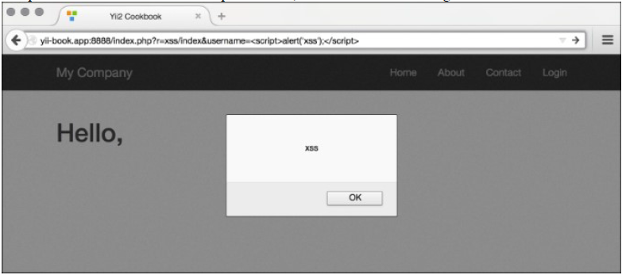

## 防止XSS

XSS代表跨站脚本，它允许注入一个客户端的脚本（通常是JavaScript）到被用户观看的网页。考虑客户端脚本的能力，这会导致非常严重的后果，比如绕过安全检查、获取其它用户的身份或者数据泄露。

在本小节中，我们将会看到如何使用`\yii\helpers\Html`和`\yii\helpers\HtmlPurifier`来转义输出从而防止XSS。

### 准备

1. 按照官方指南[http://www.yiiframework.com/doc-2.0/guide-start-installation.html](http://www.yiiframework.com/doc-2.0/guide-start-installation.html)的描述，使用Composer包管理器创建一个新的应用。
2. 创建`controllers/XssController.php`：

```php
<?php
namespace app\controllers;
use Yii;
use yii\helpers\Html;
use yii\web\Controller;
/**
 * Class SiteController.
 * @package app\controllers
 */
class XssController extends Controller
{
    /**
     * @return string
     */
    public function actionIndex()
    {
        $username = Yii::$app->request->get('username', 'nobody');
        return $this->renderContent(Html::tag('h1',
            'Hello, ' . $username . '!'
        ));
    }
}
```

3. 通常情况下，他会被使用为`/xss/simple?username=Administrator`。然而，因为没有考虑安全准则*过滤输入，转移输出*，恶意的用户能够使用如下方式使用它：

```
/xss/simple?username=<script>alert('XSS');</script>
```

4. 上边的代码将会导致一个脚本注入，如下截图所示：



### 如何做...

执行如下步骤：

1. 为了防止上边屏幕截图中的XSS警报，我们需要将其传给浏览器之前进行转义。方法如下：

```php
<?php
namespace app\controllers;
use Yii;
use yii\helpers\Html;
use yii\web\Controller;
/**
 * Class SiteController.
 * @package app\controllers
 */
class XssController extends Controller
{
    /**
     * @return string
     */
    public function actionIndex()
    {
        $username = Yii::$app->request->get('username', 'nobody');
        return $this->renderContent(Html::tag('h1', Html::encode('Hello, ' . $username . '!')));
    }
}
```

2. 现在你就不会看到警告了，而是得到正确的转义的HTML，截图如下所示：


3. 因此，基本的规则是，转义所有动态的数据。例如，我们应该为名字链接做同样的转义：

```php
use \yii\helpers\Html;
echo Html::a(Html::encode($_GET['username']), array());
```

完成了。你的页面能防止XSS。如果我们希望一些HTML能通过怎么办？我们不能再使用`\yii\helpers\Html::encode`，因为它会将HTML输出为代码，而我们需要是的是实际的表示。幸运的是，Yii有一个工具，它能让你过滤恶意的HTML。这个工具名叫`HTML Purifier`，使用方法如下：

```php
<?php
namespace app\controllers;
use Yii;
use yii\helpers\Html;
use yii\helpers\HtmlPurifier;
use yii\web\Controller;
/**
 * Class SiteController.
 * @package app\controllers
 */
class XssController extends Controller
{
    /**
     * @return string
     */
    public function actionIndex()
    {
        $username = Yii::$app->request->get('username', 'nobody');
        $content = Html::tag('h1', 'Hello, ' . $username . '!');
        return $this->renderContent(
            HtmlPurifier::process($content)
        );
    }
}
```

现在如果我们使用如下地址访问`/xss/index?username=<i>username</i>!<script>alert('XSS')</script>`，HTML净化器会移除恶意的部分，我们将会得到如下结果：


### 工作原理

1. 深入底层看，`\yii\helpers\Html::encode`类似如下所示：

```php
public static function encode($content, $doubleEncode = true)
{
    return htmlspecialchars($content, ENT_QUOTES | ENT_SUBSTITUTE, 
        Yii::$app ? Yii::$app->charset : 'UTF-8',
        $doubleEncode);
}
```

2. 所以本质上是用PHP的`htmlspecialchars`函数，只要第三个参数能正确传递，这个函数非常安全。

`\yii\helpers\HtmlPurifier`使用HTML净化库，这是解决HTML中XSS最先进的解决方案。我们使用了它的默认配置，这对绝大部分用户输入的内容都是有效的。

### 更多...

关于XSS和HTML净化器需要多了解一些东西。接下来的部分就会讨论。

#### XSS类型

XSS注入有两个主要的类型，如下：

- 非持久
- 持久

第一种类型是本小节中最常用的XSS类型；在大部分不安全的web应用中都可以发现。用户传递的数据不会被存储，所以注入脚本只有当用户输入的时候才会执行。但是，这看上去仍然不安全。恶意的用户可以将XSS放在一个链接中，然后放在别的网站上；当其它用户点击访问时，就会发生XSS注入。

第二种情况更验证，因为由恶意用户输入的数据被存储在了数据库中，并被展示给了很多网络用户。使用这种类型的XSS，恶意用户甚至可以通过命令，使其它用户删除他们能访问的数据，摧毁你的网站。

### 参考

欲了解更多关于XSS以及如何处理它，参考如下资源：

- [http://htmlpurifier.org/docs](http://htmlpurifier.org/docs)
- [http://ha.ckers.org/xss.html](http://ha.ckers.org/xss.html)
- [http://shiflett.org/blog/2007/may/character-encoding-and-xss](http://shiflett.org/blog/2007/may/character-encoding-and-xss)