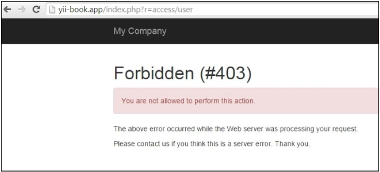
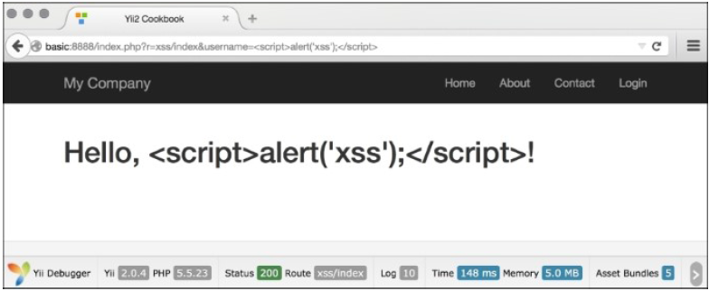
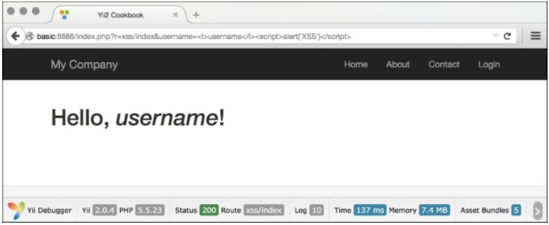
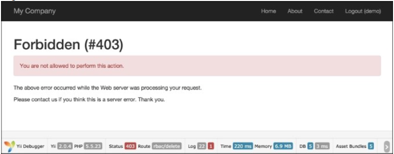

# 第五章 安全

在本章中，我们将会讨论如下话题：

- 身份验证
- 使用控制器过滤器
- 防止XSS
- 防止SQL注入
- 防止CSRF
- 使用RBAC
- 加密/解密数据

## 介绍

安全是任何web应用非常重要的一部分。

在本章中，你将会学习如何根据一般web应用安全准则（过滤输入，转义输出）来保持你应用的安全性。我们将会讨论多个话题，例如创建自己的应用过滤器、防止XSS、CSRF和SQL注入，转移输出，以及使用基于角色的访问控制。欲了解安全最佳实践，参考[http://www.yiiframework.com/doc-2.0/guidesecurity-best-practices.html#avoiding-debug-info-and-tools-at-production](http://www.yiiframework.com/doc-2.0/guidesecurity-best-practices.html#avoiding-debug-info-and-tools-at-production)。

身份验证

大部分应用都会为用户提供登录或者重置忘记的密码的功能。在Yii2中，缺省情况下，我们没有这个机会。对于`basic`应用模板，默认情况下，Yii只提供了两个测试用户，这个两个用户是在`User`模型中写死的。所以，我们必须实现特殊的代码，来使得用户能数据库中登录。

### 准备

1. 按照官方指南[http://www.yiiframework.com/doc-2.0/guide-start-installation.html](http://www.yiiframework.com/doc-2.0/guide-start-installation.html)的描述，使用Composer包管理器创建一个新的应用。
2. 在你的配置的组件部分，添加：

```
'user' => [
    'identityClass' => 'app\models\User',
    'enableAutoLogin' => true,
],
```

3. 创建一个`User`表。输入如下命令创建migration：

```
./yii migrate/create create_user_table
```

4. 更新刚刚创建的migration：

```
<?php
use yii\db\Schema;
use yii\db\Migration;
class m150626_112049_create_user_table extends Migration
{
    public function up()
    {
        $tableOptions = null;
        if ($this->db->driverName === 'mysql') {
            $tableOptions = 'CHARACTER SET utf8 COLLATE utf8_general_ci ENGINE=InnoDB';
        }
        $this->createTable('{{%user}}', [
            'id' => Schema::TYPE_PK,
            'username' => Schema::TYPE_STRING . ' NOT NULL',
            'auth_key' => Schema::TYPE_STRING . '(32) NOT NULL',
            'password_hash' => Schema::TYPE_STRING . ' NOT NULL',
            'password_reset_token' => Schema::TYPE_STRING,
        ], $tableOptions);
    }
    public function down()
    {
        $this->dropTable('{{%user}}');
    }
}
```

5. 更新已存在的模型`models/User`：

```
<?php
namespace app\models;
use yii\db\ActiveRecord;
use yii\web\IdentityInterface;
use yii\base\NotSupportedException;
use Yii;
class User extends ActiveRecord implements IdentityInterface
{
    /**
     * @inheritdoc
     */
    public function rules()
    {
        return [
            ['username', 'required'],
            ['username', 'unique'],
            ['username', 'string', 'min' => 3],
            ['username', 'match', 'pattern' =>
                '~^[A-Za-z][A-Za-z0-9]+$~', 'message' => 'Username can contain only alphanumeric characters.'],
            [['username', 'password_hash',
                'password_reset_token'],
                'string', 'max' => 255
            ],
            ['auth_key', 'string', 'max' => 32],
        ];
    }
    
    /**
     * @inheritdoc
     */
    public static function findIdentity($id)
    {
        return static::findOne($id);
    }
    
    public static function findIdentityByAccessToken($token, $type = null)
    {
        throw new NotSupportedException('"findIdentityByAccessToken" is not implemented.');
    }
    
    /**
     * Finds user by username
     *
     * @param string $username
     * @return User
     */
    public static function findByUsername($username)
    {
        return static::findOne(['username' => $username]);
    }
    
    /**
     * @inheritdoc
     */
    public function getId()
    {
        return $this->getPrimaryKey();
    }
    
    /**
     * @inheritdoc
     */
    public function getAuthKey()
    {
        return $this->auth_key;
    }
    
    /**
     * @inheritdoc
     */
    public function validateAuthKey($authKey)
    {
        return $this->getAuthKey() === $authKey;
    }
    
    /**
     * Validates password
     *
     * @param string $password password to validate
     * @return boolean if password provided is valid for current
    user
     */
    public function validatePassword($password)
    {
        return Yii::$app->getSecurity()->validatePassword($password, $this->password_hash);
    }
    
    /**
     * Generates password hash from password and sets it to the model
     *
     * @param string $password
     */
    public function setPassword($password)
    {
        $this->password_hash =
            Yii::$app->getSecurity()->generatePasswordHash($password);
    }
    
    /**
     * Generates "remember me" authentication key
     */
    public function generateAuthKey()
    {
        $this->auth_key =
            Yii::$app->getSecurity()->generateRandomString();
    }
    
    /**
     * Generates new password reset token
     */
    public function generatePasswordResetToken()
    {
        $this->password_reset_token =
            Yii::$app->getSecurity()->generateRandomString() . '_' . time();
    }
    
    /**
     * Finds user by password reset token
     *
     * @param string $token password reset token
     * @return static|null
     */
    public static function findByPasswordResetToken($token)
    {
        $expire =
            Yii::$app->params['user.passwordResetTokenExpire'];
        $parts = explode('_', $token);
        $timestamp = (int) end($parts);
        if ($timestamp + $expire < time()) {
            return null;
        }
        return static::findOne([
            'password_reset_token' => $token
        ]);
    }
}
```

6. 创建一个migration，它会添加一个测试用户：

```
./yii migrate/create create_test_user
```

7. 更新刚刚创建的migrate：

```
<?php
use yii\db\Migration;
use app\models\User;
class m150626_120355_create_test_user extends Migration
{
    public function up()
    {
        $testUser = new User();
        $testUser->username = 'admin';
        $testUser->setPassword('admin');
        $testUser->generateAuthKey();
        $testUser->save();
    }
    public function down()
    {
        User::findByUsername('turbulence')->delete();
        return false;
    }
}
```

8. 安装所有的migration：

```
./yii migrate up
```

### 如何做...

1. 访问`site/login`，输入`admin/admin`凭证：


2. 如果你完成了这些步骤，你就能登录。

### 工作原理...

1. 首先，为用户表创建一个migration。除了ID和用户名，我们的表还包含特殊的字段，例如`auth_key`（主要用途是通过cookie验证用户的身份），`password_hash`（处于安全原因，我们不能存储密码本身，而应该只是存储密码的hash），以及`password_reset_token`（当用户需要重置密码时使用）。
2. 安装和`create_test_user` migration之后的结果如下图所示：


我们已经为`User`模型添加了特殊的方法，并且修改了继承`class User extends ActiveRecord implements IdentityInterface`，因为我们需要能从数据库中找到用户。

你也可以从高级app[https://github.com/yiisoft/yii2-appadvanced/blob/master/common/models/User.php](https://github.com/yiisoft/yii2-appadvanced/blob/master/common/models/User.php)中复制用户模型`User。

### 参考

欲了解更多信息，参考[http://www.yiiframework.com/doc-2.0/guide-securityauthentication.html](http://www.yiiframework.com/doc-2.0/guide-securityauthentication.html)。

## 使用控制器过滤器

在许多例子中，我们需要过滤输入的数据，或者基于这些数据执行一些动作。例如，使用自定义过滤器，我们可以使用IP过滤访问者，强制用户使用HTTPS，或者在使用应用之前，重定向用户到一个安装页面。

在Yii2中，过滤器本质上是一种特殊的behavior，所以使用过滤器和使用behavior是一样的。

Yii有许多内置的过滤器：

- Core
- Custom
- Authentication
- Content Negotiator
- HttpCache
- PageCache
- RateLimiter
- Verb
- Cors

在本小节中，我们将实现如下内容：

- 对控制器动作的访问限制到只有登录的用户
- 对控制器动作的访问限制到指定的IP
- 只允许指定用户角色访问

## 准备

1. 按照官方指南[http://www.yiiframework.com/doc-2.0/guide-start-installation.html](http://www.yiiframework.com/doc-2.0/guide-start-installation.html)的描述，使用Composer包管理器创建一个新的应用。
2. 创建`app/components/AccessRule.php`：

```
<?php
namespace app\components;
use app\models\User;
class AccessRule extends \yii\filters\AccessRule {
    /**
     * @inheritdoc
     */
    protected function matchRole($user)
    {
        if (empty($this->roles)) {
            return true;
        }
        $isGuest = $user->getIsGuest();
        foreach ($this->roles as $role) {
            switch($role) {
                case '?':
                    return ($isGuest) ? true : false;
                case User::ROLE_USER:
                    return (!$isGuest) ? true : false;
                case $user->identity->role: // Check if the user is logged in, and the roles match
                    return (!$isGuest) ? true : false;
                default:
                    return false;
            }
        }
        return false;
    }
}
```

3. 创建`app/controllers/AccessController.php`：

```
<?php
namespace app\controllers;
use app\models\User;
use Yii;
use yii\filters\AccessControl;
use app\components\AccessRule;
use yii\web\Controller;
class AccessController extends Controller
{
    public function behaviors()
    {
        return [
            'access' => [
                'class' => AccessControl::className(),
                // We will override the default rule config with the new AccessRule class
                'ruleConfig' => [
                    'class' => AccessRule::className(),
                ],
                'rules' => [
                    [
                        'allow' => true,
                        'actions' => ['auth-only'],
                        'roles' => [User::ROLE_USER]
                    ],
                    [
                        'allow' => true,
                        'actions' => ['ip'],
                        'ips' => ['127.0.0.1'],
                    ],
                    [
                        'allow' => true,
                        'actions' => ['user'],
                        'roles' => [ User::ROLE_ADMIN],
                    ],
                    [
                        'allow' => false,
                    ]
                ],
            ]
        ];
    }
    public function actionAuthOnly()
    {
        echo "Looks like you are authorized to run me.";
    }
    public function actionIp()
    {
        echo "Your IP is in our list. Lucky you!";
    }
    public function actionUser()
    {
        echo "You're the right man. Welcome!";
    }
}
```

4. 修改`User`类：

```
<?php
namespace app\models;
class User extends \yii\base\Object implements \yii\web\IdentityInterface
{
    // add roles contstants
    CONST ROLE_USER = 200;
    CONST ROLE_ADMIN = 100;
    public $id;
    public $username;
    public $password;
    public $authKey;
    public $accessToken;
    public $role;
    private static $users = [
        '100' => [
            'id' => '100',
            'username' => 'admin',
            'password' => 'admin',
            'authKey' => 'test100key',
            'accessToken' => '100-token',
            'role' => USER::ROLE_ADMIN // add admin role for admin user
        ],
        '101' => [
            'id' => '101',
            'username' => 'demo',
            'password' => 'demo',
            'authKey' => 'test101key',
            'accessToken' => '101-token',
            'role' => USER::ROLE_USER // add user role for admin user
        ],
    ];
    //…
}
```

### 如何做...

1. 为了使用`AccessControl`，在你的控制器的`behaviors()`方法中声明：

```
public function behaviors()
{
    return [
        'access' => [
            'class' => AccessControl::className(),
            'rules' => [
                [
                    'allow' => true,
                    'actions' => ['auth-only'],
                    'roles' => ['@'],
                ],
                [
                    'allow' => true,
                    'actions' => ['ip'],
                    'ips' => ['127.0.0.1'],
                ],
                [
                    'allow' => true,
                    'actions' => ['user'],
                    'roles' => ['admin'],
                ],
                [
                    'allow' => true,
                    'actions' => ['user'],
                    'matchCallback' => function ($rule, $action) {
                        return preg_match('/MSIE9/',$_SERVER['HTTP_USER_AGENT']) !== false;
                    }
                ],
                ['allow' => false]
            ],
        ]
    ];
}
```

2. 尝试使用IE浏览器和其他浏览器运行控制器动作，使用`admin`和`demo`用户。

### 工作原理...

我们开始限制控制器动作给已经登录的用户，查看如下`rules`数组中的代码：

```
[
    'allow' => true,
    'actions' => ['auth-only'],
    'roles' => [User::ROLE_USER]
],
```

每一个数组都是一个访问规则。你可以使用`allow=true`或者`allow=>false`。对于每一个规则，有若干个参数。

缺省情况下，Yii不会拒绝任何事情，所以如果你需要最大程度的安全，考虑添加`['allow' => false]`到规则的末尾。

在我们的规则中，我们使用了两个参数。第一个是动作参数，












