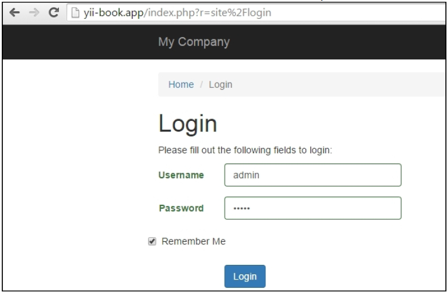
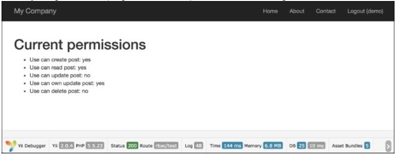
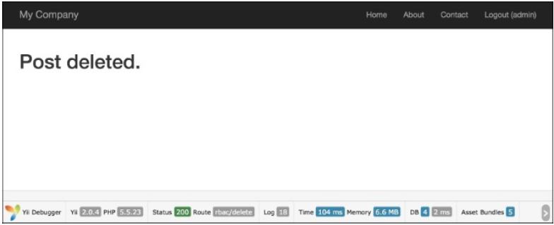

# 第五章 安全

在本章中，我们将会讨论如下话题：

- 身份验证
- 使用控制器过滤器
- 防止XSS
- 防止SQL注入
- 防止CSRF
- 使用RBAC
- 加密/解密数据

## 介绍

安全是任何web应用非常重要的一部分。

在本章中，你将会学习如何根据一般web应用安全准则（过滤输入，转义输出）来保持你应用的安全性。我们将会讨论多个话题，例如创建自己的应用过滤器、防止XSS、CSRF和SQL注入，转移输出，以及使用基于角色的访问控制。欲了解安全最佳实践，参考[http://www.yiiframework.com/doc-2.0/guidesecurity-best-practices.html#avoiding-debug-info-and-tools-at-production](http://www.yiiframework.com/doc-2.0/guidesecurity-best-practices.html#avoiding-debug-info-and-tools-at-production)。

身份验证

大部分应用都会为用户提供登录或者重置忘记的密码的功能。在Yii2中，缺省情况下，我们没有这个机会。对于`basic`应用模板，默认情况下，Yii只提供了两个测试用户，这个两个用户是在`User`模型中写死的。所以，我们必须实现特殊的代码，来使得用户能数据库中登录。

### 准备

1. 按照官方指南[http://www.yiiframework.com/doc-2.0/guide-start-installation.html](http://www.yiiframework.com/doc-2.0/guide-start-installation.html)的描述，使用Composer包管理器创建一个新的应用。
2. 在你的配置的组件部分，添加：

```
'user' => [
    'identityClass' => 'app\models\User',
    'enableAutoLogin' => true,
],
```

3. 创建一个`User`表。输入如下命令创建migration：

```
./yii migrate/create create_user_table
```

4. 更新刚刚创建的migration：

```
<?php
use yii\db\Schema;
use yii\db\Migration;
class m150626_112049_create_user_table extends Migration
{
    public function up()
    {
        $tableOptions = null;
        if ($this->db->driverName === 'mysql') {
            $tableOptions = 'CHARACTER SET utf8 COLLATE utf8_general_ci ENGINE=InnoDB';
        }
        $this->createTable('{{%user}}', [
            'id' => Schema::TYPE_PK,
            'username' => Schema::TYPE_STRING . ' NOT NULL',
            'auth_key' => Schema::TYPE_STRING . '(32) NOT NULL',
            'password_hash' => Schema::TYPE_STRING . ' NOT NULL',
            'password_reset_token' => Schema::TYPE_STRING,
        ], $tableOptions);
    }
    public function down()
    {
        $this->dropTable('{{%user}}');
    }
}
```

5. 更新已存在的模型`models/User`：

```
<?php
namespace app\models;
use yii\db\ActiveRecord;
use yii\web\IdentityInterface;
use yii\base\NotSupportedException;
use Yii;
class User extends ActiveRecord implements IdentityInterface
{
    /**
     * @inheritdoc
     */
    public function rules()
    {
        return [
            ['username', 'required'],
            ['username', 'unique'],
            ['username', 'string', 'min' => 3],
            ['username', 'match', 'pattern' =>
                '~^[A-Za-z][A-Za-z0-9]+$~', 'message' => 'Username can contain only alphanumeric characters.'],
            [['username', 'password_hash',
                'password_reset_token'],
                'string', 'max' => 255
            ],
            ['auth_key', 'string', 'max' => 32],
        ];
    }
    
    /**
     * @inheritdoc
     */
    public static function findIdentity($id)
    {
        return static::findOne($id);
    }
    
    public static function findIdentityByAccessToken($token, $type = null)
    {
        throw new NotSupportedException('"findIdentityByAccessToken" is not implemented.');
    }
    
    /**
     * Finds user by username
     *
     * @param string $username
     * @return User
     */
    public static function findByUsername($username)
    {
        return static::findOne(['username' => $username]);
    }
    
    /**
     * @inheritdoc
     */
    public function getId()
    {
        return $this->getPrimaryKey();
    }
    
    /**
     * @inheritdoc
     */
    public function getAuthKey()
    {
        return $this->auth_key;
    }
    
    /**
     * @inheritdoc
     */
    public function validateAuthKey($authKey)
    {
        return $this->getAuthKey() === $authKey;
    }
    
    /**
     * Validates password
     *
     * @param string $password password to validate
     * @return boolean if password provided is valid for current
    user
     */
    public function validatePassword($password)
    {
        return Yii::$app->getSecurity()->validatePassword($password, $this->password_hash);
    }
    
    /**
     * Generates password hash from password and sets it to the model
     *
     * @param string $password
     */
    public function setPassword($password)
    {
        $this->password_hash =
            Yii::$app->getSecurity()->generatePasswordHash($password);
    }
    
    /**
     * Generates "remember me" authentication key
     */
    public function generateAuthKey()
    {
        $this->auth_key =
            Yii::$app->getSecurity()->generateRandomString();
    }
    
    /**
     * Generates new password reset token
     */
    public function generatePasswordResetToken()
    {
        $this->password_reset_token =
            Yii::$app->getSecurity()->generateRandomString() . '_' . time();
    }
    
    /**
     * Finds user by password reset token
     *
     * @param string $token password reset token
     * @return static|null
     */
    public static function findByPasswordResetToken($token)
    {
        $expire =
            Yii::$app->params['user.passwordResetTokenExpire'];
        $parts = explode('_', $token);
        $timestamp = (int) end($parts);
        if ($timestamp + $expire < time()) {
            return null;
        }
        return static::findOne([
            'password_reset_token' => $token
        ]);
    }
}
```

6. 创建一个migration，它会添加一个测试用户：

```
./yii migrate/create create_test_user
```

7. 更新刚刚创建的migrate：

```
<?php
use yii\db\Migration;
use app\models\User;
class m150626_120355_create_test_user extends Migration
{
    public function up()
    {
        $testUser = new User();
        $testUser->username = 'admin';
        $testUser->setPassword('admin');
        $testUser->generateAuthKey();
        $testUser->save();
    }
    public function down()
    {
        User::findByUsername('turbulence')->delete();
        return false;
    }
}
```

8. 安装所有的migration：

```
./yii migrate up
```

### 如何做...

1. 访问`site/login`，输入`admin/admin`凭证：



2. 如果你完成了这些步骤，你就能登录。

### 工作原理...

1. 首先，为用户表创建一个migration。除了ID和用户名，我们的表还包含特殊的字段，例如`auth_key`（主要用途是通过cookie验证用户的身份），`password_hash`（处于安全原因，我们不能存储密码本身，而应该只是存储密码的hash），以及`password_reset_token`（当用户需要重置密码时使用）。
2. 安装和`create_test_user` migration之后的结果如下图所示：


我们已经为`User`模型添加了特殊的方法，并且修改了继承`class User extends ActiveRecord implements IdentityInterface`，因为我们需要能从数据库中找到用户。

你也可以从高级app[https://github.com/yiisoft/yii2-appadvanced/blob/master/common/models/User.php](https://github.com/yiisoft/yii2-appadvanced/blob/master/common/models/User.php)中复制用户模型`User。

### 参考

欲了解更多信息，参考[http://www.yiiframework.com/doc-2.0/guide-securityauthentication.html](http://www.yiiframework.com/doc-2.0/guide-securityauthentication.html)。

## 使用控制器过滤器

在许多例子中，我们需要过滤输入的数据，或者基于这些数据执行一些动作。例如，使用自定义过滤器，我们可以使用IP过滤访问者，强制用户使用HTTPS，或者在使用应用之前，重定向用户到一个安装页面。

在Yii2中，过滤器本质上是一种特殊的behavior，所以使用过滤器和使用behavior是一样的。

Yii有许多内置的过滤器：

- Core
- Custom
- Authentication
- Content Negotiator
- HttpCache
- PageCache
- RateLimiter
- Verb
- Cors

在本小节中，我们将实现如下内容：

- 对控制器动作的访问限制到只有登录的用户
- 对控制器动作的访问限制到指定的IP
- 只允许指定用户角色访问

## 准备

1. 按照官方指南[http://www.yiiframework.com/doc-2.0/guide-start-installation.html](http://www.yiiframework.com/doc-2.0/guide-start-installation.html)的描述，使用Composer包管理器创建一个新的应用。
2. 创建`app/components/AccessRule.php`：

```
<?php
namespace app\components;
use app\models\User;
class AccessRule extends \yii\filters\AccessRule {
    /**
     * @inheritdoc
     */
    protected function matchRole($user)
    {
        if (empty($this->roles)) {
            return true;
        }
        $isGuest = $user->getIsGuest();
        foreach ($this->roles as $role) {
            switch($role) {
                case '?':
                    return ($isGuest) ? true : false;
                case User::ROLE_USER:
                    return (!$isGuest) ? true : false;
                case $user->identity->role: // Check if the user is logged in, and the roles match
                    return (!$isGuest) ? true : false;
                default:
                    return false;
            }
        }
        return false;
    }
}
```

3. 创建`app/controllers/AccessController.php`：

```
<?php
namespace app\controllers;
use app\models\User;
use Yii;
use yii\filters\AccessControl;
use app\components\AccessRule;
use yii\web\Controller;
class AccessController extends Controller
{
    public function behaviors()
    {
        return [
            'access' => [
                'class' => AccessControl::className(),
                // We will override the default rule config with the new AccessRule class
                'ruleConfig' => [
                    'class' => AccessRule::className(),
                ],
                'rules' => [
                    [
                        'allow' => true,
                        'actions' => ['auth-only'],
                        'roles' => [User::ROLE_USER]
                    ],
                    [
                        'allow' => true,
                        'actions' => ['ip'],
                        'ips' => ['127.0.0.1'],
                    ],
                    [
                        'allow' => true,
                        'actions' => ['user'],
                        'roles' => [ User::ROLE_ADMIN],
                    ],
                    [
                        'allow' => false,
                    ]
                ],
            ]
        ];
    }
    public function actionAuthOnly()
    {
        echo "Looks like you are authorized to run me.";
    }
    public function actionIp()
    {
        echo "Your IP is in our list. Lucky you!";
    }
    public function actionUser()
    {
        echo "You're the right man. Welcome!";
    }
}
```

4. 修改`User`类：

```
<?php
namespace app\models;
class User extends \yii\base\Object implements \yii\web\IdentityInterface
{
    // add roles contstants
    CONST ROLE_USER = 200;
    CONST ROLE_ADMIN = 100;
    public $id;
    public $username;
    public $password;
    public $authKey;
    public $accessToken;
    public $role;
    private static $users = [
        '100' => [
            'id' => '100',
            'username' => 'admin',
            'password' => 'admin',
            'authKey' => 'test100key',
            'accessToken' => '100-token',
            'role' => USER::ROLE_ADMIN // add admin role for admin user
        ],
        '101' => [
            'id' => '101',
            'username' => 'demo',
            'password' => 'demo',
            'authKey' => 'test101key',
            'accessToken' => '101-token',
            'role' => USER::ROLE_USER // add user role for admin user
        ],
    ];
    //…
}
```

### 如何做...

1. 为了使用`AccessControl`，在你的控制器的`behaviors()`方法中声明：

```
public function behaviors()
{
    return [
        'access' => [
            'class' => AccessControl::className(),
            'rules' => [
                [
                    'allow' => true,
                    'actions' => ['auth-only'],
                    'roles' => ['@'],
                ],
                [
                    'allow' => true,
                    'actions' => ['ip'],
                    'ips' => ['127.0.0.1'],
                ],
                [
                    'allow' => true,
                    'actions' => ['user'],
                    'roles' => ['admin'],
                ],
                [
                    'allow' => true,
                    'actions' => ['user'],
                    'matchCallback' => function ($rule, $action) {
                        return preg_match('/MSIE9/',$_SERVER['HTTP_USER_AGENT']) !== false;
                    }
                ],
                ['allow' => false]
            ],
        ]
    ];
}
```

2. 尝试使用IE浏览器和其他浏览器运行控制器动作，使用`admin`和`demo`用户。

### 工作原理...

我们开始限制控制器动作给已经登录的用户，查看如下`rules`数组中的代码：

```
[
    'allow' => true,
    'actions' => ['auth-only'],
    'roles' => [User::ROLE_USER]
],
```

每一个数组都是一个访问规则。你可以使用`allow=true`或者`allow=>false`。对于每一个规则，有若干个参数。

缺省情况下，Yii不会拒绝任何事情，所以如果你需要最大程度的安全，考虑添加`['allow' => false]`到规则的末尾。

在我们的规则中，我们使用了两个参数。第一个是动作参数，它指定的该规则会应用在哪些动作上。第二个参数时角色参数，它指定了该规则会应用于哪些角色上。

Yii2内置访问控制默认只支持两个角色：游客（未登录），用符号`?`指定，登录的用户，用服务`@`指定。

使用简单的访问控制，我们可以基于用户的登录状态限制对指定页面的访问。如果用户在未登录状态下访问这些页面，Yii会将他们重定向到登录页面。

规则会一个接一个执行，从第一个开始，直到能匹配上一个。如果没有一个能匹配，那么该访问被认为是允许的。

下一个任务是限制指定IP的访问。在这个例子中，涉及如下两个访问规则：

```
[
    'allow' => true,
    'actions' => ['ip'],
    'ips' => ['127.0.0.1'],
],
```

第一个规则允许指定IP列表中的IP访问。在我们的例子中，我们使用了一个回路地址，它指向我们自己的电脑。尝试将其修改为`127.0.0.2`，看看当IP地址不匹配时是什么表现。第二个规则是拒绝所以，包括其它所有IP。

接下来，我们只允许指定用户角色访问：

```
[
    'allow' => true,
    'actions' => ['user'],
    'roles' => [ User::ROLE_ADMIN],
],
```

上边的规则允许`admin`角色的用户访问user动作，因此，如果你以`admin`登录，你将可以访问，但如果你以`demo`登录，将会被拒绝。


我们重写了标准`AccessRule`类，存放在`components/AccessRule.php`。在我们的`AccessRule`类内部，我们重写了`matchRole`方法，在这我们获取并检查了当前用户的角色，并使用我们的规则进行匹配。

最后，我们需要拒绝指定浏览器的访问。在本小节中，我们只拒绝IE 9的访问。这个规则被放在了首位，所以它首先会执行：

```
[
    'all`ow' => true,
    'actions' => ['user'],
    'matchCallback' => function ($rule, $action) {
        return preg_match('/MSIE 9/',$_SERVER['HTTP_USER_AGENT'])!==false;
    }`
],
```

我们使用的这个检测技术是不可靠的，因为MSIE在其它很多用户代理中都会包含。想了解用户代理字符串的列表，可以参考`http://www.useragentstring.com/`。

在上边的代码中，我们使用了另外一个过滤规则属性，名叫`matchCallback`。这个属性表明只有当函数中的属性返回`true`时规则会生效。

我们的函数检查用户代理字符串是否包含MSIE 9.0字符串。你可以根据自己的需求，指定任何PHP代码。

### 参考

为了了解更多有关访问控制和过滤器的信息，参考如下地址：

- [http://www.yiiframework.com/doc-2.0/guide-structure-filters.html](http://www.yiiframework.com/doc-2.0/guide-structure-filters.html)
- [http://www.yiiframework.com/doc-2.0/yii-filters-accesscontrol.html](http://www.yiiframework.com/doc-2.0/yii-filters-accesscontrol.html)
- [http://www.yiiframework.com/doc-2.0/yii-filters-accessrule.html](http://www.yiiframework.com/doc-2.0/yii-filters-accessrule.html)
- [https://github.com/yiisoft/yii2/blob/master/docs/guide/structure-filters.md](https://github.com/yiisoft/yii2/blob/master/docs/guide/structure-filters.md)
- [http://www.yiiframework.com/doc-2.0/guide-security-authorization.html#access-control-filter](http://www.yiiframework.com/doc-2.0/guide-security-authorization.html#access-control-filter)
- `使用RBAC`小节

## 防止XSS

XSS代表跨站脚本，它允许注入一个客户端的脚本（通常是JavaScript）到被用户观看的网页。考虑客户端脚本的能力，这会导致非常严重的后果，比如绕过安全检查、获取其它用户的身份或者数据泄露。

在本小节中，我们将会看到如何使用`\yii\helpers\Html`和`\yii\helpers\HtmlPurifier`来转义输出从而防止XSS。

### 准备

1. 按照官方指南[http://www.yiiframework.com/doc-2.0/guide-start-installation.html](http://www.yiiframework.com/doc-2.0/guide-start-installation.html)的描述，使用Composer包管理器创建一个新的应用。
2. 创建`controllers/XssController.php`：

```
<?php
namespace app\controllers;
use Yii;
use yii\helpers\Html;
use yii\web\Controller;
/**
 * Class SiteController.
 * @package app\controllers
 */
class XssController extends Controller
{
    /**
     * @return string
     */
    public function actionIndex()
    {
        $username = Yii::$app->request->get('username', 'nobody');
        return $this->renderContent(Html::tag('h1',
            'Hello, ' . $username . '!'
        ));
    }
}
```

3. 通常情况下，他会被使用为`/xss/simple?username=Administrator`。然而，因为没有考虑安全准则*过滤输入，转移输出*，恶意的用户能够使用如下方式使用它：

```
/xss/simple?username=<script>alert('XSS');</script>
```

4. 上边的代码将会导致一个脚本注入，如下截图所示：


### 如何做...

执行如下步骤：

1. 为了防止上边屏幕截图中的XSS警报，我们需要将其传给浏览器之前进行转义。方法如下：

```
<?php
namespace app\controllers;
use Yii;
use yii\helpers\Html;
use yii\web\Controller;
/**
 * Class SiteController.
 * @package app\controllers
 */
class XssController extends Controller
{
    /**
     * @return string
     */
    public function actionIndex()
    {
        $username = Yii::$app->request->get('username', 'nobody');
        return $this->renderContent(Html::tag('h1', Html::encode('Hello, ' . $username . '!')));
    }
}
```

2. 现在你就不会看到警告了，而是得到正确的转义的HTML，截图如下所示：


3. 因此，基本的规则是，转义所有动态的数据。例如，我们应该为名字链接做同样的转义：

```
use \yii\helpers\Html;
echo Html::a(Html::encode($_GET['username']), array());
```

完成了。你的页面能防止XSS。如果我们希望一些HTML能通过怎么办？我们不能再使用`\yii\helpers\Html::encode`，因为它会将HTML输出为代码，而我们需要是的是实际的表示。幸运的是，Yii有一个工具，它能让你过滤恶意的HTML。这个工具名叫`HTML Purifier`，使用方法如下：

```
<?php
namespace app\controllers;
use Yii;
use yii\helpers\Html;
use yii\helpers\HtmlPurifier;
use yii\web\Controller;
/**
 * Class SiteController.
 * @package app\controllers
 */
class XssController extends Controller
{
    /**
     * @return string
     */
    public function actionIndex()
    {
        $username = Yii::$app->request->get('username', 'nobody');
        $content = Html::tag('h1', 'Hello, ' . $username . '!');
        return $this->renderContent(
            HtmlPurifier::process($content)
        );
    }
}
```

现在如果我们使用如下地址访问`/xss/index?username=<i>username</i>!<script>alert('XSS')</script>`，HTML净化器会移除恶意的部分，我们将会得到如下结果：


### 工作原理

1. 深入底层看，`\yii\helpers\Html::encode`类似如下所示：

```
public static function encode($content, $doubleEncode = true)
{
    return htmlspecialchars($content, ENT_QUOTES | ENT_SUBSTITUTE, 
        Yii::$app ? Yii::$app->charset : 'UTF-8',
        $doubleEncode);
}
```

2. 所以本质上是用PHP的`htmlspecialchars`函数，只要第三个参数能正确传递，这个函数非常安全。

`\yii\helpers\HtmlPurifier`使用HTML净化库，这是解决HTML中XSS最先进的解决方案。我们使用了它的默认配置，这对绝大部分用户输入的内容都是有效的。

### 更多...

关于XSS和HTML净化器需要多了解一些东西。接下来的部分就会讨论。

#### XSS类型

XSS注入有两个主要的类型，如下：

- 非持久
- 持久

第一种类型是本小节中最常用的XSS类型；在大部分不安全的web应用中都可以发现。用户传递的数据不会被存储，所以注入脚本只有当用户输入的时候才会执行。但是，这看上去仍然不安全。恶意的用户可以将XSS放在一个链接中，然后放在别的网站上；当其它用户点击访问时，就会发生XSS注入。

第二种情况更验证，因为由恶意用户输入的数据被存储在了数据库中，并被展示给了很多网络用户。使用这种类型的XSS，恶意用户甚至可以通过命令，使其它用户删除他们能访问的数据，摧毁你的网站。

### 参考

欲了解更多关于XSS以及如何处理它，参考如下资源：

- [http://htmlpurifier.org/docs](http://htmlpurifier.org/docs)
- [http://ha.ckers.org/xss.html](http://ha.ckers.org/xss.html)
- [http://shiflett.org/blog/2007/may/character-encoding-and-xss](http://shiflett.org/blog/2007/may/character-encoding-and-xss)

## 防止SQL注入

SQL注入是一种代码注入，它利用了数据库层的易损性，允许你执行任意SQL，允许恶意用户删除数据或者提升自己的权限。

在本小节中，我们将会看到易损代码的例子，以及如何修复他们。

### 准备

1. 按照官方指南[http://www.yiiframework.com/doc-2.0/guide-start-installation.html](http://www.yiiframework.com/doc-2.0/guide-start-installation.html)的描述，使用Composer包管理器创建一个新的应用。
2. 执行如下SQL：

```
DROP TABLE IF EXISTS `user`;
CREATE TABLE `user` (
  `id` int(11) unsigned NOT NULL AUTO_INCREMENT,
  `username` varchar(100) NOT NULL,
  `password` varchar(32) NOT NULL,
  PRIMARY KEY (`id`)
);
INSERT INTO `user`(`id`,`username`,`password`) VALUES ('1','Alex','202cb962ac59075b964b07152d234b70');
INSERT INTO `user`(`id`,`username`,`password`) VALUES ('2','Qiang','202cb962ac59075b964b07152d234b70');
```

3. 使用Gii生成`User`模型。

### 如何做...

1. 首先，我们将会实现一个简单的动作，检查通过URL传递过来的用户名和密码是否是正确的。创建`app/controllers/SqlController.php`：

```
<?php
namespace app\controllers;
use app\models\User;
use Yii;
use yii\base\Controller;
use yii\base\Exception;
use yii\helpers\ArrayHelper;
use yii\helpers\Html;
/**
 * Class SqlController.
 * @package app\controllers
 */
class SqlController extends Controller
{
    protected function renderContentByResult($result)
    {
        if ($result) {
            $content = "Success";
        } else {
            $content = "Failure";
        }
        return $this->renderContent($content);
    }
    public function actionSimple()
    {
        $userName = Yii::$app->request->get('username');
        $password = Yii::$app->request->get('password');
        $passwordHash = md5($password);
        $sql = "SELECT * FROM `user`"
            ." WHERE `username` = '".$userName."'"
            ." AND password = '".$passwordHash."' LIMIT |1";
        $result = Yii::$app->db->createCommand($sql)->queryOne();
        return $this->renderContentByResult($result);
    }
}
```

2. 访问`/sql/simple?username=test&password=test`。因为我们不知道两组用户名和密码，正如所预料的，会打印失败。
3. 现在尝试访问`/sql/simple?username=%27+or+%271%27%3D%271%27%3B+--&password=whatever`。这一次，它让我们通过了，尽管实际上我们并不知道真正的身份。解压的部分`username`的值如下所示：

```
' or '1'='1'; --
```

4. 关闭quote，从而语法是正确的。添加`OR '1'='1'`，它使得条件永远是正确的。使用`; --`来结束查询并注释剩余的部分。
5. 因为没有做转义，整个查询语句是：

```
SELECT * FROM user WHERE username = '' or '1'='1'; --' AND password = '008c5926ca861023c1d2a36653fd88e2' LIMIT 1;
```

6. 修复这个问题最好的方法是使用prepared statement，如下所示：

```
public function actionPrepared()
{
    $userName = Yii::$app->request->get('username');
    $password = Yii::$app->request->get('password');
    $passwordHash = md5($password);
    $sql = "SELECT * FROM `user`"
        ." WHERE `username` = :username"
        ." AND password = :password LIMIT 1";
    $command = Yii::$app->db->createCommand($sql);
    $command->bindValue(':username', $userName);
    $command->bindValue(':password', $passwordHash);
    $result = $command->queryOne();
    return $this->renderContentByResult($result);
}
```

7. 现在使用相同的恶意参数检查`/sql/prepared`。这一次是正常的并且收到了失败的消息。相同的准则被应用到了ActiveRecord上。唯一的不同是AR使用了其它语法：

```
public function actionAr()
{
    $userName = Yii::$app->request->get('username');
    $password = Yii::$app->request->get('password');
    $passwordHash = md5($password);
    $result = User::findOne([
        'username' => $userName,
        'password' => $passwordHash
    ]);
    return $this->renderContentByResult($result);
}
```

8. 在先前的代码中，我们以键值对的样式使用了`username`和`password`参数。先前的代码我们只使用了第一个参数，这会很容易受到攻击：

```
public function actionWrongAr()
{
    $userName = Yii::$app->request->get('username');
    $password = Yii::$app->request->get('password');
    $passwordHash = md5($password);
    $condition = "`username` = '".$userName." AND `password` ='".$passwordHash."'";
    $result = User::find()->where($condition)->one();
    return $this->renderContentByResult($result);
}
```

9. 如果正确使用，prepared statement可以防止所有类型的SQL注入。但是，这里还会有一些常见的问题：

- 你可以为一个参数绑定一个值，所以，如果你希望查询`WHERE IN (1,2,3,4)`，你必须创建和绑定4个参数。
- prepared statement不能用于表名，列名，以及其它关键词。

10. 当使用`ActiveRecord`时，通过添加`where`可以解决第一个问题：

```
public function actionIn()
{
    $names = ['Alex', 'Qiang'];
    $users = User::find()->where(['username' => $names])->all();
    return $this->renderContent(Html::ul(
        ArrayHelper::getColumn($users, 'username')
    ));
}
```

11. 第二个问题有多种解决方法。第一种方法是依赖active record和PDO quoting：

```
public function actionColumn()
{
    $attr = Yii::$app->request->get('attr');
    $value = Yii::$app->request->get('value');
    $users = User::find()->where([$attr => $value])->all();
    return $this->renderContent(Html::ul(
        ArrayHelper::getColumn($users, 'username')
    ));
}
```

12. 但是最安全的方法是使用白名单：

```
public function actionWhiteList()
{
    $attr = Yii::$app->request->get('attr');
    $value = Yii::$app->request->get('value');
    $allowedAttr = ['username', 'id'];
    if (!in_array($attr, $allowedAttr)) {
        throw new Exception("Attribute specified is not allowed.");
    }
    $users = User::find()->where([$attr => $value])->all();
    return $this->renderContent(Html::ul(
        ArrayHelper::getColumn($users, 'username')
    ));
}
```

### 工作原理...

防止SQL注入时，主要的目标是正确过滤输入。在所有的情况下，除了表名，我们使用了prepared statements——大多数关系数据库都支持的特性。他们允许你创建一次statement，然后多次使用，他们提供了安全的方法来绑定参数。

在Yii中，你可以为Active Record和DAO使用prepared statement。当使用DAO时，可以使用`bindValue`和`bindParam`来达到目的。当我们希望执行多个同类型但值不同的查询时，非常有用。

```
public function actionBind()
{
    $userName = 'Alex';
    $passwordHash = md5('password1');
    $sql = "INSERT INTO `user` (`username`, `password`) VALUES (:username, :password);";
    // insert first user
    $command = Yii::$app->db->createCommand($sql);
    $command->bindParam('username', $userName);
    $command->bindParam('password', $passwordHash);
    $command->execute();
    // insert second user
    $userName = 'Qiang';
    $passwordHash = md5('password2');
    $command->execute();
    return $this->renderContent(Html::ul(
        ArrayHelper::getColumn(User::find()->all(), 'username')
    ));
}
```

大部分Active Record方法接受参数。安全起见，你应该使用他们，而不是将原始数据传进去。

至于quoting表名，列和其它关键词，你可以依赖Active Record，或者使用白名单方法。

### 参考

欲了解更多关于SQL注入，以及使用Yii配合数据库工作，参考如下地址：

- [http://www.slideshare.net/billkarwin/sql-injection-myths-and-fallacies](http://www.slideshare.net/billkarwin/sql-injection-myths-and-fallacies)
- [http://www.yiiframework.com/doc-2.0/yii-db-connection.html](http://www.yiiframework.com/doc-2.0/yii-db-connection.html)
- [http://www.yiiframework.com/doc-2.0/yii-db-command.html](http://www.yiiframework.com/doc-2.0/yii-db-command.html)
- [http://www.yiiframework.com/doc-2.0/guide-security-best-practices.html#avoiding-sql-injections](http://www.yiiframework.com/doc-2.0/guide-security-best-practices.html#avoiding-sql-injections)
- 第三章*Active Model，模型和数据库*中的*从数据库获取数据*小节

## 防止CSRF








