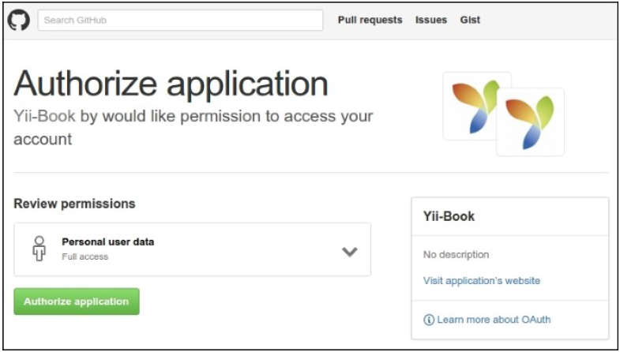

## 身份认证客户端

这个扩展为Yii2框架添加了OpenID、OAuth和OAuth2 consumers。

### 准备

1. 按照官方指南[http://www.yiiframework.com/doc-2.0/guide-start-installation.html](http://www.yiiframework.com/doc-2.0/guide-start-installation.html)的描述，使用Composer包管理器创建一个新的应用。
2. 使用如下命令安装扩展：

```
composer require yiisoft/yii2-authclient
```

### 如何做...

1. 打开你的Github应用页面`https://github.com/settings/applications`并添加自己的新应用：


2. 获取**Client ID**和**Client Secret**：


3. 配置你的web配置，并为`authClientCollection`组件设置相应的选项：

```
'components' => [
    // ...
    'authClientCollection' => [
        'class' => 'yii\authclient\Collection',
        'clients' => [
            'google' => [
                'class' =>'yii\authclient\clients\GoogleOpenId'
            ],
            'github' => [
                'class' => 'yii\authclient\clients\GitHub',
                'clientId' => '87f0784aae2ac48f78a',
                'clientSecret' =>'fb5953a54dea4640f3a70d8abd96fbd25592ff18',
            ],
            // etc.
        ],
    ],
],
```

4. 打开你的`SiteController`并添加`auth`独立动作和成功回调方法：

```
use yii\authclient\ClientInterface;
public function actions()
{
    return [
        // ...
        'auth' => [
            'class' => 'yii\authclient\AuthAction',
            'successCallback' => [$this, 'onAuthSuccess'],
        ],
    ];
}

public function onAuthSuccess(ClientInterface $client)
{
    $attributes = $client->getUserAttributes();
    \yii\helpers\VarDumper::dump($attributes, 10, true);
    exit;
}
```

5. 打开`views/site/login.php`文件并插入`AuthChoice`小组件：

```
<div class="site-login">
    <h1><?= Html::encode($this->title) ?></h1>
    <div class="panel panel-default">
        <div class="panel-body">
            <?= yii\authclient\widgets\AuthChoice::widget(['baseAuthUrl' => ['site/auth'], 'popupMode' => false,]) ?>
        </div>
    </div>
    <p>Please fill out the following fields to login:</p>
    ...
</div>
```

6. 你将会看到你配置的图标：


7. 为了使用Github provider进行验证：



8. 如果成功，你的回调将会展示验证的用户属性：

```
[
    'login' => 'Name'
    'id' => 0000000
    'avatar_url' =>'https://avatars.githubusercontent.com/u/0000000?v=3'
    'gravatar_id' => ''
    'url' => 'https://api.github.com/users/Name'
    'html_url' => 'https://github.com/Name'
    //...
    'name' => 'YourName'
    'blog' =>site.com'
    'email => mail@site.com'
    //...
]
```

9. 在`onAuthSuccess`方法中创建你自己认证的代码，可参考例子[https://github.com/yiisoft/yii2-authclient/blob/master/docs/guide/quick-start.md](https://github.com/yiisoft/yii2-authclient/blob/master/docs/guide/quick-start.md)。

### 工作原理...

这个扩展为你的应用提供了OpenID、OAuth和OAuth2认证客户端。

`AuthChoice`小组件在一个选择的服务网站上打开了一个身份认证页面，存储`auth`动作URL。身份认证以后，通过一个POST请求发送认证数据时，当前的服务将用户重定向回去。`AuthAction`收到这个请求，并调用相应的回调。

你可以使用任何存在的客户端或者创建自己的。

### 参考

- 为了了解更多关于扩展使用的信息，参考：
    + [https://github.com/yiisoft/yii2-authclient/tree/master/docs/guide](https://github.com/yiisoft/yii2-authclient/tree/master/docs/guide)
    + [http://www.yiiframework.com/doc-2.0/ext-authclient-index.html](http://www.yiiframework.com/doc-2.0/ext-authclient-index.html)
- 欲了解更多关于OpenID、OAuth和OAuth2认证技术，参考：
    + [http://openid.net](http://openid.net)
    + [http://oauth.net](http://oauth.net)