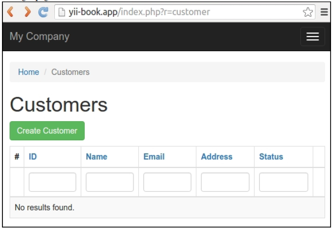

## MongoDB驱动

这个扩展为Yii2框架提供了MongoDB的集成，允许你通过ActiveRecord风格的模型使用MongoDB collection的记录。

### 准备

1. 按照官方指南[http://www.yiiframework.com/doc-2.0/guide-start-installation.html](http://www.yiiframework.com/doc-2.0/guide-start-installation.html)的描述，使用Composer包管理器创建一个新的应用。
2. 从[https://docs.mongodb.org/manual/installation/](https://docs.mongodb.org/manual/installation/)使用正确的安装过程为你的系统安装MongoDB。
3. 安装`php5-mongo` PHP扩展
4. 使用如下命令安装组件：

```
composer require yiisoft/yii2-mongodb
```

###如何做...

1. 首先，创建新的MongoDB数据库。在`mongo-client`shell中运行它，并输入数据库的名称：

```
mongo
> use mydatabase
```

2. 添加连接信息到你的`components`配置部分：

```
return [
    // ...
    'components' => [
        // ...
        'mongodb' => [
            'class' => '\yii\mongodb\Connection',
            'dsn' => 'mongodb://localhost:27017/mydatabase',
        ],
    ],
];
```

3. 添加新的控制台控制器到你的控制台配置文件中：

```
return [
    // ...
    'controllerMap' => [
        'mongodb-migrate' => 'yii\mongodb\console\controllers\MigrateController'
    ],
];
```

4. 使用shell命令创建新的migration：

```
php yii mongodb-migrate/create create_customer_collection
```

5. 输入如下代码到`up()`和`down()`方法中：

```
<?php
use yii\mongodb\Migration;
class m160201_102003_create_customer_collection extends Migration
{
    public function up()
    {
        $this->createCollection('customer');
    }
    public function down()
    {
        $this->dropCollection('customer');
    }
}
```

6. 应用migration：

```
php yii mongodb-migrate/up
```

7. 添加MongoDB调试板，以及模型生成器到你的配置中：

```
<?php
if (YII_ENV_DEV) {
    // configuration adjustments for 'dev' environment
    $config['bootstrap'][] = 'debug';
    $config['modules']['debug'] = [
        'class' => 'yii\debug\Module',
        'panels' => [
            'mongodb' => [
                'class' => 'yii\mongodb\debug\MongoDbPanel',
            ],
        ],
    ];
    $config['bootstrap'][] = 'gii';
    $config['modules']['gii'] = [
        'class' => 'yii\gii\Module',
        'generators' => [
            'mongoDbModel' => [
                'class' => 'yii\mongodb\gii\model\Generator'
            ]
        ],
    ];
}
```

8. 运行Gii生成器：


9. 启动新的`MongoDB Model Generator`来为你的collection生成新的模型：


10. 点击**预览**和**生成**按钮
11. 检查你是否有了新的模型`app\models\Customer`：

```
<?php
namespace app\models;
use Yii;
use yii\mongodb\ActiveRecord;
/**
 * This is the model class for collection "customer".
 *
 * @property \MongoId|string $_id
 * @property mixed $name
 * @property mixed $email
 * @property mixed $address
 * @property mixed $status
 */
class Customer extends ActiveRecord
{
    public static function collectionName()
    {
        return 'customer';
    }
    public function attributes()
    {
        return [
            '_id',
            'name',
            'email',
            'address',
            'status',
        ];
    }
    public function rules()
    {
        return [
            [['name', 'email', 'address', 'status'], 'safe']
        ];
    }
    public function attributeLabels()
    {
        return [
            '_id' => 'ID',
            'name' => 'Name',
            'email' => 'Email',
            'address' => 'Address',
            'status' => 'Status',
        ];
    }
}
```

12. 再次运行Gii，并生成CRUD：


13. 检查你已经生成了`CustomerController`类，并运行新的customer管理页面：



14. 你可以创建、更新和删除你的顾客数据。
15. 在页面的底部查看**调试**板：


16. 你可以看到整个MongoDB查询数以及完整的执行时间。点击计数badge和查询指示：


#### 基本用法

你可以通过`\yii\mongodb\Collection`实例访问数据库和集合：

```
$collection = Yii::$app->mongodb->getCollection('customer');
$collection->insert(['name' => 'John Smith', 'status' => 1]);
```

为了执行`find`查询，你应该使用`\yii\mongodb\Query`：

```
use yii\mongodb\Query;
$query = new Query;
// compose the query
$query->select(['name', 'status'])
    ->from('customer')
    ->limit(10);
// execute the query
$rows = $query->all();
```

**注意**：MongoDB文档id（“_id”字段）不是数量，是一个`\MongoId`类的实例。你不需要关心从整形或者字符串`$id`转换为`\MongoId`，因为查询创建会自动转换：

```
$query = new \yii\mongodb\Query;
$row = $query->from('item')
    ->where(['_id' => $id]) // implicit typecast to \MongoId
    ->one();
```

为了获取真实的Mongo ID字符串，你应该将`\MongoId`做类型转为字符串：

```
$query = new Query;
$row = $query->from('customer')->one();
var_dump($row['_id']); // outputs:
"object(MongoId)"var_dump((string)$row['_id']);
```

### 工作原理...

这个扩展的`Query`、`ActiveQuery`以及`ActiveRecord`继承了`yii\db\QueryInterface`和`yii\db\BaseActiveRecord`。因此他们和框架内置的`Query`、`ActiveQuery`以及`ActiveRecord`是兼容的。

你可以为你的模型使用`yii\mongodb\ActiveRecord`，`yii\mongodb\ActiveQuery`构建器来获取你的模型，并在你的data provider使用他们：

```
use yii\data\ActiveDataProvider;
use app\models\Customer;
$provider = new ActiveDataProvider([
    'query' => Customer::find(),
    'pagination' => [
        'pageSize' => 10,
    ]
]);
```

关于如何使用Yii ActiveRecord的一般信息，请参考第三章，*ActiveRecord，模型和数据库*。

### 参考

- 欲了解更多关于该扩展的信息，请参考如下地址：
    + [https://github.com/yiisoft/yii2-mongodb/blob/master/docs/guide/README.md](https://github.com/yiisoft/yii2-mongodb/blob/master/docs/guide/README.md)
    + [http://www.yiiframework.com/doc-2.0/ext-mongodb-index.html](http://www.yiiframework.com/doc-2.0/ext-mongodb-index.html)
- 关于原始库的信息，参考
    + [https://docs.mongodb.org/manual/](https://docs.mongodb.org/manual/)
- 关于ActiveRecord的信息参考第三章，*ActiveRecord，模型和数据库*