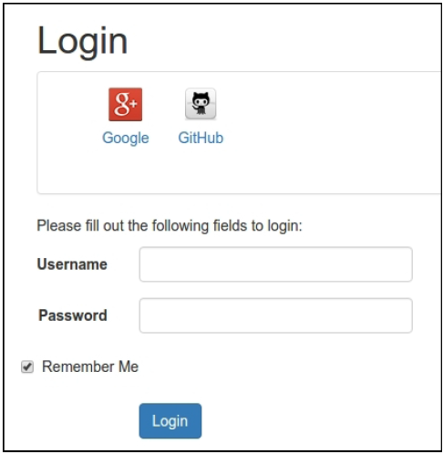
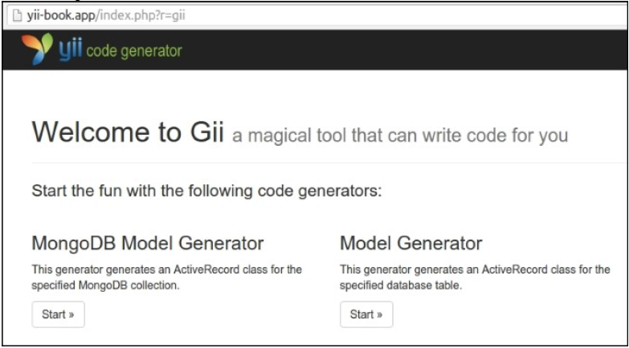
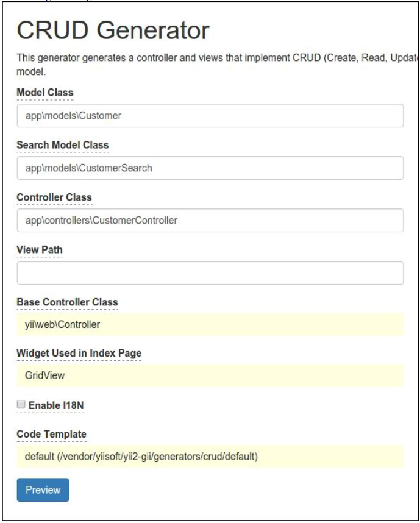
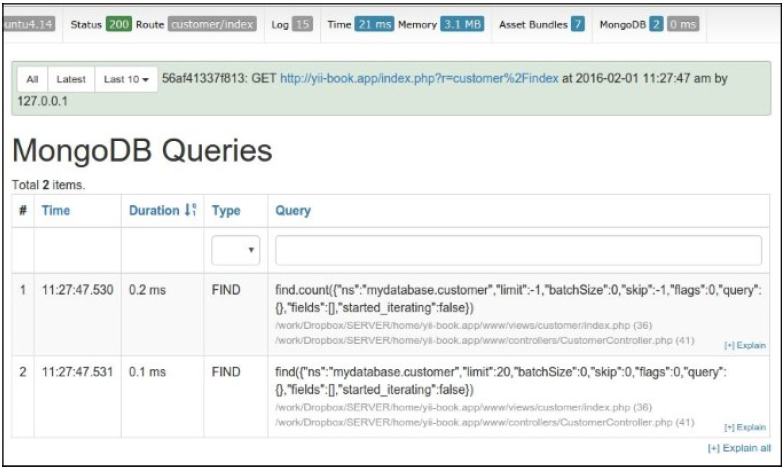
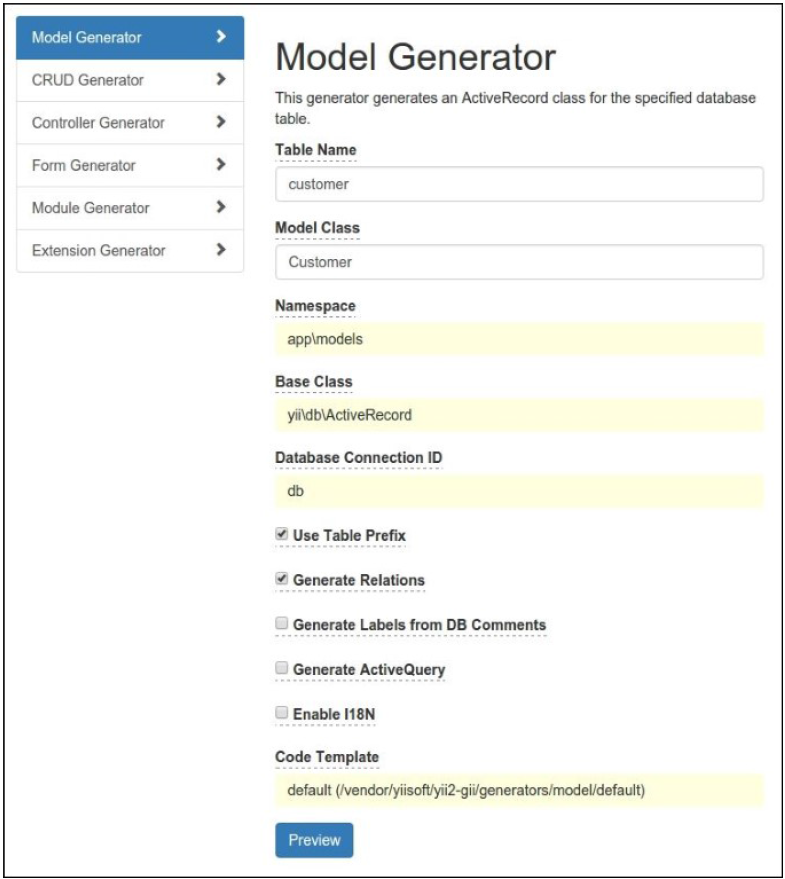
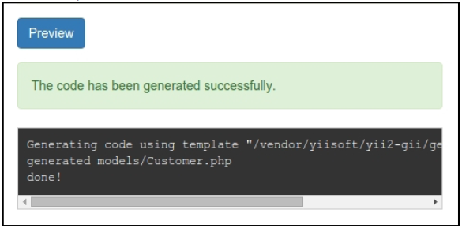

# 官方扩展

在本章中，我们将会讨论如下话题：

- 身份认证客户端
- SwitchMailer电子邮件库
- Faker fixture数据生成器
- Imagine库
- MongoDB驱动
- ElasticSearch引擎适配器
- Gii代码生成器
- Pjax JQuery插件
- Redis数据库驱动

## 介绍

Yii2官方库为一些流行的库、数据库和搜索引擎提供了适配器。在本章中，我们将会向你展示如何在你的项目中安装和使用官方扩展。你也将会了解到如何写自己的扩展，并分享给其它开发者。

## 身份认证客户端

这个扩展为Yii2框架添加了OpenID、OAuth和OAuth2 consumers。

### 准备

1. 按照官方指南[http://www.yiiframework.com/doc-2.0/guide-start-installation.html](http://www.yiiframework.com/doc-2.0/guide-start-installation.html)的描述，使用Composer包管理器创建一个新的应用。
2. 使用如下命令安装扩展：

```
composer require yiisoft/yii2-authclient
```

### 如何做...

1. 打开你的Github应用页面`https://github.com/settings/applications`并添加自己的新应用：


2. 获取**Client ID**和**Client Secret**：


3. 配置你的web配置，并为`authClientCollection`组件设置相应的选项：

```
'components' => [
    // ...
    'authClientCollection' => [
        'class' => 'yii\authclient\Collection',
        'clients' => [
            'google' => [
                'class' =>'yii\authclient\clients\GoogleOpenId'
            ],
            'github' => [
                'class' => 'yii\authclient\clients\GitHub',
                'clientId' => '87f0784aae2ac48f78a',
                'clientSecret' =>'fb5953a54dea4640f3a70d8abd96fbd25592ff18',
            ],
            // etc.
        ],
    ],
],
```

4. 打开你的`SiteController`并添加`auth`独立动作和成功回调方法：

```
use yii\authclient\ClientInterface;
public function actions()
{
    return [
        // ...
        'auth' => [
            'class' => 'yii\authclient\AuthAction',
            'successCallback' => [$this, 'onAuthSuccess'],
        ],
    ];
}

public function onAuthSuccess(ClientInterface $client)
{
    $attributes = $client->getUserAttributes();
    \yii\helpers\VarDumper::dump($attributes, 10, true);
    exit;
}
```

5. 打开`views/site/login.php`文件并插入`AuthChoice`小组件：

```
<div class="site-login">
    <h1><?= Html::encode($this->title) ?></h1>
    <div class="panel panel-default">
        <div class="panel-body">
            <?= yii\authclient\widgets\AuthChoice::widget(['baseAuthUrl' => ['site/auth'], 'popupMode' => false,]) ?>
        </div>
    </div>
    <p>Please fill out the following fields to login:</p>
    ...
</div>
```

6. 你将会看到你配置的图标：



7. 为了使用Github provider进行验证：


8. 如果成功，你的回调将会展示验证的用户属性：

```
[
    'login' => 'Name'
    'id' => 0000000
    'avatar_url' =>'https://avatars.githubusercontent.com/u/0000000?v=3'
    'gravatar_id' => ''
    'url' => 'https://api.github.com/users/Name'
    'html_url' => 'https://github.com/Name'
    //...
    'name' => 'YourName'
    'blog' =>site.com'
    'email => mail@site.com'
    //...
]
```

9. 在`onAuthSuccess`方法中创建你自己认证的代码，可参考例子[https://github.com/yiisoft/yii2-authclient/blob/master/docs/guide/quick-start.md](https://github.com/yiisoft/yii2-authclient/blob/master/docs/guide/quick-start.md)。

### 工作原理...

这个扩展为你的应用提供了OpenID、OAuth和OAuth2认证客户端。

`AuthChoice`小组件在一个选择的服务网站上打开了一个身份认证页面，存储`auth`动作URL。身份认证以后，通过一个POST请求发送认证数据时，当前的服务将用户重定向回去。`AuthAction`收到这个请求，并调用相应的回调。

你可以使用任何存在的客户端或者创建自己的。

### 参考

- 为了了解更多关于扩展使用的信息，参考：
    + [https://github.com/yiisoft/yii2-authclient/tree/master/docs/guide](https://github.com/yiisoft/yii2-authclient/tree/master/docs/guide)
    + [http://www.yiiframework.com/doc-2.0/ext-authclient-index.html](http://www.yiiframework.com/doc-2.0/ext-authclient-index.html)
- 欲了解更多关于OpenID、OAuth和OAuth2认证技术，参考：
    + [http://openid.net](http://openid.net)
    + [http://oauth.net](http://oauth.net)

## SwitchMailer电子邮件库

许多web应用因为安全原因需要通过电子邮件发送通知和确认客户端动作。Yii2框架为已存在的SwitchMailer库提供了一个warpper，`yiisoft/yii2-swiftmailer`。

### 准备

按照官方指南[http://www.yiiframework.com/doc-2.0/guide-start-installation.html](http://www.yiiframework.com/doc-2.0/guide-start-installation.html)的描述，使用Composer包管理器创建一个新的应用。

基础应用和高级应用都包含这个扩展。

### 如何做...

现在我们将会尝试从我们自己的应用中发送任何种类的电子邮件。

#### 发送纯文本电子邮件

1. 在`config/console.php`文件中设置mailer配置：

```
'components' => [
    // ...
    'mailer' => [
        'class' => 'yii\swiftmailer\Mailer',
        'useFileTransport' => true,
    ],
    // ...
],
```

2. 创建一个测试控制台控制器，`MailController`：

```
<?php
namespace app\commands;
use yii\console\Controller;
use Yii;
class MailController extends Controller
{
    public function actionSend()
    {
        Yii::$app->mailer->compose()
            ->setTo('to@yii-book.app')
            ->setFrom(['from@yii-book.app' => Yii::$app->name])
            ->setSubject('My Test Message')
            ->setTextBody('My Text Body')
            ->send();
    }
}
```

3. 运行如下控制台命令：

```
php yii main/send
```

4. 检查你的`runtime/mail`目录。它应该包含你的邮件文件。

**注意**：邮件文件包含了特殊电子邮件源格式的信息，兼容任何邮件软件。你可以按纯文本文件打开。

5. 设置`useFileTransport`参数为false，或者从配置中移除这个字符串：

```
'mailer' => [
    'class' => 'yii\swiftmailer\Mailer',
],
```

然后将你真实的电子邮件ID放入`setTo()`方法：

```
->setTo('my@real-email.com')
```

6. 再次运行控制台命令：

```
php yii mail/send
```

7. 检查你的`inbox`目录。

**注意**：默认情况下，SwiftMailer使用了一个标准的PHP函数，`mail()`，来发送邮件。请检查你的服务器是否正确设置，从而可以使用`mail()`函数发送邮件。

需要邮箱系统拒绝没有DKIM和SPF签名的邮件（例如使用`mail()`函数发送的邮件）或者将他们放到垃圾文件夹中。

#### 发送HTML内容

1. 检查你应用中的`mail/layouts/html.php`文件并使用如下内容添加`mail/layouts/text.php`文件：

```
<?php
/* @var $this \yii\web\View */
/* @var $message \yii\mail\MessageInterface */
/* @var $content string */
?>
<?php $this->beginPage() ?>
<?php $this->beginBody() ?>
<?= $content ?>
<?php $this->endBody() ?>
<?php $this->endPage() ?>
```

2. 在`mail/message-html.php`文件中创建你自己的视图：

```
<?php
use yii\helpers\Html;
/* @var $this yii\web\View */
/* @var $name string */
?>
<p>Hello, <?= Html::encode($name) ?>!</p>
Create a mail/message-text.php file with the same content, but without HTML tags:
<?php
use yii\helpers\Html;
/* @var $this yii\web\View */
/* @var $name string */
?>
Hello, <?= Html::encode($name) ?>!
```

3. 使用如下代码创建一个控制台控制器`MailController`：

```
<?php
namespace app\commands;
use yii\console\Controller;
use Yii;
class MailController extends Controller
{
    public function actionSendHtml()
    {
        $name = 'John';
        Yii::$app->mailer->compose('message-html',['name' => $name])
            ->setTo('to@yii-book.app')
            ->setFrom(['from@yii-book.app' => Yii::$app->name])
            ->setSubject('My Test Message')
            ->send();
    }
    public function actionSendCombine()
    {
        $name = 'John';
        Yii::$app->mailer->compose(['html' => 'message-html', 'text' => 'message-text'], ['name' => $name,])
            ->setTo('to@yii-book.app')
            ->setFrom(['from@yii-book.app'
            => Yii::$app->name])
            ->setSubject('My Test Message')
            ->send();
    }
}
```

4. 运行如下控制台命令：

```
php yii mail/send-html
php yii mail/send-combine
```

#### 使用SMTP传输

1. 为`mailer`组件设置`transport`参数：

```
'mailer' => [
    'class' => 'yii\swiftmailer\Mailer',
    'transport' => [
        'class' => 'Swift_SmtpTransport',
        'host' => 'smtp.gmail.com',
        'username' => 'username@gmail.com',
        'password' => 'password',
        'port' => '587',
        'encryption' => 'tls',
    ],
],
```

2. 书写并运行如下代码：

```
Yii::$app->mailer->compose()
    ->setTo('to@yii-book.app')
    ->setFrom('username@gmail.com')
    ->setSubject('My Test Message')
    ->setTextBody('My Text Body')
    ->send();
```

3. 检查你的Gmail收件箱。

**注意**：Gmail自动重写

#### 添加附件和图片

### 如何做...

### 参考

## Fake fixture 数据生成器

### 准备

### 如何做...

#### 使用你自己的数据类型

### 工作原理...

#### 注意

### 参考

## Imagine库

### 准备

### 如何做...

#### 作为工厂使用

#### 使用内部方法

### 工作原理...

### 参考


## MongoDB驱动

### 准备

###如何做...

#### 基本用法

#### 注意

### 工作原理...

### 参考

## ElasticSearch引擎适配器

### 准备

### 如何做...

#### 使用查询类

#### 使用ActiveRecord

#### 使用ElasticSearch调试板

### 工作原理...

#### 注意

### 参考

## Gii代码生成器

### 准备

### 如何做...

#### 使用GUI

#### 使用CLI

### 工作原理...

### 参考

## Pjax JQuery插件

### 准备

### 如何做...

#### 指定一个自定义ID

#### 使用ActiveForm

#### 使用客户端脚本

### 工作原理...

### 参考

## Redis数据库驱动

### 准备

### 如何做...

#### 直接使用方法

#### 使用ActiveRecord

### 工作原理...

### 参考

















