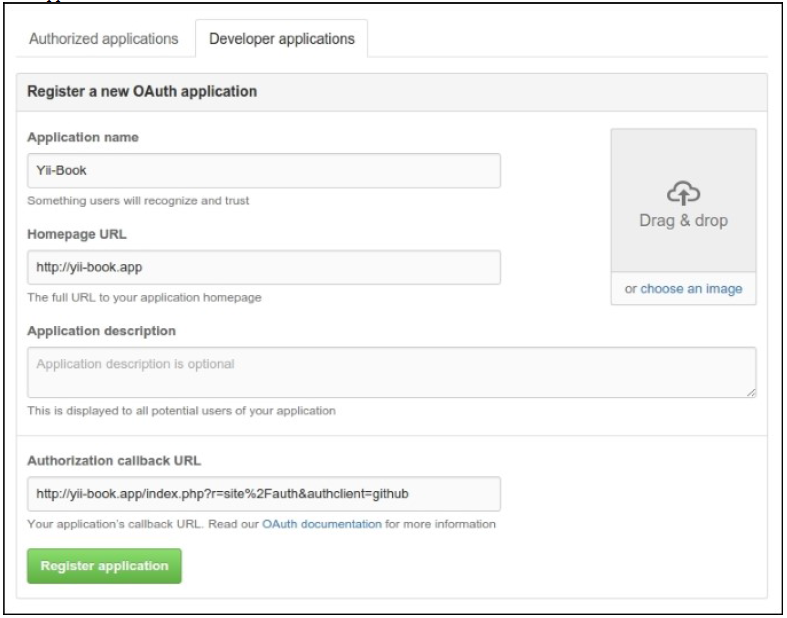
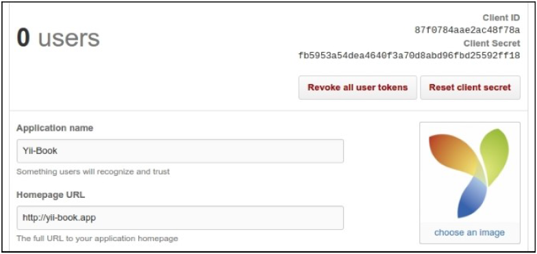
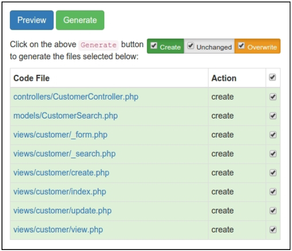

# 官方扩展

在本章中，我们将会讨论如下话题：

- 身份认证客户端
- SwitchMailer电子邮件库
- Faker fixture数据生成器
- Imagine库
- MongoDB驱动
- ElasticSearch引擎适配器
- Gii代码生成器
- Pjax JQuery插件
- Redis数据库驱动

## 介绍

Yii2官方库为一些流行的库、数据库和搜索引擎提供了适配器。在本章中，我们将会向你展示如何在你的项目中安装和使用官方扩展。你也将会了解到如何写自己的扩展，并分享给其它开发者。

## 身份认证客户端

这个扩展为Yii2框架添加了OpenID、OAuth和OAuth2 consumers。

### 准备

1. 按照官方指南[http://www.yiiframework.com/doc-2.0/guide-start-installation.html](http://www.yiiframework.com/doc-2.0/guide-start-installation.html)的描述，使用Composer包管理器创建一个新的应用。
2. 使用如下命令安装扩展：

```
composer require yiisoft/yii2-authclient
```

### 如何做...

1. 打开你的Github应用页面`https://github.com/settings/applications`并添加自己的新应用：



2. 获取**Client ID**和**Client Secret**：



3. 配置你的web配置，并为`authClientCollection`组件设置相应的选项：

```
'components' => [
    // ...
    'authClientCollection' => [
        'class' => 'yii\authclient\Collection',
        'clients' => [
            'google' => [
                'class' =>'yii\authclient\clients\GoogleOpenId'
            ],
            'github' => [
                'class' => 'yii\authclient\clients\GitHub',
                'clientId' => '87f0784aae2ac48f78a',
                'clientSecret' =>'fb5953a54dea4640f3a70d8abd96fbd25592ff18',
            ],
            // etc.
        ],
    ],
],
```

4. 打开你的`SiteController`并添加`auth`独立动作和成功回调方法：

```
use yii\authclient\ClientInterface;
public function actions()
{
    return [
        // ...
        'auth' => [
            'class' => 'yii\authclient\AuthAction',
            'successCallback' => [$this, 'onAuthSuccess'],
        ],
    ];
}

public function onAuthSuccess(ClientInterface $client)
{
    $attributes = $client->getUserAttributes();
    \yii\helpers\VarDumper::dump($attributes, 10, true);
    exit;
}
```

5. 打开`views/site/login.php`文件并插入`AuthChoice`小组件：

```
<div class="site-login">
    <h1><?= Html::encode($this->title) ?></h1>
    <div class="panel panel-default">
        <div class="panel-body">
            <?= yii\authclient\widgets\AuthChoice::widget(['baseAuthUrl' => ['site/auth'], 'popupMode' => false,]) ?>
        </div>
    </div>
    <p>Please fill out the following fields to login:</p>
    ...
</div>
```

6. 你将会看到你配置的图标：


7. 为了使用Github provider进行验证：


8. 如果成功，你的回调将会展示验证的用户属性：

```
[
    'login' => 'Name'
    'id' => 0000000
    'avatar_url' =>'https://avatars.githubusercontent.com/u/0000000?v=3'
    'gravatar_id' => ''
    'url' => 'https://api.github.com/users/Name'
    'html_url' => 'https://github.com/Name'
    //...
    'name' => 'YourName'
    'blog' =>site.com'
    'email => mail@site.com'
    //...
]
```

9. 在`onAuthSuccess`方法中创建你自己认证的代码，可参考例子[https://github.com/yiisoft/yii2-authclient/blob/master/docs/guide/quick-start.md](https://github.com/yiisoft/yii2-authclient/blob/master/docs/guide/quick-start.md)。

### 工作原理...

这个扩展为你的应用提供了OpenID、OAuth和OAuth2认证客户端。

`AuthChoice`小组件在一个选择的服务网站上打开了一个身份认证页面，存储`auth`动作URL。身份认证以后，通过一个POST请求发送认证数据时，当前的服务将用户重定向回去。`AuthAction`收到这个请求，并调用相应的回调。

你可以使用任何存在的客户端或者创建自己的。

### 参考

- 为了了解更多关于扩展使用的信息，参考：
    + [https://github.com/yiisoft/yii2-authclient/tree/master/docs/guide](https://github.com/yiisoft/yii2-authclient/tree/master/docs/guide)
    + [http://www.yiiframework.com/doc-2.0/ext-authclient-index.html](http://www.yiiframework.com/doc-2.0/ext-authclient-index.html)
- 欲了解更多关于OpenID、OAuth和OAuth2认证技术，参考：
    + [http://openid.net](http://openid.net)
    + [http://oauth.net](http://oauth.net)

## SwitchMailer电子邮件库

许多web应用因为安全原因需要通过电子邮件发送通知和确认客户端动作。Yii2框架为已存在的SwitchMailer库提供了一个warpper，`yiisoft/yii2-swiftmailer`。

### 准备

按照官方指南[http://www.yiiframework.com/doc-2.0/guide-start-installation.html](http://www.yiiframework.com/doc-2.0/guide-start-installation.html)的描述，使用Composer包管理器创建一个新的应用。

基础应用和高级应用都包含这个扩展。

### 如何做...

现在我们将会尝试从我们自己的应用中发送任何种类的电子邮件。

#### 发送纯文本电子邮件

1. 在`config/console.php`文件中设置mailer配置：

```
'components' => [
    // ...
    'mailer' => [
        'class' => 'yii\swiftmailer\Mailer',
        'useFileTransport' => true,
    ],
    // ...
],
```

2. 创建一个测试控制台控制器，`MailController`：

```
<?php
namespace app\commands;
use yii\console\Controller;
use Yii;
class MailController extends Controller
{
    public function actionSend()
    {
        Yii::$app->mailer->compose()
            ->setTo('to@yii-book.app')
            ->setFrom(['from@yii-book.app' => Yii::$app->name])
            ->setSubject('My Test Message')
            ->setTextBody('My Text Body')
            ->send();
    }
}
```

3. 运行如下控制台命令：

```
php yii main/send
```

4. 检查你的`runtime/mail`目录。它应该包含你的邮件文件。

**注意**：邮件文件包含了特殊电子邮件源格式的信息，兼容任何邮件软件。你可以按纯文本文件打开。

5. 设置`useFileTransport`参数为false，或者从配置中移除这个字符串：

```
'mailer' => [
    'class' => 'yii\swiftmailer\Mailer',
],
```

然后将你真实的电子邮件ID放入`setTo()`方法：

```
->setTo('my@real-email.com')
```

6. 再次运行控制台命令：

```
php yii mail/send
```

7. 检查你的`inbox`目录。

**注意**：默认情况下，SwiftMailer使用了一个标准的PHP函数，`mail()`，来发送邮件。请检查你的服务器是否正确设置，从而可以使用`mail()`函数发送邮件。

需要邮箱系统拒绝没有DKIM和SPF签名的邮件（例如使用`mail()`函数发送的邮件）或者将他们放到垃圾文件夹中。

#### 发送HTML内容

1. 检查你应用中的`mail/layouts/html.php`文件并使用如下内容添加`mail/layouts/text.php`文件：

```
<?php
/* @var $this \yii\web\View */
/* @var $message \yii\mail\MessageInterface */
/* @var $content string */
?>
<?php $this->beginPage() ?>
<?php $this->beginBody() ?>
<?= $content ?>
<?php $this->endBody() ?>
<?php $this->endPage() ?>
```

2. 在`mail/message-html.php`文件中创建你自己的视图：

```
<?php
use yii\helpers\Html;
/* @var $this yii\web\View */
/* @var $name string */
?>
<p>Hello, <?= Html::encode($name) ?>!</p>
Create a mail/message-text.php file with the same content, but without HTML tags:
<?php
use yii\helpers\Html;
/* @var $this yii\web\View */
/* @var $name string */
?>
Hello, <?= Html::encode($name) ?>!
```

3. 使用如下代码创建一个控制台控制器`MailController`：

```
<?php
namespace app\commands;
use yii\console\Controller;
use Yii;
class MailController extends Controller
{
    public function actionSendHtml()
    {
        $name = 'John';
        Yii::$app->mailer->compose('message-html',['name' => $name])
            ->setTo('to@yii-book.app')
            ->setFrom(['from@yii-book.app' => Yii::$app->name])
            ->setSubject('My Test Message')
            ->send();
    }
    public function actionSendCombine()
    {
        $name = 'John';
        Yii::$app->mailer->compose(['html' => 'message-html', 'text' => 'message-text'], ['name' => $name,])
            ->setTo('to@yii-book.app')
            ->setFrom(['from@yii-book.app'
            => Yii::$app->name])
            ->setSubject('My Test Message')
            ->send();
    }
}
```

4. 运行如下控制台命令：

```
php yii mail/send-html
php yii mail/send-combine
```

#### 使用SMTP传输

1. 为`mailer`组件设置`transport`参数：

```
'mailer' => [
    'class' => 'yii\swiftmailer\Mailer',
    'transport' => [
        'class' => 'Swift_SmtpTransport',
        'host' => 'smtp.gmail.com',
        'username' => 'username@gmail.com',
        'password' => 'password',
        'port' => '587',
        'encryption' => 'tls',
    ],
],
```

2. 书写并运行如下代码：

```
Yii::$app->mailer->compose()
    ->setTo('to@yii-book.app')
    ->setFrom('username@gmail.com')
    ->setSubject('My Test Message')
    ->setTextBody('My Text Body')
    ->send();
```

3. 检查你的Gmail收件箱。

**注意**：Gmail自动重写`From`字段为你的默认电子邮件ID，但其他电子邮件系统没有这么做。在传输配置中总是使用一个唯一电子邮件ID，并在`setFrom()`方法中为其它电子邮件系统中传递反垃圾邮件政策。

#### 添加附件和图片

添加相关的方法来附加任何文件到你的邮件中：

```
class MailController extends Controller
{
    public function actionSendAttach()
    {
        Yii::$app->mailer->compose()
            ->setTo('to@yii-book.app')
            ->setFrom(['from@yii-book.app' => Yii::$app->name])
            ->setSubject('My Test Message')
            ->setTextBody('My Text Body')
            ->attach(Yii::getAlias('@app/README.md'))
            ->send();
    }
}
```

或者在你的电子邮件视图文件中使用`embed()`方法来粘贴一个图片到电子邮件内容中：

```
embed($imageFile); ?>">
```

它会自动添加图片文件附件并插入它的唯一标识。

### 工作原理...

wrapper实现了`\yii\mail\MailerInterface`。它的`compose()`方法返回了一个消息对象（`\yii\mail\MessageInterface`的一个实现）。

你可以使用`setTextBody()`和`setHtmlBody()`手动设置纯文本和HTML内容，或者你可以将你的视图和视图参数传递给`compose()`方法。在这个例子中，mailer调用`\yii\web\View::render()`方法来渲染相应的内容。

`useFileTransport`参数在文件中存储电子邮件而不是真正的发送。它对于本地开发和应用测试非常有用。

### 参考

- 欲了解更多关于`yii2-swiftmailer`扩展的信息，访问如下地址：
    + [http://www.yiiframework.com/doc-2.0/guide-tutorial-mailing.html](http://www.yiiframework.com/doc-2.0/guide-tutorial-mailing.html)
    + [http://www.yiiframework.com/doc-2.0/ext-swiftmailer-index.html](http://www.yiiframework.com/doc-2.0/ext-swiftmailer-index.html)
- 欲了解更多关于`SwiftMailer`库，参考如下地址：
    + [http://swiftmailer.org/docs/introduction.html](http://swiftmailer.org/docs/introduction.html)
    + [https://github.com/swiftmailer/swiftmailer](https://github.com/swiftmailer/swiftmailer)

## Fake fixture 数据生成器

`fzaninotto/faker`是一个PHP扩展，它可以生成需要种类的假数据：名称、电话、地址，以及随机字符串和数字等等。它可以帮助你生成需要随机记录，用于性能和逻辑测试。你可以通过写自己的formatters和generators来扩展你支持的类型集合。

在Yii2应用骨架中，`yiisoft/yii2-faker` wrapper被包含在`composer.json`文件的`require-dev`部分中，这部分用于测试代码（第十一章，*测试*）。这个wrapper为控制台应用和测试环境提供`FixtureController`控制台。

### 准备

按照官方指南[http://www.yiiframework.com/doc-2.0/guide-start-installation.html](http://www.yiiframework.com/doc-2.0/guide-start-installation.html)的描述，使用Composer包管理器创建一个新的应用。

### 如何做...

1. 打开目录`tests/codeception/templates`并添加fixture模板文件`users.txt`：

```
<?php
/**
* @var $faker \Faker\Generator
* @var $index integer
*/
return [
    'name' => $faker->firstName,
    'phone' => $faker->phoneNumber,
    'city' => $faker->city,
    'about' => $faker->sentence(7, true),
    'password' => Yii::$app->getSecurity()->generatePasswordHash('password_' . $index),
    'auth_key' => Yii::$app->getSecurity()->generateRandomString(),
];
```

2. 运行测试控制台`yii`命令：

```
php tests/codeception/bin/yii fixture/generate users --count=2
```

3. 确认migration生成。

4. 检查`tests/codeception/fixtures`是否包含新的`users.php`文件，以及自动生成的数据：

```
return [
    [
        'name' => 'Isadore',
        'phone' => '952.877.8545x190',
        'city' => 'New Marvinburgh',
        'about' => 'Ut quidem voluptatem itaque veniam voluptas dolores.',
        'password' => '$2y$13$Fi3LOl/sKlomUH.DLgqBkOB/uCLmgCoPPL1KXiW0hffnkrdkjCzAC',
        'auth_key' => '1m05hlgaAG8zfm0cyDyoRGMkbQ9W6hj1',
    ],
    [
        'name' => 'Raleigh',
        'phone' => '1-655-488-3585x699',
        'city' => 'Reedstad',
        'about' => 'Dolorem quae impedit tempore libero doloribus nobis dicta tempora facere.',
        'password' => '$2y$13$U7Qte5Y1jVLrx/pnhwdwt.1uXDegGXuNVzEQyUsb65WkBtjyjUuYm',
        'auth_key' => 'uWWJDgy5jNRk6KjqpxS5JuPv0OHearqE',
    ],
],
```

#### 使用你自己的数据类型

1. 使用你自定义生成逻辑创建你自己的provider：

```
<?php
namespace tests\codeception\faker\providers;
use Faker\Provider\Base;
class UserStatus extends Base
{
    public function userStatus()
    {
        return $this->randomElement([0, 10, 20, 30]);
    }
}
```

2. 在`/tests/codeception/config/config.php`文件中添加provider到provider列表中：

```
return [
    'controllerMap' => [
        'fixture' => [
            'class' => 'yii\faker\FixtureController',
            'fixtureDataPath' => '@tests/codeception/fixtures',
            'templatePath' => '@tests/codeception/templates',
            'namespace' => 'tests\codeception\fixtures',
            'providers' => [
                'tests\codeception\faker\providers\UserStatus',
            ],
        ],
    ],
// ...
];
```

3. 添加`status`字段到你的fixture模板文件中：

```
<?php
/**
 * @var $faker \Faker\Generator
 * @var $index integer
 */
return [
    'name' => $faker->firstName,
    'status' => $faker->userStatus,
];
```

4. 使用控制台命令生成fixture：

```
php tests/codeception/bin/yii fixture/generate users --count=2
```

5. 检查`fixtures/users.php`生成的代码是否包含你的自定义值：

```
return [
    [
        'name' => 'Christelle',
        'status' => 30,
    ],
    [
        'name' => 'Theo',
        'status' => 10,
    ],
];
```

### 工作原理...

`yii2-faker`扩展包含一个控制台生成器（它使用你的模板来生成fixture数据文件），并给了你一个准备好的原始`Faker`对象实例。你可以生成所有或者指定的fixtures，并且你可以在控制台参数中传递自定义数值或者语言。

**注意**

如果你的测试使用这些fixtures的话，小心已存在的测试文件，因为自动生成会完全覆盖旧数据。

### 参考

- 源代码以及关于扩展的更多信息，参考：
- [https://github.com/yiisoft/yii2-faker/tree/master/docs/guide](https://github.com/yiisoft/yii2-faker/tree/master/docs/guide)
- [http://www.yiiframework.com/doc-2.0/ext-faker-index.html](http://www.yiiframework.com/doc-2.0/ext-faker-index.html)
- 欲了解更多关于原始库的信息，参考：
- [https://github.com/fzaninotto/Faker](https://github.com/fzaninotto/Faker)
- 第十一章，*测试*

## Imagine库

Imagine是用于操作图片的OOP库。它可以让你在GD、Imagic和Gmagic PHP扩展的帮助下，对多种格式的图片进行裁剪、缩放以及执行其它操作。Yii2-Imagine是队这个库的轻量静态封装。

### 准备

1. 按照官方指南[http://www.yiiframework.com/doc-2.0/guide-start-installation.html](http://www.yiiframework.com/doc-2.0/guide-start-installation.html)的描述，使用Composer包管理器创建一个新的应用。
2. 使用如下命令安装扩展：

```
composer require yiisoft/yii2-imagine
```

### 如何做...

在你的项目中，你可以以两种方式使用扩展：

- 作为工厂使用
- 使用内部方法

#### 作为工厂使用

你可以使用`Imagine`库类的一个实例：

```
$imagine = new Imagine\Gd\Imagine();
// or
$imagine = new Imagine\Imagick\Imagine();
// or
$imagine = new Imagine\Gmagick\Imagine();
```

但是，这依赖于你系统中已存在的PHP扩展。你可以使用`getImagine()`方法：

```
$imagine = \yii\imagine\Image::getImagine();
```

#### 使用内部方法

你可以使用`corp()`、`thumbnail()`、`watermark()`、`text()`、`frame()`方法用于常见的高级操作：

```
<?php
use yii\imagine\Image;
Image::crop('path/to/image.jpg', 100, 100, ManipulatorInterface::THUMBNAIL_OUTBOUND)
->save('path/to/destination/image.jpg', ['quality' => 90]);
```

在`\yii\imagine\BaseImage`的源代码中查看所有支持的方法以及细节。

### 工作原理...

这个扩展准备用户数据，创建一个原始的Imagine对象，并调用对应的方法。所有的方法都会返回原始的iamge对象。你可以继续操作这个图像，或者将结果保存到你的磁盘上。

### 参考

- 欲了解更多关于这个扩展的信息，参考如下地址：
    + [http://www.yiiframework.com/doc-2.0/ext-imagine-index.html](http://www.yiiframework.com/doc-2.0/ext-imagine-index.html)
    + [https://github.com/yiisoft/yii2-imagine](https://github.com/yiisoft/yii2-imagine)
- 欲了解更多关于原始库的信息，参考[http://imagine.readthedocs.org/en/latest/](http://imagine.readthedocs.org/en/latest/)。

## MongoDB驱动

这个扩展为Yii2框架提供了MongoDB的集成，允许你通过ActiveRecord风格的模型使用MongoDB collection的记录。

### 准备

1. 按照官方指南[http://www.yiiframework.com/doc-2.0/guide-start-installation.html](http://www.yiiframework.com/doc-2.0/guide-start-installation.html)的描述，使用Composer包管理器创建一个新的应用。
2. 从[https://docs.mongodb.org/manual/installation/](https://docs.mongodb.org/manual/installation/)使用正确的安装过程为你的系统安装MongoDB。
3. 安装`php5-mongo` PHP扩展
4. 使用如下命令安装组件：

```
composer require yiisoft/yii2-mongodb
```

###如何做...

1. 首先，创建新的MongoDB数据库。在`mongo-client`shell中运行它，并输入数据库的名称：

```
mongo
> use mydatabase
```

2. 添加连接信息到你的`components`配置部分：

```
return [
    // ...
    'components' => [
        // ...
        'mongodb' => [
            'class' => '\yii\mongodb\Connection',
            'dsn' => 'mongodb://localhost:27017/mydatabase',
        ],
    ],
];
```

3. 添加新的控制台控制器到你的控制台配置文件中：

```
return [
    // ...
    'controllerMap' => [
        'mongodb-migrate' => 'yii\mongodb\console\controllers\MigrateController'
    ],
];
```

4. 使用shell命令创建新的migration：

```
php yii mongodb-migrate/create create_customer_collection
```

5. 输入如下代码到`up()`和`down()`方法中：

```
<?php
use yii\mongodb\Migration;
class m160201_102003_create_customer_collection extends Migration
{
    public function up()
    {
        $this->createCollection('customer');
    }
    public function down()
    {
        $this->dropCollection('customer');
    }
}
```

6. 应用migration：

```
php yii mongodb-migrate/up
```

7. 添加MongoDB调试板，以及模型生成器到你的配置中：

```
<?php
if (YII_ENV_DEV) {
    // configuration adjustments for 'dev' environment
    $config['bootstrap'][] = 'debug';
    $config['modules']['debug'] = [
        'class' => 'yii\debug\Module',
        'panels' => [
            'mongodb' => [
                'class' => 'yii\mongodb\debug\MongoDbPanel',
            ],
        ],
    ];
    $config['bootstrap'][] = 'gii';
    $config['modules']['gii'] = [
        'class' => 'yii\gii\Module',
        'generators' => [
            'mongoDbModel' => [
                'class' => 'yii\mongodb\gii\model\Generator'
            ]
        ],
    ];
}
```

8. 运行Gii生成器：


9. 启动新的`MongoDB Model Generator`来为你的collection生成新的模型：


10. 点击**预览**和**生成**按钮
11. 检查你是否有了新的模型`app\models\Customer`：

```
<?php
namespace app\models;
use Yii;
use yii\mongodb\ActiveRecord;
/**
 * This is the model class for collection "customer".
 *
 * @property \MongoId|string $_id
 * @property mixed $name
 * @property mixed $email
 * @property mixed $address
 * @property mixed $status
 */
class Customer extends ActiveRecord
{
    public static function collectionName()
    {
        return 'customer';
    }
    public function attributes()
    {
        return [
            '_id',
            'name',
            'email',
            'address',
            'status',
        ];
    }
    public function rules()
    {
        return [
            [['name', 'email', 'address', 'status'], 'safe']
        ];
    }
    public function attributeLabels()
    {
        return [
            '_id' => 'ID',
            'name' => 'Name',
            'email' => 'Email',
            'address' => 'Address',
            'status' => 'Status',
        ];
    }
}
```

12. 再次运行Gii，并生成CRUD：


13. 检查你已经生成了`CustomerController`类，并运行新的customer管理页面：


14. 你可以创建、更新和删除你的顾客数据。
15. 在页面的底部查看**调试**板：


16. 你可以看到整个MongoDB查询数以及完整的执行时间。点击计数badge和查询指示：


#### 基本用法

你可以通过`\yii\mongodb\Collection`实例访问数据库和集合：

```
$collection = Yii::$app->mongodb->getCollection('customer');
$collection->insert(['name' => 'John Smith', 'status' => 1]);
```

为了执行`find`查询，你应该使用`\yii\mongodb\Query`：

```
use yii\mongodb\Query;
$query = new Query;
// compose the query
$query->select(['name', 'status'])
    ->from('customer')
    ->limit(10);
// execute the query
$rows = $query->all();
```

**注意**：MongoDB文档id（“_id”字段）不是数量，是一个`\MongoId`类的实例。你不需要关心从整形或者字符串`$id`转换为`\MongoId`，因为查询创建会自动转换：

```
$query = new \yii\mongodb\Query;
$row = $query->from('item')
    ->where(['_id' => $id]) // implicit typecast to \MongoId
    ->one();
```

为了获取真实的Mongo ID字符串，你应该将`\MongoId`做类型转为字符串：

```
$query = new Query;
$row = $query->from('customer')->one();
var_dump($row['_id']); // outputs:
"object(MongoId)"var_dump((string)$row['_id']);
```

### 工作原理...

这个扩展的`Query`、`ActiveQuery`以及`ActiveRecord`继承了`yii\db\QueryInterface`和`yii\db\BaseActiveRecord`。因此他们和框架内置的`Query`、`ActiveQuery`以及`ActiveRecord`是兼容的。

你可以使用

```
use yii\data\ActiveDataProvider;
use app\models\Customer;
$provider = new ActiveDataProvider([
    'query' => Customer::find(),
    'pagination' => [
        'pageSize' => 10,
    ]
]);
```

### 参考

## ElasticSearch引擎适配器

### 准备

### 如何做...

```
return [
    //....
    'components' => [
        'elasticsearch' => [
            'class' => 'yii\elasticsearch\Connection',
            'nodes' => [
                ['http_address' => '127.0.0.1:9200'],
                // configure more hosts if you have a cluster
            ],
        ],
    ]
];
```


#### 使用查询类

```
use \yii\elasticsearch\Query;
$query = new Query;
$query->fields('id, name')
    ->from('myindex', 'users')
    ->limit(10);
$query->search();
```

```
$command = $query->createCommand();
$rows = $command->search();
```

#### 使用ActiveRecord

```
class Buyer extends \yii\elasticsearch\ActiveRecord
{
    public function attributes()
    {
        return ['id', 'name', 'address', 'registration_date'];
    }
    public function getOrders()
    {
        return $this->hasMany(Order::className(), ['buyer_id' => 'id'])->orderBy('id');
    }
}
```

```
class Order extends \yii\elasticsearch\ActiveRecord
{
    public function attributes()
    {
        return ['id', 'user_id', 'date'];
    }
    public function getBuyer()
    {
        return $this->hasOne(Customer::className(), ['id' => 'buyer_id']);
    }
}
```

```
$buyer = new Buyer();
$buyer>primaryKey = 1; // it equivalent to $customer->id = 1;
$buyer>name = 'test';
$buyer>save();
$buyer = Buyer::get(1);
$buyer = Buyer::mget([1,2,3]);
$buyer = Buyer::find()->where(['name' => 'test'])->one();
```

```
$result = Article::find()->query(["match" => ["title" =>
"yii"]])->all();
$query = Article::find()->query([
    "fuzzy_like_this" => [
        "fields" => ["title", "description"],
        "like_text" => "Some search text",
        "max_query_terms" => 12
    ]
]);
$query->all();
```

```
$query->addStatisticalFacet('click_stats', ['field' => 'visit_count']);
$query->search();
```

#### 使用ElasticSearch调试板


```
if (YII_ENV_DEV) {
    // configuration adjustments for 'dev' environment
    $config['bootstrap'][] = 'debug';
    $config['modules']['debug'] = [
        'class' => 'yii\debug\Module',
        'panels' => [
            'elasticsearch' => [
                'class' => 'yii\elasticsearch\DebugPanel',
            ],
        ],
    ];
    $config['bootstrap'][] = 'gii';
    $config['modules']['gii'] = 'yii\gii\Module';
}
```

### 工作原理...

#### 注意

### 参考

## Gii代码生成器

### 准备

```
use yii\db\Schema;
use yii\db\Migration;
class m160201_154207_create_customer_table extends Migration
{
    public function up()
    {
        $tableOptions = null;
        if ($this->db->driverName === 'mysql') {
            $tableOptions =
                'CHARACTER SET utf8 COLLATE utf8_unicode_ci ENGINE=InnoDB';
        }
        $this->createTable('{{%customer}}', [
            'id' => Schema::TYPE_PK,
            'name' => Schema::TYPE_STRING . ' NOT NULL',
            'email' => Schema::TYPE_STRING . ' NOT NULL',
            'address' => Schema::TYPE_STRING,
        ], $tableOptions);
    }
    public function down()
    {
        $this->dropTable('{{%customer}}');
    }
}
```

```
php yii migrate/up
```

### 如何做...

#### 使用GUI

```
if (YII_ENV_DEV) {
    $config['bootstrap'][] = 'gii';
    $config['modules']['gii'] = [
        'class' => 'yii\gii\Module',
    ];
}
```

```
defined('YII_ENV') or define('YII_ENV', 'dev');
```

```
$config['modules']['gii'] = [
    'class' => 'yii\gii\Module',
    allowedIPs = ['127.0.0.1', '::1', '192.168.0.*'],
];
```

#### 使用CLI

```
return [
    // ...
    'modules' => [
        'gii' => 'yii\gii\Module',
    ],
    // ...
];
```

```
php yii help gii
php yii help gii/model
```

```
php yii gii/model --tableName=customer --modelClass=Customer --useTablePrefix=1
```

```
php yii gii/crud --modelClass=app\\models\\Customer \
    --searchModelClass=app\\models\\CustomerSearch \
    --controllerClass=app\\controllers\\CustomerController
```

### 工作原理...

### 参考

## Pjax JQuery插件

### 准备

### 如何做...

```
<?php
use yii\widgets\Pjax;
?>
<?php Pjax::begin(); ?>
    <?= GridView::widget([...]); ?>
<?php Pjax::end(); ?>
```

```
<div id="w1">
    <div id="w2" class="grid-view">...</div>
</div>
<script type="text/javascript">jQuery(document).ready(function () {
    jQuery(document).pjax("#w1 a", "#w1", {...});
});</script>
```

#### 指定一个自定义ID

```
public function actionIndex()
{
    $dataProvider = ...;
    if (Yii::$app->request->isPjax) {
        return $this->renderPartial('_items', [
            'dataProvider' => $dataProvider,
        ]);
    } else {
        return $this->render('index', [
            'dataProvider' => $dataProvider,
        ]);
    }
}
```

```
<nav id="w0">...</nav> // Main navigation
<ul id="w1">...</ul> // Breadcrumbs widget
<div id="w2">...</div> // Pjax widget
```

```
<div id="w0">...</div> // Pjax widget
```

```
<?php Pjax::begin(['id' => 'countries']) ?>
    <?= GridView::widget([...]); ?>
<?php Pjax::end() ?>
```


#### 使用ActiveForm

```
<?php
use \yii\widgets\Pjax
use \yii\widgets\ActiveForm;
<?php yii\widgets\Pjax::begin(['id' => 'my-block']) ?>
<?php $form = ActiveForm::begin(['options' => [
    'data-pjax' => true,
]]); ?>
<?= $form->field($model, 'name') ?>
<?php ActiveForm::end(); ?>
<?php Pjax::end(); ?>
```

#### 使用客户端脚本

```
<?php $this->registerJs('
    $("#my-block").on("pjax:complete", function() {
        alert('Pjax is completed');
    });
'); ?>
```

```
<?php $this->registerJs('
    $("#my-button").on("click", function() {
        $.pjax.reload({container:"#my-block"});
    });
'); ?>
```

### 工作原理...

### 参考

## Redis数据库驱动

### 准备

### 如何做...

```
return [
    //....
    'components' => [
        'redis' => [
            'class' => 'yii\redis\Connection',
            'hostname' => 'localhost',
            'port' => 6379,
            'database' => 0,
        ],
    ]
];
```

#### 直接使用方法

```
Yii::$app->redis->executeCommand('hmset', ['test_collection', 'key1', 'val1', 'key2', 'val2']);
```

```
Yii::$app->redis->hmset('test_collection', 'key1', 'val1', 'key2', 'val2')
```

#### 使用ActiveRecord

```
class Customer extends \yii\redis\ActiveRecord
{
    public function attributes()
    {
        return ['id', 'name', 'address', 'registration_date'];
    }
    public function getOrders()
    {
        return $this->hasMany(Order::className(), ['customer_id' => 'id']);
    }
}
```

```
$customer = new Customer();
$customer->name = 'test';
$customer->save();
echo $customer->id; // id will automatically be incremented if not set explicitly
// find by query
$customer = Customer::find()->where(['name' => 'test'])->one();
```

### 工作原理...

### 参考





