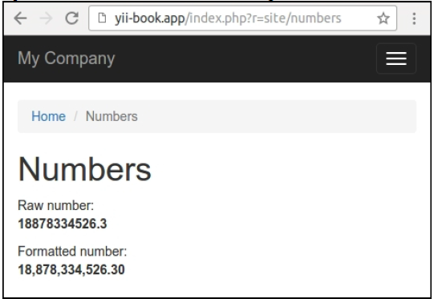

## 创建帮助类

有许多内置的框架帮助类，例如`yii\helpers`命名空间下的`StringHelper`。这里包含了很多有用的静态方法，用于操纵字符串、文件、数组和其它目标。

在需要情况下，对于额外的行为，你可以创建一个自己的帮助类，并将任何静态函数放在里边。例如，我们在本小节中事先了数字帮助类。

### 准备

按照官方指南[http://www.yiiframework.com/doc-2.0/guide-start-installation.html](http://www.yiiframework.com/doc-2.0/guide-start-installation.html)的描述，使用Composer包管理器创建一个新的`yii2-app-basic`应用。

### 如何做...

1. 在你的项目中创建`helpers`文件夹，以及`NumberHelper`类：

```php
<?php
namespace app\helpers;
class NumberHelper
{
    public static function format($value, $decimal = 2)
    {
        return number_format($value, $decimal, '.', ',');
    }
}
```

2. 添加`actionNumbers`方法到`NumberHelper`：

```php
<?php
...
class SiteController extends Controller
{
    …
    public function actionNumbers()
    {
        return $this->render('numbers', ['value' => 18878334526.3]);
    }
}
```

3. 添加`views/site/numbers.php`视图：

```php
<?php
use app\helpers\NumberHelper;
use yii\helpers\Html;
/* @var $this yii\web\View */
/* @var $value float */
$this->title = 'Numbers';
$this->params['breadcrumbs'][] = $this->title;
?>
<div class="site-numbers">
    <h1><?= Html::encode($this->title) ?></h1>
    <p>
        Raw number:<br />
        <b><?= $value ?></b>
    </p>
    <p>
        Formatted number:<br />
        <b><?= NumberHelper::format($value) ?></b>
    </p>
</div>
```

4. 打开这个动作。你将会看到如下截图：



在其它例子中，你可以指定其它数量的十进制数。观察如下例子：

```php
NumberHelper::format($value, 3)
```

### 工作原理...

Yii2中任何帮助类只是函数的集合，在对应的类中以静态方法实现。

你可以使用一个帮助类用于实现任何类型的输出，操纵任何变量的任何值，以及其它例子。

**注意**：通常，静态帮助类是轻量干净的函数，有少数几个参数。避免将你的业务逻辑和其它复杂的操纵到帮助类中。在其它情况中，使用小组件或者其它组件，而不是帮助类。

### 参考

欲了解更多信息，参考：

[http://www.yiiframework.com/doc-2.0/guide-helper-overview.html](http://www.yiiframework.com/doc-2.0/guide-helper-overview.html)

例如对于内置帮助类，参考框架中`helpers`文件夹下的源代码。对于框架，参考：

[https://github.com/yiisoft/yii2/tree/master/framework/helpers](https://github.com/yiisoft/yii2/tree/master/framework/helpers)。