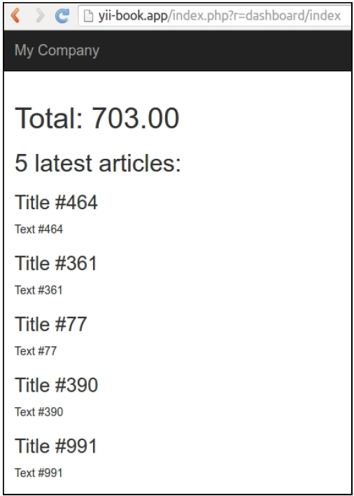
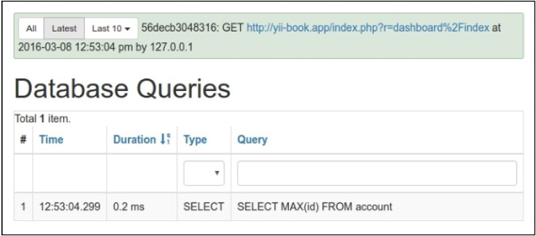

## 使用缓存依赖和chains

Yii支持需要缓存后端，但是使Yii缓存灵活的是依赖和依赖chaining支持。有一些情况，你不能简单的只缓存1个小时的数据，因为信息随时可能会边。

在这个小节中，我们将会学习如何缓存整个页面，并能在有更新时获取最新的数据。这个页面是一个仪表盘类型的，将会展示5个最新添加的文章，以及总数。

**注意**：注意一个操作不能被编辑 as it is added，但是一个文章可以。

### 准备

按照官方指南[http://www.yiiframework.com/doc-2.0/guide-start-installation.html](http://www.yiiframework.com/doc-2.0/guide-start-installation.html)的描述，使用Composer包管理器创建一个新的`yii2-app-basic`应用。

1. 在`config/web.php`中激活缓存组件：

```
return [
    // ...
    'components' => [
        'cache' => ['class' => 'yii\caching\FileCache',

        ],
    ],
];
```

2. 设置一个新的数据库，并将它配置到`config/db.php`中：
3. 运行如下migration：

```
<?php
use yii\db\Schema;
use yii\db\Migration;
class m160308_093233_create_example_tables extends Migration
{
    public function up()
    {
        $tableOptions = null;
        if ($this->db->driverName === 'mysql') {
            $tableOptions = 'CHARACTER SET utf8 COLLATE utf8_general_ci ENGINE=InnoDB';
        }
        $this->createTable('{{%account}}', [
            'id' => Schema::TYPE_PK,
            'amount' => Schema::TYPE_DECIMAL . '(10,2) NOT NULL',
        ], $tableOptions);
        $this->createTable('{{%article}}', [
            'id' => Schema::TYPE_PK,
            'title' => Schema::TYPE_STRING . ' NOT NULL',
            'text' => Schema::TYPE_TEXT . ' NOT NULL',
        ], $tableOptions);
    }
    public function down()
    {
        $this->dropTable('{{%article}}');
        $this->dropTable('{{%account}}');
    }
}
```

4. 使用Yii为account和article表生成模型。
5. 创建`protected/controllers/DashboardController.php`：

```
<?php
namespace app\controllers;
use app\models\Account;
use app\models\Article;
use yii\web\Controller;
class DashboardController extends Controller
{
    public function actionIndex()
    {
        $total = Account::find()->sum('amount');
        $articles = Article::find()->orderBy('id DESC')->limit(5)->all();
        return $this->render('index', array(
            'total' => $total,
            'articles' => $articles,
        ));
    }
    public function actionRandomOperation()
    {
        $rec = new Account();
        $rec->amount = rand(-1000, 1000);
        $rec->save();
        echo 'OK';
    }
    public function actionRandomArticle()
    {
        $n = rand(0, 1000);
        $article = new Article();
        $article->title = "Title #".$n;
        $article->text = "Text #".$n;
        $article->save();
        echo 'OK';
    }
}
```

6. 创建`views/dashboard/index.php`：

```
<?php
use yii\helpers\Html;
/* @var $this yii\web\View */
/* @var $total int */
/* @var $articles app\models\Article[] */
?>
    <h1>Total: <?= $total ?></h1>
    <h2>5 latest articles:</h2>
<?php foreach($articles as $article): ?>
    <h3><?= Html::encode($article->title) ?></h3>
    <div><?= Html::encode($article->text) ?></div>
<?php endforeach ?>
```

7. 运行`dashboard/random-operation`和`dashboard/random-article`几次，然后，运行`dashboard/index`你将会看到如下所示的截图：



8. 在页面的底部，点击调试面板上数据库查询的数量：


看到一个查询列表：


### 如何做...

执行如下步骤：

1. 我们需要修改控制器的代码：

```
<?php
namespace app\controllers;
use app\models\Account;
use app\models\Article;
use yii\caching\DbDependency;
use yii\caching\TagDependency;
use yii\web\Controller;
class DashboardController extends Controller
{
    public function behaviors()
    {
        return [
            'pageCache' => [
                'class' => 'yii\filters\PageCache',
                'only' => ['index'],
                'duration' => 24 * 3600 * 365, // 1 year
                'dependency' => [
                    'class' => 'yii\caching\ChainedDependency',
                    'dependencies' => [
                        new TagDependency(['tags' =>
                            ['articles']]),
                        new DbDependency(['sql' => 'SELECT MAX(id) FROM ' . Account::tableName()])
                    ]
                ],
            ],
        ];
    }

    public function actionIndex()
    {
        $total = Account::find()->sum('amount');
        $articles = Article::find()->orderBy('id DESC')->limit(5)->all();
        return $this->render('index', array(
            'total' => $total,
            'articles' => $articles,
        ));
    }
    public function actionRandomOperation()
    {
        $rec = new Account();
        $rec->amount = rand(-1000, 1000);
        $rec->save();
        echo 'OK';
    }

    public function actionRandomArticle()
    {
        $n = rand(0, 1000);
        $article = new Article();
        $article->title = "Title #".$n;
        $article->text = "Text #".$n;
        $article->save();
        TagDependency::invalidate(\Yii::$app->cache,
            'articles');
        echo 'OK';
    }
}
```

2. 完成了。现在，在加载`dashboard/index`几次以后，你将会看到只有1个查询，如下所示：



此外，尝试运行`dashboard/random-operation`或者`dashboard/randomarticle`，并刷新`dashboard/index`。数据将会改变：


### 工作原理...

为了修改最少的代码，并达到最高的性能，我们使用一个过滤器来作全页缓存：

```
public function behaviors()
{
    return [
        'pageCache' => [
            'class' => 'yii\filters\PageCache',
            'only' => ['index'],
            'duration' => 24 * 3600 * 365, // 1 year
            'dependency' => [
                'class' => 'yii\caching\ChainedDependency',
                'dependencies' => [
                    new TagDependency(['tags' => ['articles']]),
                    new DbDependency(['sql' => 'SELECT MAX(id) FROM account'])
                ]
            ],
        ],
    ];
}
```

先前的代码意味着我们在`index`动作中应用一个全页缓存。这个页面将会缓存1年，并且如果数据改变了，这个缓存将会刷新。因此，一般情况下，依赖工作如下：

- 按依赖中的描述，第一次运行会获取最新的数据，保存以备之后调用，并更新缓存
- 按依赖中的描述，获取最新的数据，获取保存的数据，然后比较两者
- 如果相等，使用缓存的数据
- 如果不相等，更新缓存，使用最新的数据，并保存最新依赖数据，以备以后调用

在我们的例子中，使用了两个类型的依赖——标签和DB。一个标签依赖使用自定义字符串标签标记数据，并检查它，来决定缓存是否无效，一个DB依赖使用SQL查询结果来达到相同的目的。

现在你可能有的问题是，“为什么有时候使用DB而有时候使用标签？”这是一个好问题。

使用DB依赖的目的是，替换重的计算，并选择一个轻的查询，尽可能获取少的数据。关于这种依赖最好的事情是，我们不需要在已有的代码中嵌入任何额外的逻辑。在我们的例子中，我们可以使用这种类型的依赖用于账户操作，但是不能用于文章，因为文章的内容会改变。因此，对于文章，我们设置一个全局标签，名叫文章，它表示我们可以手动调用来刷新文章缓存：

```
TagDependency::invalidate(\Yii::$app->cache, 'articles');
```

### 参考

欲了解更多关于缓存的信息，并使用缓存依赖，参考[http://www.yiiframework.com/doc-2.0/guide-caching-overview.html](http://www.yiiframework.com/doc-2.0/guide-caching-overview.html)。