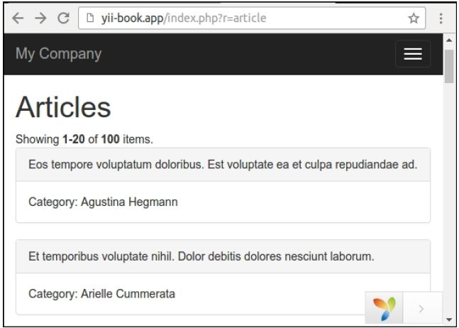
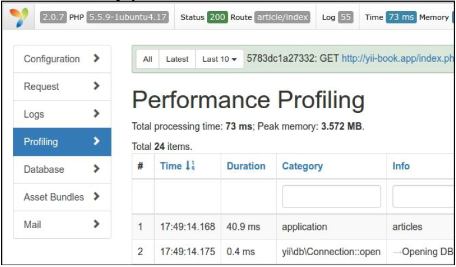

## 使用Yii profiling一个应用

如果在部署一个Yii应用时，你使用了所有的最佳实践，但是你仍然得不到你想要的性能，很有可能是应用本身存在一些性能瓶颈。在处理这些性能瓶颈时最主要的原则是你不应该假设任何事请，并在尝试优化它之前去测试和profile代码。

在本小节中，我们将会尝试找出Yii2最小应用的性能瓶颈。

### 准备

按照官方指南[http://www.yiiframework.com/doc-2.0/guide-start-installation.html](http://www.yiiframework.com/doc-2.0/guide-start-installation.html)的描述，使用Composer包管理器创建一个新的`yii2-app-basic`应用。

1. 设置数据库连接，并应用如下migration：

```
<?php
use yii\db\Migration;
class m160308_093233_create_example_tables extends Migration
{
    public function up()
    {
        $tableOptions = null;
        if ($this->db->driverName === 'mysql') {
            $tableOptions = 'CHARACTER SET utf8 COLLATE utf8_general_ci ENGINE=InnoDB';
        }
        $this->createTable('{{%category}}', [
            'id' => $this->primaryKey(),
            'name' => $this->string()->notNull(),
        ], $tableOptions);
        $this->createTable('{{%article}}', [
            'id' => $this->primaryKey(),
            'category_id' => $this->integer()->notNull(),
            'title' => $this->string()->notNull(),
            'text' => $this->text()->notNull(),
        ], $tableOptions);
        $this->createIndex('idx-article-category_id',
            '{{%article}}', 'category_id');
        $this->addForeignKey('fk-article-category_id',
            '{{%article}}', 'category_id', '{{%category}}', 'id');
    }
    public function down()
    {
        $this->dropTable('{{%article}}');
        $this->dropTable('{{%category}}');
    }
}
```

2. 在Yii中为每一个表生成模型。
3. 写如下控制台命令：

```
<?php
namespace app\commands;
use app\models\Article;
use app\models\Category;
use Faker\Factory;
use yii\console\Controller;
class DataController extends Controller
{
    public function actionInit()
    {
        $db = \Yii::$app->db;
        $faker = Factory::create();
        $transaction = $db->beginTransaction();
        try {
            $categories = [];
            for ($id = 1; $id <= 100; $id++) {
                $categories[] = [
                    'id' => $id,
                    'name' => $faker->name,
                ];
            }
            $db->createCommand()->batchInsert(Category::tableName(), ['id', 'name'], $categories)->execute();
            $articles = [];
            for ($id = 1; $id <= 100; $id++) {
                $articles[] = [
                    'id' => $id,
                    'category_id' => $faker->numberBetween(1, 100),
                    'title' => $faker->text($maxNbChars = 100),
                    'text' => $faker->text($maxNbChars = 200),
                ];
            }
            $db->createCommand()
                ->batchInsert(Article::tableName(), ['id', 'category_id', 'title', 'text'], $articles)->execute();
            $transaction->commit();
        } catch (\Exception $e) {
            $transaction->rollBack();
            throw $e;
        }
    }
}
```

并执行它：

```
./yii data/init
```

4. 添加`ArticleController`类：

```
<?php
namespace app\controllers;
use Yii;
use app\models\Article;
use yii\data\ActiveDataProvider;
use yii\web\Controller;
class ArticleController extends Controller
{
    public function actionIndex()
    {
        $query = Article::find();
        $dataProvider = new ActiveDataProvider([
            'query' => $query,
        ]);
        return $this->render('index', [
            'dataProvider' => $dataProvider,
        ]);
    }
}
```

5. 添加`views/article/index.php`视图：

```
<?php
use yii\helpers\Html;
use yii\widgets\ListView;
/* @var $this yii\web\View */
/* @var $dataProvider yii\data\ActiveDataProvider */
$this->title = 'Articles';
$this->params['breadcrumbs'][] = $this->title;
?>
<div class="article-index">
    <h1><?= Html::encode($this->title) ?></h1>
    <?= ListView::widget([
        'dataProvider' => $dataProvider,
        'itemOptions' => ['class' => 'item'],
        'itemView' => '_item',
    ]) ?>
</div>
```

然后添加`views/article/_item.php`：

```
<?php
use yii\helpers\Html;
/* @var $this yii\web\View */
/* @var $model app\models\Article */
?>
<div class="panel panel-default">
    <div class="panel-heading"><?= Html::encode($model->title);
        ?></div>
    <div class="panel-body">
        Category: <?= Html::encode($model->category->name) ?>
    </div>
</div>
```

### 如何做...

跟随如下步骤，profile基于Yii的应用：

1. 打开文章页面：



2. 打开`views/article/index.php`并在`ListView`小部件之前和之后添加profiler调用：

```
<div class="article-index">
    <h1><?= Html::encode($this->title) ?></h1>
    <?php Yii::beginProfile('articles') ?>
    <?= ListView::widget([
        'dataProvider' => $dataProvider,
        'itemOptions' => ['class' => 'item'],
        'itemView' => '_item',
    ]) ?>
    <?php Yii::endProfile('articles') ?>
</div>
```

现在刷新这个页面。

3. 展开页面底部的调试面板，点击timing badge(在我们的例子中是**73ms**)：


现在检查**Profiling**报告：



我们可以看到我们的文章块花费了将近40ms。

4. 打开我们的控制器，并为文章的`category`关系添加主动加载：

```
class ArticleController extends Controller
{
    public function actionIndex()
    {
        $query = Article::find()->with('category');
        $dataProvider = new ActiveDataProvider([
            'query' => $query,
        ]);
        return $this->render('index', [
            'dataProvider' => $dataProvider,
        ]);
    }
}
```

5. 回到网站，刷新页面，再次打开**Profiling**报告：


现在这个文章列表花费了将近25ms，因为应用使用主动加载做了更少的SQL查询。

### 工作原理...

你可以使用`Yii::beginProfile`和`Yii::endProfile`查看源代码的任何片段：

```
Yii::beginProfile('articles');
// ...
Yii::endProfile('articles');
```

在执行过页面以后，你可以在调试模块的**Profiling**页面看到这个报告，有所有的执行时间。

此外，你可以使用嵌套profiling调用：

```
Yii::beginProfile('outer');
    Yii::beginProfile('inner');
        // ...
    Yii::endProfile('inner');
Yii::endProfile('outer');
```

**注意**：注意要正确的打开和关闭调用，以及正确命名block名称。如果你忘记调用`Yii::endProfile`，或者颠倒了`Yii::endProfile('inner')`和`Yii::endProfile('outer')`的嵌套顺序，性能Profiling将不会工作。

### 参考

- 欲了解更多关于logger的信息，参考[http://www.yiiframework.com/doc-2.0/guide-runtime-logging.html#performance-profiling](http://www.yiiframework.com/doc-2.0/guide-runtime-logging.html#performance-profiling)
- 关于应用性能的调优，参考[http://www.yiiframework.com/doc-2.0/guide-tutorial-performance-tuning.html](http://www.yiiframework.com/doc-2.0/guide-tutorial-performance-tuning.html)