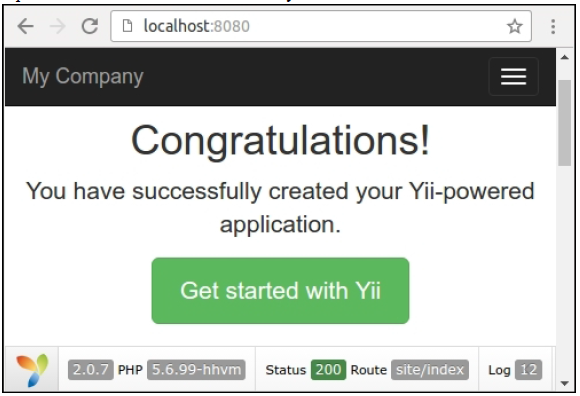

## 在HHVM上运行Yii2

**HipHop Virtual Machine (HHVM)**是一个处理虚拟机器，来自Facebook，基于just-in-time（JIT）编译。HHVM将PHP代码翻译成功中间的**HipHop bytecode (HHBC)**，并动态翻译PHP代码为机器码，它可以被优化并原生的执行。

### 准备

按照官方指南[http://www.yiiframework.com/doc-2.0/guide-start-installation.html](http://www.yiiframework.com/doc-2.0/guide-start-installation.html)的描述，使用Composer包管理器创建一个新的`yii2-app-basic`应用。

### 如何做...

根据如下步骤，在HHVM上运行Yii：

1. 安装Apache2或者Nginx web服务器：
2. 跟随这个指南[https://docs.hhvm.com/hhvm/installation/introduction](https://docs.hhvm.com/hhvm/installation/introduction)，在Linux或者Mac上安装HHVM。例如在Ubuntu上，你需要运行如下命令：

```
sudo apt-get install software-properties-common
sudo apt-key adv --recv-keys --keyserver
hkp://keyserver.ubuntu.com:80 0x5a16e7281be7a449
sudo add-apt-repository "deb http://dl.hhvm.com/ubuntu
$(lsb_release -sc) main"
sudo apt-get update
sudo apt-get install hhvm
After installing, you will see the following tips in your
terminal:
****************************************************************
****
* HHVM is installed.
*
* Running PHP web scripts with HHVM is done by having your
* webserver talk to HHVM over FastCGI. Install nginx or Apache,
* and then:
* $ sudo /usr/share/hhvm/install_fastcgi.sh
* $ sudo /etc/init.d/hhvm restart
* (if using nginx) $ sudo /etc/init.d/nginx restart
* (if using apache) $ sudo /etc/init.d/apache restart
*
* Detailed FastCGI directions are online at:
* https://github.com/facebook/hhvm/wiki/FastCGI
*
* If you're using HHVM to run web scripts, you probably want it
* to start at boot:
* $ sudo update-rc.d hhvm defaults
*
* Running command-line scripts with HHVM requires no special
setup:
* $ hhvm whatever.php
*
* You can use HHVM for /usr/bin/php even if you have php-cli
* installed:
* $ sudo /usr/bin/update-alternatives \
* --install /usr/bin/php php /usr/bin/hhvm 60
****************************************************************
****
```

3. 尝试为你的网站手动启动内置服务器：

```
cd web
hhvm -m server -p 8080
```

在你的浏览器中打开`localhost:8080`：



现在你就可以使用HHVM来开发你的项目了。

4. 如果你使用Nginx或者Apache2服务器，HHVM会在`/etc/nginx`和`/etc/apache2`目录中自动创建它自己的配置文件。在Nginx的例子中，它会创建`/etc/nginx/hhvm.conf`模板，来包含你的项目的配置。例如，我们来创建一个新的虚拟托管名叫`yii-book-hhvm.app`：

```
server {
    listen 127.0.0.1:80;
    server_name .yii-book-hhvm.app;
    root /var/www/yii-book-hhvm.app/web;
    charset utf-8;
    index index.php index.html index.htm;
    include /etc/nginx/hhvm.conf;
}
```

添加hostname到你的`/etc/hosts`：

```
127.0.0.1 yii-book-hhvm.app
```

现在重启这个Nginx服务器：

```
sudo service nginx restart
```

最后，在浏览器中打开这个新的host：


你的服务器被成功设置。

### 工作原理...

你可以在`fastcgi`模式下使用HHVM作为PHP处理的备选项。默认情况下，它会监听9000端口。你可以在`/etc/hhvm/server.ini`文件中修改`fastcgi`进程的这个默认端口：

```
hhvm.server.port = 9000
```

在`/etc/hhvm/php.ini`文件中配置这个指定的PHP选项：

### 参考

欲了解更多关于安装HHVM的信息，参考如下地址：
- [https://docs.hhvm.com/hhvm/installation/linux](https://docs.hhvm.com/hhvm/installation/linux)
- [https://docs.hhvm.com/hhvm/installation/mac](https://docs.hhvm.com/hhvm/installation/mac)

欲了解更多关于HHVM使用方法的信息，参考[https://docs.hhvm.com/hhvm/](https://docs.hhvm.com/hhvm/)