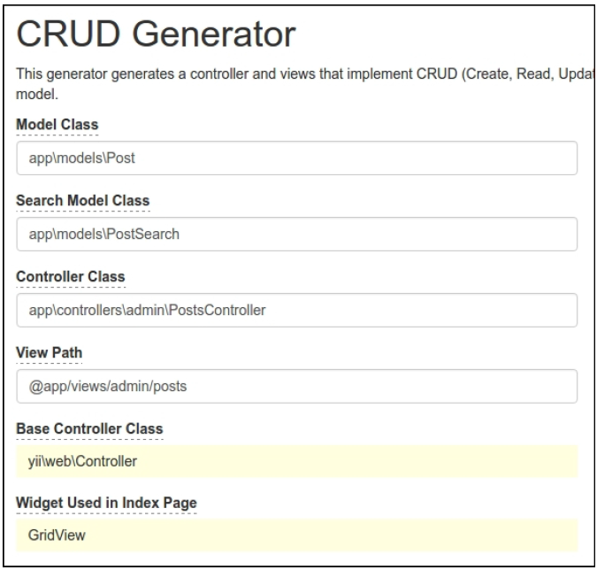
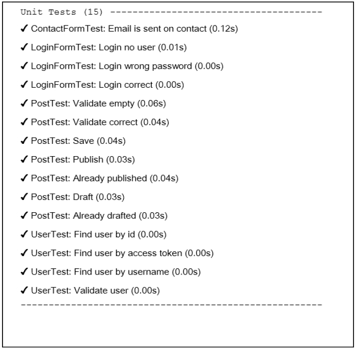
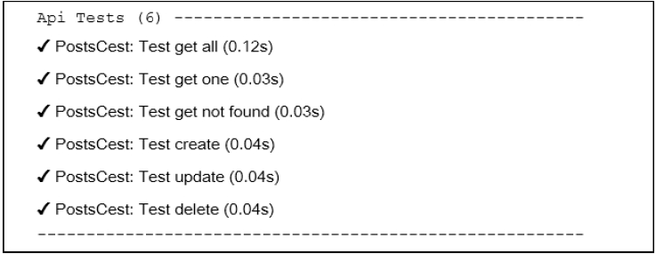

# 第十一章 测试

在本章中，我们将会讨论如下话题：

- 使用Codeception测试应用
- 使用PHPUnit做单元测试
- 使用Atoum做单元测试
- 使用Behat做单元测试

## 介绍

在本章中，你将会学习如何如何使用最好技术用于测试，例如Codeception，PHPUnit，Atoum和Behat。你将会看到如何写简单的测试和如何在你的应用中避免拟合错误。

## 使用Codeception测试应用

默认情况下，基础和高级Yii2应用skeletons使用*Codeception*作为一个测试框架。Codeception支持写单元，函数，以及接受box之外的测试。对于单元测试，它使用PHPUnit测试框架，它将被在下个小节中讨论。

### 准备

1. 按照官方指南[http://www.yiiframework.com/doc-2.0/guide-start-installation.html](http://www.yiiframework.com/doc-2.0/guide-start-installation.html)的描述，使用Composer包管理器创建一个新`yii2-app-basic`的应用。

**注意**：如果你用的是基础应用的2.0.9版本（或者更早），只需要手动升级`tests`文件夹，并添加`config/test.php`，`config/test_db.php`和`web/index-test.php`文件。此外你需要复制`composer.json`文件的`require`和`require-dev`部分，并运行`composer update`。

2. 复制并应用如下migration：

```
<?php
use yii\db\Migration;
class m160309_070856_create_post extends Migration
{
    public function up()
    {
        $this->createTable('{{%post}}', [
            'id' => $this->primaryKey(),
            'title' => $this->string()->notNull(),
            'text' => $this->text()->notNull(),
            'status' => $this->smallInteger()->notNull()->defaultValue(0),
        ]);
    }
    public function down()
    {
        $this->dropTable('{{%post}}');
    }
}
```

3. 创建`Post`模型：

```
<?php
namespace app\models;
use Yii;
use yii\db\ActiveRecord;
/**
 * @property integer $id
 * @property string $title
 * @property string $text
 * @property integer $status
 * @property integer $created_at
 * @property integer $updated_at
 */
class Post extends ActiveRecord
{
    const STATUS_DRAFT = 0;
    const STATUS_ACTIVE = 1;
    public static function tableName()
    {
        return '{{%post}}';
    }
    public function rules()
    {
        return [
            [['title', 'text'], 'required'],
            [['text'], 'string'],
            ['status', 'in', 'range' => [self::STATUS_DRAFT,
                self::STATUS_ACTIVE]],
            ['status', 'default', 'value' =>
                self::STATUS_DRAFT],
            [['title'], 'string', 'max' => 255],
        ];
    }
    public function behaviors()
    {
        return [
            TimestampBehavior::className(),
        ];
    }
    public static function getStatusList()
    {
        return [
            self::STATUS_DRAFT => 'Draft',
            self::STATUS_ACTIVE => 'Active',
        ];
    }
    public function publish()
    {
        if ($this->status == self::STATUS_ACTIVE) {
            throw new \DomainException('Post is already published.');
        }
        $this->status = self::STATUS_ACTIVE;
    }
    public function draft()
    {
        if ($this->status == self::STATUS_DRAFT) {
            throw new \DomainException('Post is already drafted.');
        }
        $this->status = self::STATUS_DRAFT;
    }
}
```

4. 生成CRUD：



5. 此外，在`views/admin/posts/_form.php`文件中为`status`字段添加状态下拉菜单，以及提交按钮的名称：

```
<div class="post-form">
    <?php $form = ActiveForm::begin(); ?>
    <?= $form->field($model, 'title')->textInput(['maxlength'
    => true]) ?>
    <?= $form->field($model, 'text')->textarea(['rows' => 6]) ?>
<?= $form->field($model, 'status')->dropDownList(Post::getStatusList()) ?>
    <div class="form-group">
        <?= Html::submitButton($model->isNewRecord ? 'Create' :
            'Update', [
            'class' => $model->isNewRecord ? 'btn btn-success' : 'btn btn-primary',
            'name' => 'submit-button',
        ]) ?>
    </div>
    <?php ActiveForm::end(); ?>
</div>
```

6. 现在检查控制器是否工作：


创建任意示例帖子。

### 如何做...

#### 为测试做准备

跟着如下步骤来为测试做准备：

1. 创建`yii2_basic_tests`或者其它测试数据库，通过应用migration来更新它：

```
tests/bin/yii migrate
```

这个命令需要在测试文件夹中运行。你可以在配置文件`/config/test_db.php`中指定你的测试数据库选项。

2. Codeception为我们的测试套件使用自动生成的Actor类。使用下面的命令创建他们：

```
composer exec codecept build
```

#### 运行单元和功能测试

我们可以立即运行任何类型的应用测试：

```
# run all available tests
composer exec codecept run

# run functional tests
composer exec codecept run functional

# run unit tests
composer exec codecept run unit
```

结果是，你可以查看测试报告如下所示：


#### 获取覆盖报告

你可以为你的代码获取代码覆盖率报告。默认情况下，代码覆盖率在配置文件`tests/codeception.yml`中是禁用的；你需要取消必要的注释，从而可以收集代码覆盖率：

```
coverage:
    enabled: true
    whitelist:
        include:
            - models/*
            - controllers/*
            - commands/*
            - mail/*
    blacklist:
        include:
            - assets/*
            - config/*
            - runtime/*
            - vendor/*
            - views/*
            - web/*
            - tests/*
```

你需要安装XDebug PHP扩展，这可以从[https://xdebug.org](https://xdebug.org)获取。例如，在Ubuntu或者Debian上，你可以在控制台中输入如下命令：

```
sudo apt-get install php5-xdebug
```

在Windows上，你必须打开`php.ini`文件，并添加到你PHP安装路径的自定义代码：

```
[xdebug]
zend_extension_ts=C:/php/ext/php_xdebug.dll
```

或者，如果你使用的是非线程安全的版本，输入如下命令：

```
[xdebug]
zend_extension=C:/php/ext/php_xdebug.dll
```

最后，你可以运行测试，并使用如下命令收集覆盖率报告：

```
#collect coverage for all tests
composer exec codecept run --coverage-html

#collect coverage only for unit tests
composer exec codecept run unit --coverage-html

#collect coverage for unit and functional tests
composer exec codecept run functional,unit --coverage-html
```

你可以在终端上看到文本的代码覆盖率输出：

```
Code Coverage Report:
    2016-03-31 08:13:05
Summary:
    Classes: 20.00% (1/5)
    Methods: 40.91% (9/22)
    Lines: 30.65% (38/124)
\app\models::ContactForm
    Methods: 33.33% ( 1/ 3) Lines: 80.00% ( 12/ 15)
\app\models::LoginForm
    Methods: 100.00% ( 4/ 4) Lines: 100.00% ( 18/ 18)
\app\models::User
    Methods: 57.14% ( 4/ 7) Lines: 53.33% ( 8/ 15)
Remote CodeCoverage reports are not printed to console

HTML report generated in coverage
```

此外，你可以在`tests/codeception/_output/coverage`路径中看到HTML格式的报告：


你可以点击任何类，并分析代码的哪些行在测试运行过程中还没有被执行到。

#### 运行验收测试

在验收测试中，你可以使用基于Curl的PhpBrowser作为请求服务器。它可以帮助你检查网站控制器，并解析HTTP和HTML响应代码。但是如果你希望测试你的CSS或者JavaScript行为，你必须使用真正的浏览器。

Selenium服务器是一个交互式的工具，它集成到了Firefox以及其它浏览器中，可以让你打开站点页面，并模拟人类动作。

为了使用真正的浏览器，我们必须安装Selenium服务器：

1. 需要完整版的Codeception包，而不是基础版的：

```
composer require --dev codeception/codeception
composer remove --dev codeception/base
```

2. 下载如下软件：

- 安装Mozilla Firefox浏览器，[https://www.mozilla.org](https://www.mozilla.org)
- 安装jre（Java运行时环境），[https://www.java.com/en/download/](https://www.java.com/en/download/)
- 下载Selenium独立服务器，[http://www.seleniumhq.org/download/](http://www.seleniumhq.org/download/)
- 下载Geckodriver，[https://github.com/mozilla/geckodriver/releases](https://github.com/mozilla/geckodriver/releases)

3. 在新的控制台窗口中启动带有driver的服务器：

```
java -jar -Dwebdriver.gecko.driver=~/geckodriver ~/selenium-server-standalone-x.xx.x.jar
```

4. 复制`tests/acceptance.suite.yml.example`到`tests/acceptance.suite.yml`，并按如下配置：

```
class_name: AcceptanceTester
modules:
    enabled:
        - WebDriver:
            url: http://127.0.0.1:8080/
            browser: firefox
        - Yii2:
            part: orm
            entryScript: index-test.php
            cleanup: false
```

5. 打开新的终端，并启动web服务器：

```
tests/bin/yii serve
```

6. 运行验收测试：

```
composer exec codecept run acceptance
```

你应该能看到Selenium是如何启动浏览器的，并检查所有的站点页面。

#### 创建数据库fixtures

在运行自己的测试之前，我们必须清楚自己的测试数据库，并加载指定的测试数据。`yii2-codeception`扩展提供`ActiveFixture`基类，用于为自己的模型创建测试数据集。运行如下步骤创建数据库fixtures：

1. 为`Post`模型创建fixture类：

```
<?php
namespace tests\fixtures;
use yii\test\ActiveFixture;
class PostFixture extends ActiveFixture
{
    public $modelClass = 'app\modules\Post';
    public $dataFile = '@tests/_data/post.php';
}
```

2. 在`test/_data/post.php`文件中添加一个演示数据集：

```
<?php
return [
    [
        'id' => 1,
        'title' => 'First Post',
        'text' => 'First Post Text',
        'status' => 1,
        'created_at' => 1457211600,
        'updated_at' => 1457211600,
    ],
    [
        'id' => 2,
        'title' => 'Old Title For Updating',
        'text' => 'Old Text For Updating',
        'status' => 1,
        'created_at' => 1457211600,
        'updated_at' => 1457211600,
    ],
    [
        'id' => 3,
        'title' => 'Title For Deleting',
        'text' => 'Text For Deleting',
        'status' => 1,
        'created_at' => 1457211600,
        'updated_at' => 1457211600,
    ],
];
```

3. 为单元测试和验收测试激活fixtures支持。只需要添加`fixtures`部分到`unit.suite.yml`文件中：

```
class_name: UnitTester
modules:
    enabled:
        - Asserts
        - Yii2:
            part: [orm, fixtures, email]
```

此外，添加`fixtures`部分到`acceptance.suite.yml`文件中：

```
class_name: AcceptanceTester
modules:
    enabled:
        - WebDriver:
            url: http://127.0.0.1:8080/
            browser: firefox
        - Yii2:
            part: [orm, fixtures]
            entryScript: index-test.php
            cleanup: false
```

4. 运行如下命令，重新生成`tester`类，应用这些修改：

```
composer exec codecept build
```

#### 写单元或综合测试

单元和综合测试检查我们项目的源代码。








