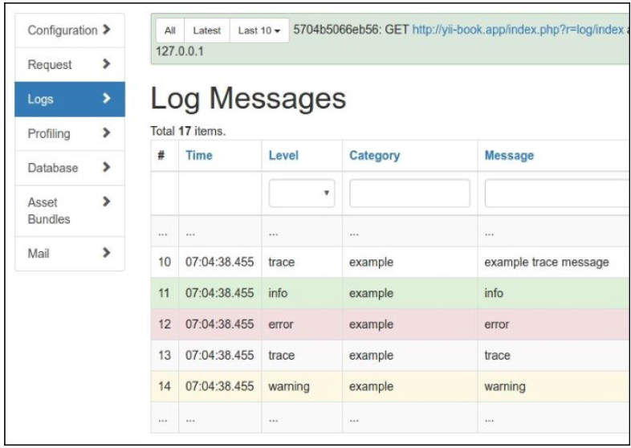
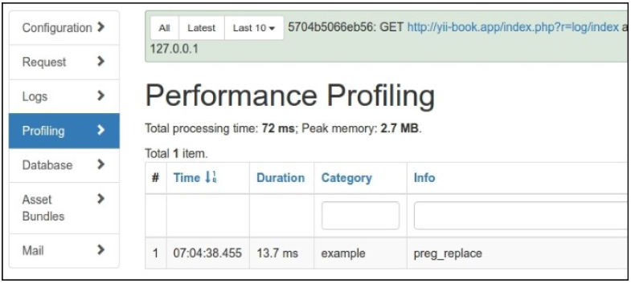

## 使用不同的日志路由

当你没有机会调试它的时候，打日志对于理解应用真正做了些什么非常关键。不管你是否相信，尽管你能100%确信你的应用将会按照你期望的执行，在生产环境中，它可以做很多你意识不到的事情。这没关系，因为没有人可以注意到任何事情。因此，如果我们期望不寻常的行为，我们需要立刻知道并有足够的信息来重现它。这就是日志派上用场的原因。

Yii允许一个开发者不止可以输出日志消息，也能根据消息的级别和种类进行不同的处理。例如，你可以将一条消息写入到数据库，发送一个电子邮件或者将它展示到浏览器中。

在本小节中，我们将会以更明智的方法处理日志消息：最重要的信息通过邮件发送，不太重要的信息会被保存到的文件A和B中，profiling将会被路由到Firebug中。此外，在开发模式下，所有的消息和profiling信息将会展示在屏幕上。

### 准备

按照官方指南[http://www.yiiframework.com/doc-2.0/guide-start-installation.html](http://www.yiiframework.com/doc-2.0/guide-start-installation.html)的描述，使用Composer包管理器创建一个新的应用。

### 如何做...

执行如下步骤：

1. 使用`config/web.php`配置日志：

```
'components' => [
    'log' => [
        'traceLevel' => 0,
        'targets' => [
            [
                'class' => 'yii\log\EmailTarget',
                'categories' => ['example'],
                'levels' => ['error'],
                'message' => [
                    'from' => ['log@example.com'],
                    'to' => ['developer1@example.com',
                        'developer2@example.com'],
                    'subject' => 'Log message',
                ],
            ],
            [
                'class' => 'yii\log\FileTarget',
                'levels' => ['error'],
                'logFile' => '@runtime/logs/error.log',
            ],
            [
                'class' => 'yii\log\FileTarget',
                'levels' => ['warning'],
                'logFile' => '@runtime/logs/warning.log',
            ],
            [
                'class' => 'yii\log\FileTarget',
                'levels' => ['info'],
                'logFile' => '@runtime/logs/info.log',
            ],
        ],
    ],
    'db' => require(__DIR__ . '/db.php'),
],
```

2. 现在，我们会在`protected/controllers/LogController.php`中生成一些消息：

```
<?php
namespace app\controllers;
use yii\web\Controller;
use Yii;
class LogController extends Controller
{
    public function actionIndex()
    {
        Yii::trace('example trace message', 'example');
        Yii::info('info', 'example');
        Yii::error('error', 'example');
        Yii::trace('trace', 'example');
        Yii::warning('warning','example');
        Yii::beginProfile('preg_replace', 'example');
        for($i=0;$i<10000;$i++){
            preg_replace('~^[ a-z]+~', '', 'test it');
        }
        Yii::endProfile('preg_replace', 'example');
        return $this->render('index');
    }
}
```

以及视图`views/log/index.php`：

```
<div class="log-index">
    <h1>Log</h1>
</div>
```

3. 现在多次运行先前的动作。在屏幕上，你应该看到`Log`头和一个有日志消息数字的调试面板：


4. 如果你点击**17**，你将会看到一个web日志，如下图所示：



5. 一条日志包含我们打的所有信息，堆栈踪迹、时间戳、级别和分类。
6. 现在打开**Profiling**页面。你应该能看到profiling消息，如下截图所示：



profiling信息展示了我们代码块的所有执行时长。

7. 因为我们刚刚修改了日志文件的名称，而不是路径，你应该能在`runtime/logs`中找到日志文件`error.log`、`warning.log`和`info.log`。
8. 打开文件你将会看到如下消息：

```
2016-03-06 07:28:35 [127.0.0.1][-][-][error][example] error
...
2016-03-06 07:28:35 [127.0.0.1][-][-][warning][example] warning
...
2016-03-06 07:28:35 [127.0.0.1][-][-][info][example] info
```

### 工作原理...

当使用`Yii::erorr`、`Yii::warning`、`Yii::info`或者`Yii::trace`打日志时，Yii将它传递给了日志路由。

依赖于如何配置，它会将消息发送给一个或多个目标，例如，通过电子邮件发送错误信息、将调试信息写入到文件A中、将警告信息写入到文件B中。

`yii\log\Dispatcher`类的对象通常被附加在一个名叫log的应用组件上。因此，为了配置它，我们应该在配置文件组件部分设置它的属性。这里唯一可配的属性是targets，它包含了一组日志路由和他们的配置。

我们已经定义了四个日志路由。这里回顾一下：

```
[
    'class' => 'yii\log\EmailTarget',
    'categories' => ['example'],
    'levels' => ['error'],
// 'mailer' => 'mailer',
    'message' => [
        'from' => ['log@example.com'],
        'to' => ['developer1@example.com', 'developer2@example.com'],
        'subject' => 'Log error',
    ],
],
```

`EmailTarget`默认通过`Yii::$app->mailer`组件发送一封电子邮件来发送日志消息。我们将类别限制为example，并将级别限制为error。电子邮件将会从`log@example.com`发送给两个开发者，且主题是`Log error`：

```
[
    'class' => 'yii\log\FileTarget',
    'levels' => [warning],
    'logFile' => '@runtime/logs/warning.log',
],
```

`FileTarget`将错误消息发送到一个指定的文件。我们将消息级别限制为warning，并使用一个名叫`warning.log`的文件。同样我们将info级别的消息存放在`Info.log`文件中。

此外，我们可以使用`yii\log\SyslogTarget`将消息写到Unix `/var/log/syslog`系统文件中，或者使用`yii\log\DbTarget`将消息写入到数据库中。对于第二种情况，你必须应用他们的migration：

```
./yii migrate --migrationPath=@yii/log/migrations/
```

### 更多...

关于Yii打日志有很多有趣的东西，在接下来的部分中进行讨论。

#### Yii::trace和Yii::getLogger()->log

`Yii::trace`是对`Yii::log`的封装：

```
public static function trace($message, $category = 'application')
{
    if (YII_DEBUG) {
        static::getLogger()->log($message, Logger::LEVEL_TRACE, $category);
    }
}
```

因此，如果Yii在`debug`模式下，`Yii::trace`使用trace级别来打日志。

#### Yii::beginProfile和Yii::endProfile

这些方法被用于测量应用中部分代码的执行时间。在我们的`LogController`中，我们测量了`preg_replace`执行10000次所用的时间：

```
Yii::beginProfile('preg_replace', 'example');
for($i=0;$i<10000;$i++){
    preg_replace('~^[ a-z]+~', '', 'test it');
}
Yii::endProfile('preg_replace', 'example');
```

`Yii::beginProfile`标记用于profiling的代码块开头。我们必须为每一个代码块设置一个唯一的token，以及指定一个可选的分类：

```
public static function beginProfile($token, $category = 'application') { … }
```

`Yii::endProfile`可以匹配到先前调用有相同的分类名的`beginProfile`：

```
public static function endProfile($token, $category = 'application') { … }
```

`begin-`和`end-`调用也必须被正确的嵌套。

#### 立即打日志消息

默认情况下，Yii会将所有的日志消息存放在内存中，知道应用终止。这是为了性能考虑，并且一般都能运行良好。

但是，如果一个控制台应用需要长时间运行，日志消息将不会被立刻写出。为了确保你的消息能在任何时候都被打印出来，你可以使用`Yii::$app->getLogger()>flush(true)`显式刷新，或者为你的控制台应用配置修改`flushInterval`和`exportInterval`：

```
'components' => [
    'log' => [
        'flushInterval' => 1,
        'targets' =>[
            [
                'class' => 'yii\log\FileTarget',
                'exportInterval' => 1,
            ],
        ], 
    ],
],
```

### 参考

- 欲了解更多关于打日志的信息，参考[http://www.yiiframework.com/doc-2.0/guideruntime-logging.html](http://www.yiiframework.com/doc-2.0/guideruntime-logging.html)
- *日志和使用上下文信息*小节