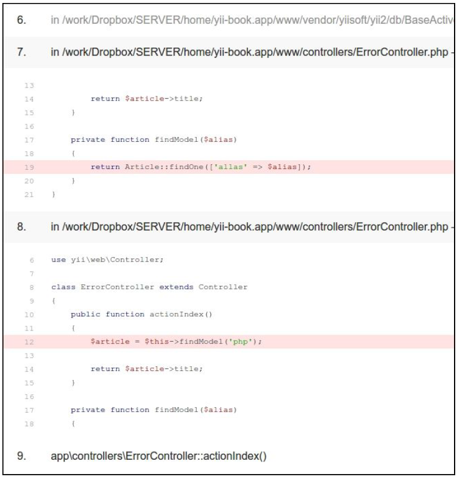

## 分析Yii错误堆栈踪迹

当发生错误时，Yii可以展示错误信息以及错误堆栈踪迹。当我们需要知道究竟是什么原因导致的错误时，堆栈踪迹非常有用。

### 准备

1. 按照官方指南[http://www.yiiframework.com/doc-2.0/guide-start-installation.html](http://www.yiiframework.com/doc-2.0/guide-start-installation.html)的描述，使用Composer包管理器创建一个新的应用。
2. 配置一个数据库，并使用如下migration导入：

```php
<?php
use yii\db\Migration;
class m160308_093234_create_article_table extends Migration
{
    public function up()
    {
        $this->createTable('{{%article}}', [
            'id' => $this->primaryKey(),
            'alias' => $this->string()->notNull(),
            'title' => $this->string()->notNull(),
            'text' => $this->text()->notNull(),
        ]);
    }
    public function down()
    {
        $this->dropTable('{{%article}}');
    }
}
```

3. 使用Yii生成一个`Article`模型。

### 如何做...

执行如下步骤：

1. 现在我们需要创建一些代码。创建`protected/controllers/ErrorController.php`：

```php
<?php
namespace app\controllers;
use app\models\Article;
use yii\web\Controller;
class ErrorController extends Controller
{
    public function actionIndex()
    {
        $article = $this->findModel('php');
        return $article->title;
    }
    private function findModel($alias)
    {
        return Article::findOne(['allas' => $alias]);
    }
}
```

2. 运行过先前的动作以后，我们应该能得到如下错误：


3. 而且，堆栈踪迹展示了如下错误：



### 工作原理...

从错误消息中，我们知道在数据库中，我们没有列的别称，但是我们已经再代码别的地方用到了它。在我们的例子中，这很容易通过搜索所有的文件来找到，但是在一个大项目中，一个列可以存放在一个变量中。而且，we have everything to fix an error without leaving the screen where the stack trace is displayed。我们只是需要小心的读它。

堆栈踪迹逆序地展示了一个调用链条，以产生错误的一个开始。一般来说，我们不需要看所有的踪迹来了解发生了什么。这个框架代码本身已经充分测试了，所以发生错误的可能性是比较小的。这就是为什么Yii展示应用的踪迹是打开的，而框架的踪迹是折叠的。

因此，我们使用第一个展开的部分，并查找别称。找到以后，我们可以立刻告诉你它被用于`ErrorController.php`的第19行中。

### 参考

- 欲了解错误处理的信息，参考[http://www.yiiframework.com/doc-2.0/guide-runtime-handling-errors.html](http://www.yiiframework.com/doc-2.0/guide-runtime-handling-errors.html)
- *日志和使用上下文信息*小节