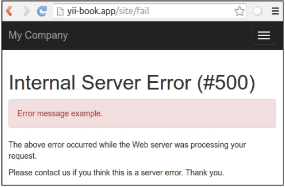
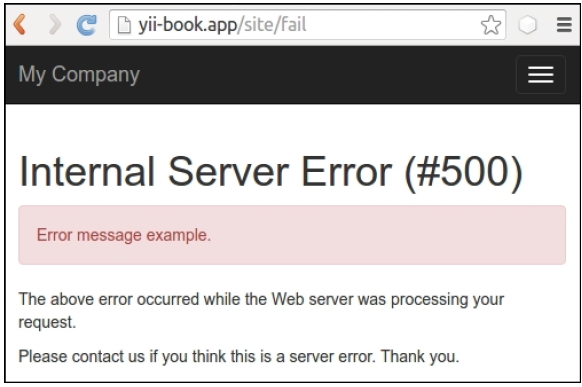

## 展示自定义错误

在Yii中，错误处理是非常灵活的，所以你可以为一种特定的错误创建你自己的错误处理方法。在这个小结中，我们将会以一个非常灵敏的方法处理一个404找不到的错误。我们将会展示一个404页面，它会基于输入栏中输入的内容提供建议的内容。

### 准备

1. 按照官方指南[http://www.yiiframework.com/doc-2.0/guide-start-installation.html](http://www.yiiframework.com/doc-2.0/guide-start-installation.html)的描述，使用Composer包管理器创建一个新的应用。
2. 添加失败动作到你的`SiteController`：

```
class SiteController extends Controller
{
    // …
    public function actionFail()
    {
        throw new ServerErrorHttpException('Error message example.');
    }
}
```

3. 添加如下内容到`web/.htaccess`：

```
RewriteEngine on
RewriteCond %{REQUEST_FILENAME} !-f
RewriteCond %{REQUEST_FILENAME} !-d
RewriteRule . index.php
```

4. 在`config/web.php`文件中为`urlManager`组件配置友好的URL：

```
'components' => [
    // …
    'urlManager' => [
        'enablePrettyUrl' => true,
        'showScriptName' => false,
    ],
],
```

5. 对于不存在的URL，展示`Not found`异常：


6. 同时，在我们的`actionFail`中展示`Internal Server Error`异常：



7. 现在我们希望为`Not Found`页面创建一个自定义页面。

### 如何做...

现在我们需要修改`Not Found`页面的内容，但不考虑其它错误类型。为了达到这个目标，执行如下步骤：

1. 打开`SiteController`类并找到`actions()`方法：

```
class SiteController extends Controller
{
    // ...
    public function actions()
    {
        return [
            'error' => [
                'class' => 'yii\web\ErrorAction',
            ],
            'captcha' => [
                'class' => 'yii\captcha\CaptchaAction',
                'fixedVerifyCode' => YII_ENV_TEST ? 'testme' : null,
            ],
        ];
    }
    // ...
}
```

2. 移除默认的`error`部分，`actions()`如下所示：

```
<?php
class SiteController extends Controller
{
    // ...
    public function actions()
    {
        return [
            'captcha' => [
                'class' => 'yii\captcha\CaptchaAction',
                'fixedVerifyCode' => YII_ENV_TEST ? 'testme' : null,
            ],
        ];
    }
    // ...
}
```


3. 添加自己的`actionError()`方法：

```
class SiteController extends Controller
{
    // ...
    public function actionError()
    {
    }
}
```

4. 打开原始的`\yii\web\ErrorAction`类，复制它的动作内容到我们的`actionError()`中，并自定义它用于渲染自定义`error-404`视图，从而展示404错误码的`Not Found`错误：

```
<?php
// ...
use yii\base\Exception;
use yii\base\UserException;
class SiteController extends Controller
{
    // ...
    public function actionError()
    {
        if (($exception =
                Yii::$app->getErrorHandler()->exception)== null) {
            $exception = new HttpException(404, Yii::t('yii',
                'Page not found.'));
        }
        if ($exception instanceof HttpException) {
            $code = $exception->statusCode;
        } else {
            $code = $exception->getCode();
        }
        if ($exception instanceof Exception) {
            $name = $exception->getName();
        } else {
            $name = Yii::t('yii', 'Error');
        }
        if ($code) {
            $name .= " (#$code)";
        }
        if ($exception instanceof UserException) {
            $message = $exception->getMessage();
        } else {
            $message = Yii::t('yii', 'An internal server error occurred.');
        }
        if (Yii::$app->getRequest()->getIsAjax()) {
            return "$name: $message";
        } else {
            if ($code == 404) {
                return $this->render('error-404');
            } else {
                return $this->render('error', [
                    'name' => $name,
                    'message' => $message,
                    'exception' => $exception,
                ]);
            }
        }
    }
}
```

5. 使用一个自定义消息添加`views/site/error-404.php`视图文件：

```
<?php
use yii\helpers\Html;
/* @var $this yii\web\View */
$this->title = 'Not Found!'
?>
<div class="site-error-404">
    <h1>Oops!</h1>
    <p>Sorry, but requested page not found.</p>
    <p>
        Please follow to <?= Html::a('index page', ['site/index'])?>
        to continue reading. Thank you.
    </p>
</div>
```

6. 现在尝试访问不存在的URL，就能看到`error-404.php`视图中的内容：


7. 但是，对于一个失败的动作，我们能看到`error.php`文件中默认的内容：



### 工作原理...

默认情况下，在`yii2-app-basic`应用中，我们在配置文件`config/web.oho`中为`errorHandler`组件配置`errorAction`为`site/error`。这意味着这个框架将会使用这个路由用于展示每一个被处理的异常：

```
'components' => [
    'errorHandler' => [
        'errorAction' => 'site/error',
    ],
],
```

在`SiteController`类中，我们使用内置的`yii\web\ErrorAction`类，它会渲染所谓的`error.php`视图：

```
class SiteController extends Controller
{
    // ...
    public function actions()
    {
        return [
            'error' => [
                'class' => 'yii\web\ErrorAction',
            ],
            'captcha' => [
                'class' => 'yii\captcha\CaptchaAction',
                'fixedVerifyCode' => YII_ENV_TEST ? 'testme' : null,
            ],
        ];
    }
    // ...
}
```

如果我们希望复写它的实现，我们可以 replace it in an inline actionError() method with our own custom content。

在这个小结中，我们添加了自己的`if`条件，用于渲染一个基于错误码的指定视图：

```
if ($code == 404) {
    return $this->render('error-404');
} else {
    return $this->render('error', [
        'name' => $name,
        'message' => $message,
        'exception' => $exception,
    ]);
}
```

同时，我们可以为`Not Found`页面使用一个自定义设计。

### 参考

为了了解更多Yii中的错误处理，参考[http://www.yiiframework.com/doc-2.0/guide-runtime-handling-errors.html](http://www.yiiframework.com/doc-2.0/guide-runtime-handling-errors.html)。