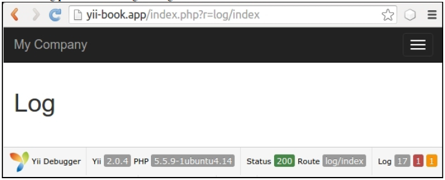
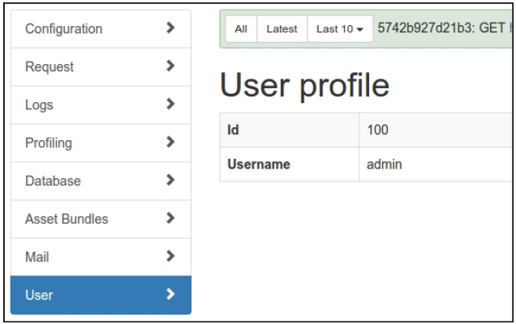

# 第十二章 调试，日志和错误处理

在本章中，我们将会讨论如下话题：

- 使用不同的日志路由
- 分析Yii错误堆栈踪迹
- 打日志并使用上下文信息
- 展示自定义错误
- 为调试扩展自定义面板

## 介绍

如果应用比较复杂，创建一个没有bug的应用几乎是不可能的，所以开发者必须检测错误并能迅速的处理他们。Yii有一套实用的特性，可以处理日志和错误。而且，在调试模式下，如果发生错误，Yii可以给出堆栈踪迹。实用它，你可以非常迅速的修复错误。

在本章中，我们将会回顾日志，分析异常的堆栈踪迹，并实现自己的错误处理。

## 使用不同的日志路由

当你没有机会调试它的时候，打日志对于理解应用真正做了些什么非常关键。不管你是否相信，尽管你能100%确信你的应用将会按照你期望的执行，在生产环境中，它可以做很多你意识不到的事情。这没关系，因为没有人可以注意到任何事情。因此，如果我们期望不寻常的行为，我们需要立刻知道并有足够的信息来重现它。这就是日志派上用场的原因。

Yii允许一个开发者不止可以输出日志消息，也能根据消息的级别和种类进行不同的处理。例如，你可以将一条消息写入到数据库，发送一个电子邮件或者将它展示到浏览器中。

在本小节中，我们将会以更明智的方法处理日志消息：最重要的信息通过邮件发送，不太重要的信息会被保存到的文件A和B中，profiling将会被路由到Firebug中。此外，在开发模式下，所有的消息和profiling信息将会展示在屏幕上。

### 准备

按照官方指南[http://www.yiiframework.com/doc-2.0/guide-start-installation.html](http://www.yiiframework.com/doc-2.0/guide-start-installation.html)的描述，使用Composer包管理器创建一个新的应用。

### 如何做...

执行如下步骤：

1. 使用`config/web.php`配置日志：

```
'components' => [
    'log' => [
        'traceLevel' => 0,
        'targets' => [
            [
                'class' => 'yii\log\EmailTarget',
                'categories' => ['example'],
                'levels' => ['error'],
                'message' => [
                    'from' => ['log@example.com'],
                    'to' => ['developer1@example.com',
                        'developer2@example.com'],
                    'subject' => 'Log message',
                ],
            ],
            [
                'class' => 'yii\log\FileTarget',
                'levels' => ['error'],
                'logFile' => '@runtime/logs/error.log',
            ],
            [
                'class' => 'yii\log\FileTarget',
                'levels' => ['warning'],
                'logFile' => '@runtime/logs/warning.log',
            ],
            [
                'class' => 'yii\log\FileTarget',
                'levels' => ['info'],
                'logFile' => '@runtime/logs/info.log',
            ],
        ],
    ],
    'db' => require(__DIR__ . '/db.php'),
],
```

2. 现在，我们会在`protected/controllers/LogController.php`中生成一些消息：

```
<?php
namespace app\controllers;
use yii\web\Controller;
use Yii;
class LogController extends Controller
{
    public function actionIndex()
    {
        Yii::trace('example trace message', 'example');
        Yii::info('info', 'example');
        Yii::error('error', 'example');
        Yii::trace('trace', 'example');
        Yii::warning('warning','example');
        Yii::beginProfile('preg_replace', 'example');
        for($i=0;$i<10000;$i++){
            preg_replace('~^[ a-z]+~', '', 'test it');
        }
        Yii::endProfile('preg_replace', 'example');
        return $this->render('index');
    }
}
```

以及视图`views/log/index.php`：

```
<div class="log-index">
    <h1>Log</h1>
</div>
```

3. 现在多次运行先前的动作。在屏幕上，你应该看到`Log`头和一个有日志消息数字的调试面板：



4. 如果你点击**17**，你将会看到一个web日志，如下图所示：


5. 一条日志包含我们打的所有信息，堆栈踪迹、时间戳、级别和分类。
6. 现在打开**Profiling**页面。你应该能看到profiling消息，如下截图所示：


profiling信息展示了我们代码块的所有执行时长。

7. 因为我们刚刚

```

```




